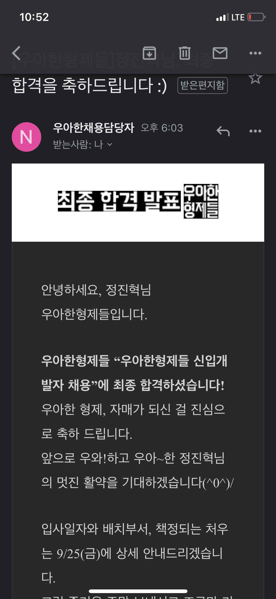
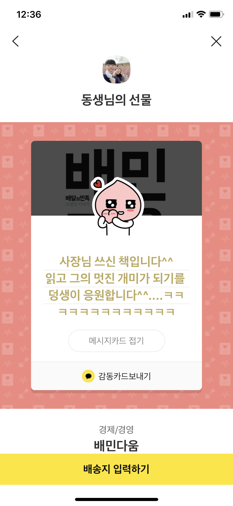
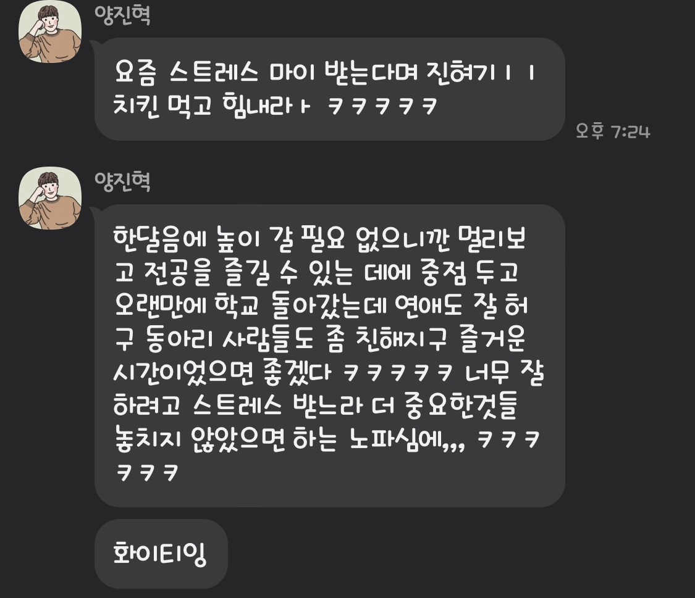
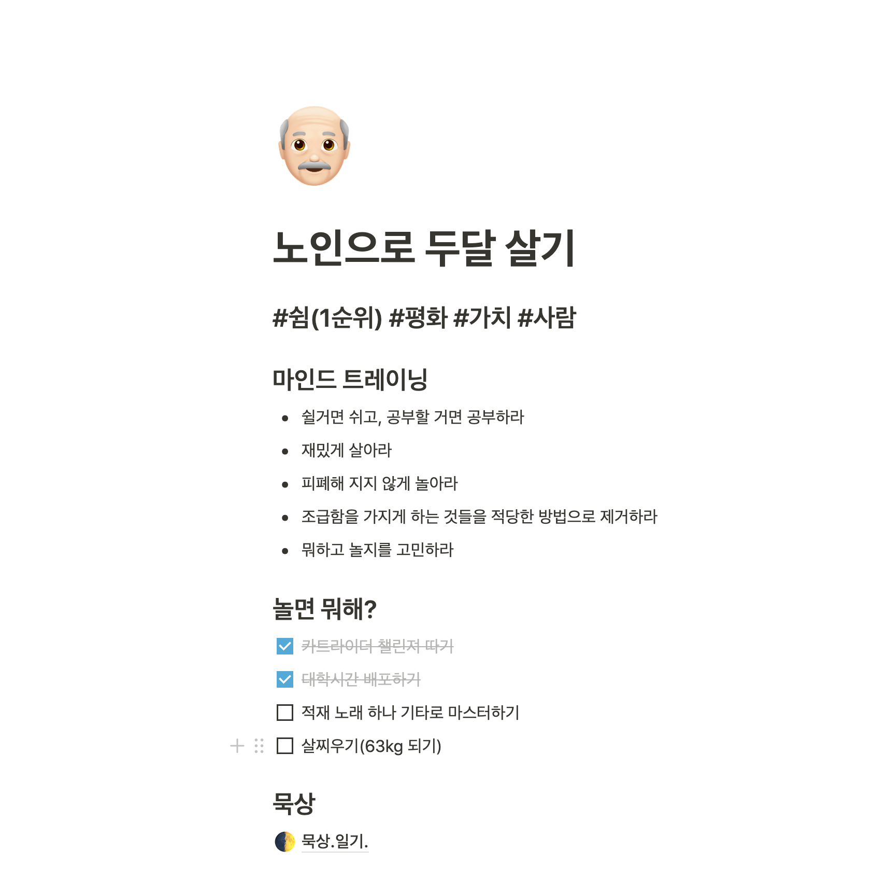
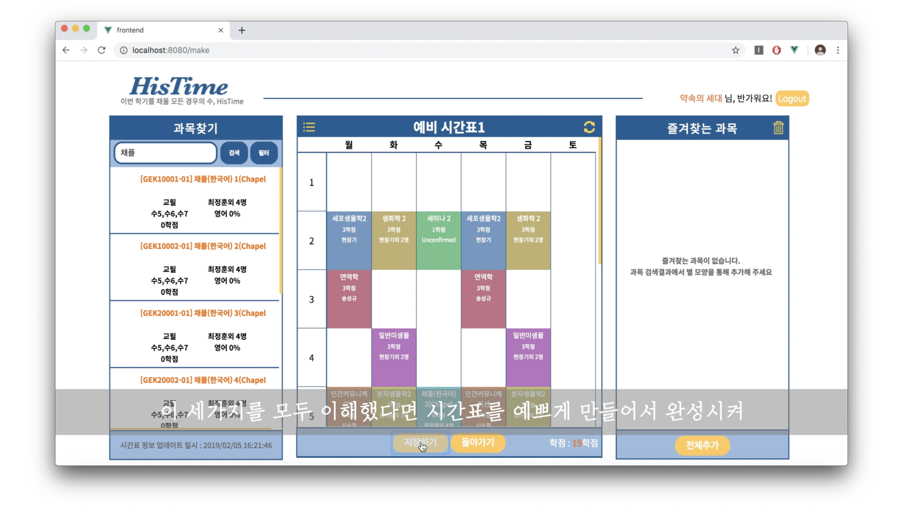
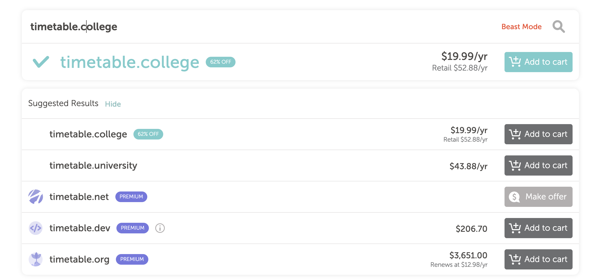
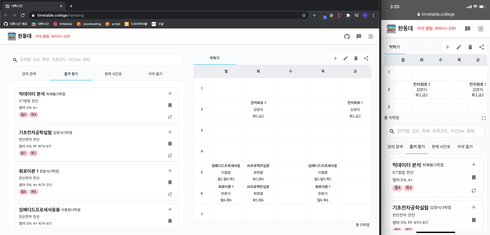
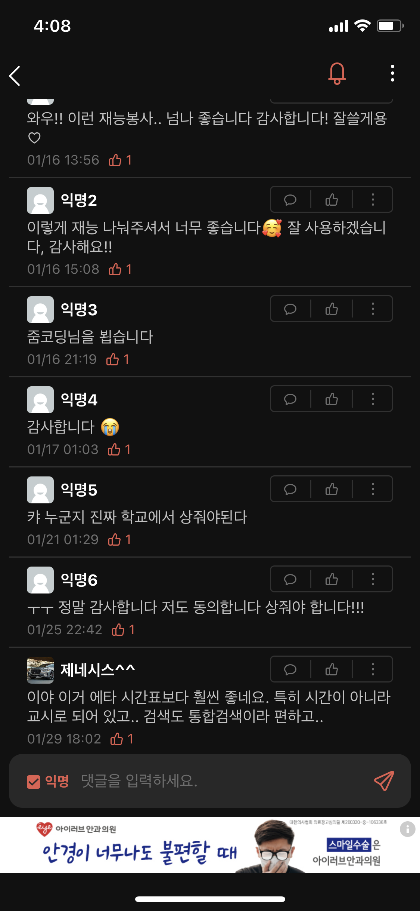
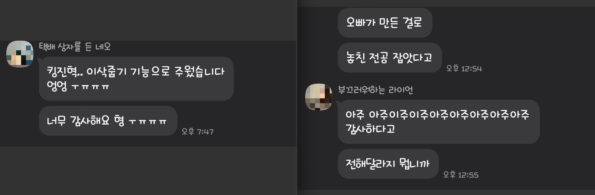

## 🤓 이 글의 목적

정말 오랜만에 글을 쓴다. 이 글을 통해 복학과 동시에 시작된 혼돈의 시간와 지금을 되돌아 보려 한다.

## 🤯 혼돈의 카오스 그리고 알게된 소중한 시간

### 🎓 복학, 조기 취업 그리고 취업계

Picky와 우아한테크캠프(우테캠)를 거치며 여러 훌륭한 사람들을 많이 만났다. 그리고 내가 꿈꾸는 개발자로서 미래의 **이상적인 모습**을 어렴풋이 그리게 되었다. 그 모습을 향해 적극적으로 달려보고 싶었지만, 아직 대학교라는 큰 산을 마무리하지 못한 상황이기에 나는 다시 포항으로 돌아가야만 했다.

학교는 배우는 기관이니 가서 열심히 배우고 돌아오겠다는 마음으로 마음을 다잡고 포항으로 돌아왔다. 하지만 아무래도 오랜만에 겪는 강의식 학습과 평가, 그리고 학교 커리큘럼에 대한 적응은 쉽지 않았고 마음을 다 잡지 못하고 계속 방황하게 되었다.

이 와중에 우테캠의 연장선으로 채용 면접 과정을 진행하게 되었는데 너무 감사하게도 기대하지 않았던 캠프로 주어진 채용 기회를 잡게 되었다. (많이 부족하지만 성장 가능성을 보고 나에게 기회를 준 우아한형제들은 정말 멋진 회사이다.)



<br/>

다만 1년을 학교를 다니며 취업 준비를 하려 했던 나에게 졸업까지 기다려줄 수 없는 상황임을 채용팀으로 부터 전해 듣게 되었다. 갑자기 듣는 청천병력 같은 이야기에 너무 당황했지만 급하게 방법을 찾아 입사 예정 시기를 6월이 아닌 3월로 변경하게 되었다.



<br/>

갑자기 당겨진 입사 시기 속에서 나는 성장에 대한 조바심을 느끼기 시작했다. 캠프를 함께 진행한 사람들은 각자의 상황에 맞게 성장하고 있었고, 사실 나는 지금 졸업을 위해 학업을 마무리하는 과정만으로도 버거운 상황이 있었다.

아래 카톡은 내 상황을 들은 양진혁형이 보내준 메시지이다ㅠㅠ 형은 진짜 최고다.



그렇게 회사에서 혹은 취준을 하며 열심히 자신의 일을 하고 있는 사람들 속에서 정체되어 있는 느낌 속에서 애써 나를 다잡고 겨우겨우 마지막 학기를 보내게 되었다.

<br/>

### 🧳 휴식을 포기하려 했던 입사 전 두달

학기를 마치고, 입사 예정인 3월까지 남은 2달 좀 넘는 시간 동안 무엇을 할지 고민하기 시작했다.

사실 쉬려고 했지만 쉬는 중에도 계속해서 조급함이 나를 괴롭혔다. 때마침 1,2월 두달간 내가 너무 존경하는 개발자 밑에서 일할 수 있는 기회를 얻게 되었다. 주변에서는 일하려는 나를 이해하지 못하겠다는 눈치였지만 어차피 제대로 쉬지도 못할꺼 차라리 일을 하고 지금 느끼는 조바심을 없애는게 낫겠다는 생각에 일정을 잡고 직접 회사를 방문하기로 했다.

나는 이왕 하는거 빡세게 해보자 라는 마음으로 캐리어를 끌고 상경을 강행했다. 집을 구하려고 여러군데 연락을 해놓고 회사를 방문했다. 담담하게 들어갔지만 막상 회사의 분위기를 본 나는 너무 당황했다. 회사에 대한 대표님의 소개를 듣고 나니 '이거 너무 좋은데?' 라는 생각이 들었고 무엇보다 회사 분위기는 그야말로 핫했다. 다들 열정과 끈끈함 속 뭔가 설명할 수 없는 강력한 무언가에 취해 있는 걸 보았다.

이전 같으면 이런 회사와 분위기에 당연히 끌렸을 나있지만 2달간 함께 취해 미친듯이 일할 나의 모습을 그리다가 점점 몸이 경직되기 시작했다. 그리고 그렇게 2달을 열심히 달리고 3월부터 다시 달리기 시작할 생각을 하니 아찔한 생각이 들었다. 생각을 다 잡으려 했지만 몸과 정신이 말을 듣지 않았다.

고민을 하던 끝내 그날 밤 기회를 주려 했던 개발자님과 대표님께 너무나도 죄송하게도 회사와 함께 하지 못하겠다는 이야기를 전달드렸다.(정말 너무 갑작스러운 결정에 나의 행동을 이해해주셨던 두분께 너무 죄송하고 감사하다.)

## 👴🏻 결국 선택한 나만의 시간

일하기를 포기하고 나서야 이 시간이 얼마나 소중한지 확실히 깨닫게 되었다. 그동안 조바심 때문에 포기하려 했던 다시 돌아오지 않을 이 시간을 후회없이 보내야겠다는 생각이 또렷해졌다. 계속해서 나를 힘들게 했던 조바심은 내가 왜 붙들고 있었지 기억이 나지 않을 정도로 머리 속에서 사라지게 되었다.

### 🌝 뭐하고 놀지?

머리 속에는 쉬고 놀자는 생각이 가득했지만 코로나 때문에 여행, 만남에 대한 제약이 많았다. 그래서 진짜 쉼을 추구하자는 마음으로 혼자 놀기를 기획하게 되었다. 그동안 억제하고 잊고 살았던 게임과 기타연습도 해보기로 마음을 먹었다. 무엇보다 쉼이 목표였기에 쉬기를 쉼을 방해하는 일들을 제거하고 평화롭게 살기 위해 룰도 정했다.



### 🤓 놀면 뭐해? 프로젝트 하지

동시에 2년전에 진행헀던 웹 프로젝트인 **HisTime 프로젝트를 대학시간이라는 이름으로 재개발**하게 되었다.

HisTime 프로젝트는 **한동대** **수강신청 도우미 웹으로** 나는 백엔드 개발자로 참여해서 베타 버전을 출시하고 한 학기 서비스했고 나름 괜찮은 반응을 얻었다. 하지만 당시에 이제 막 공부하고 배포를 하다보니 서비스 중에 문제가 생기지 않을까 불안함이 컸다. 결국 그렇게 해당 프로젝트는 한학기 후 마무리 됐고 뭔가 결국 그렇게 HisTime은 나에게 아쉬움으로 남아 있었다.



쉬면서 이 프로젝트를 다시 진행해보는 것도 재밌겠다는 생각에 빠르게 깃헙 레포를 파고 프로젝트를 시작했다. 그리고 너무 잘어울리는 도메인도 저렴한 가격에 구매하게 되었다!ㅎㅎㅎ



내가 하고 싶은 때와 시간에 맞춰서 융통성 있게 프로젝트를 진행하기 위해서 개인 프로젝트로 진행하게 되었다. 그리고 캠프 후기에도 남겼지만 해민이를 보면서 디자인에 대한 욕심이 생겨 이번 프로젝트에는 디자인도 내가 직접 해보기로 마음 먹었고 본격적으로 프로젝트를 시작했다.

## 🧚‍♀️ 그렇게 1월이 지나고...

### 🎸 가족, 기타, 카러플 챌린저

그렇게 1월을 지나 이제 마지막 한달을 앞두고 있다. 매일 부모님과 식사하고 예능 보고, 주말에 동생이 오면 가족끼리 즐겁게 시간을 보내게 되었다.(집이 좋다..) 이전에는 가족과의 시간을 보내는 중에도 조급함이 있었는데 오랜만에 여유있게 가족과 함께 할 수 있었다.


그리고 완전히 녹슬었던 기타줄도 갈았다. 카포도 사서 집에서 틈틈이 기타 연습을 했다.(아직 많이 부족하지만 적재가 비긴어게인에서 불렀던 두사람의 연주를 열심히 연습하고 있다.) 그리고 오랜만에 게임에 푹 빠져서 살아봤다. 목표로 했던 챌린저에 도달하고 카오스를 얻기 위해 과금을 하려던 찰나에 정신을 차리고 결국 하산(삭제)했다ㅎㅎㅎㅎ 카러플 진짜 재밌다...


### 👨‍💻 개인 프로젝트는..?

결국 현재 배포하고 꾸준히 서비스를 하는 중에 있다. 개발의 자세한 내용은 [(개인프로젝트 개발 회고) 대학시간 개발기](https://zoomkoding.github.io/%EB%8C%80%ED%95%99%EC%8B%9C%EA%B0%84/%ED%9A%8C%EA%B3%A0/2021/02/10/college-timetable-development.html)를 참고하길 바란다.

- [웹사이트 링크](http://www.timetable.college/handong)
- [깃헙레포 링크](https://github.com/zoomKoding/college-timetable)

처음에는 그냥 재밌게 개발하고 하고 싶은 때 개발을 하자고 마음을 먹었는데 사실 여기에 제일 시간을 많이 쏟은 것 같다. 결국 욕심을 한껏 부려서 계속 고민하고 피드백을 받으며 새로운 기능을 배포하고 있다.


이번 프로젝트 같은 경우는 여러 레퍼런스를 참고하며 디자인도 직접하고, 자신 없었던 리액트로 개발을 진행하다보니 뭔가 나의 영역을 넓히는 느낌에 즐거움이 컸다. 두 영역 모두 내가 공부할 것들이 많이 있지만 충분히 도전해 볼 가치가 있다 느낄 만큼 흥미로웠다.



<br/>

서비스를 확장하는데 코드 퀄리티가 걸림돌이 되지 않게 좋은 코드에 대한 고민도 프로젝트 내내 이어졌다. 개발을 진행하면서 그동안 거의 내 방 벽지처럼 존재했던 클린코드를 꺼내서 읽기 시작했는데 첫 장을 읽고 뼈를 맞았다.

그리고 그들이 제시한 추상적인 원칙들을 내가 이해한 선에서 내 코드에 적용 시키려 몇일을 쓰기도 했다.(아직 많이 부족하지만 그때 고민한 덕을 지금 좀 보고 있다 ㅎㅎ)

그리고 무엇보다 내 서비스라고 생각하고 진행하다보니 귀찮을 법한 SSL 달기, 피드백 받기, 홍보글 작성하기, 이런 것들도 열심히 하게 되었다. 그리고 계속해서 유저의 피드백을 듣기도 하고, 만들어줘서 고맙다는 얘기를 들으면서 서비스를 확장하다보니 보람도 컸다.



누가 예전에 나에게 개발자는 유저수가 많은 게 중요한 게 아니라 실질적으로 내 개발 결과물로 인해 고마워하는 사람들의 이야기를 듣는 게 중요하다는 이야기를 해줬다. 이 말에 정말 많이 공감한다. 여러 경로를 통해서 나한테 감사함을 표현해주는 사용자 분들 덕에 이 프로젝트를 더 즐겁고 보람차게 진행하고 있다.



## 🤔 느낀점

사실 1월에서야 이 시간의 소중함을 알게 되었기 때문에 스트레스 속에 보냈던 지난 학기에 대한 아쉬움이 남았다. 만일 내가 더 일찍 지금 시간들의 소중함을 알았더라면 조바심에 갇히지 않고 그 시간을 잘 보낼 수 있었을 텐데 하고 말이다.

아쉽지만 그렇기 때문에 지금 이 시간이 너무 소중하고 더 많이 아낌없이 누리고 싶다. 남은 한달은 이것 저것 준비할 것들로 바쁘겠지만 행복 코딩과 짧은 휴식을 최대한 누리기 위해 부단히 노력해야겠다

```toc

```
