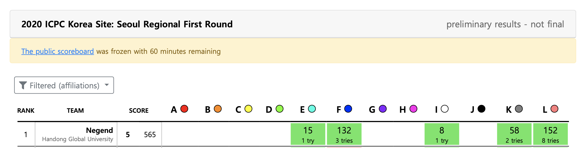

## 마지막 ICPC 참가

- 내년 10월에는 학교에 있을 가능성이 거의 0에 가깝기에 이제 진짜 마지막으로 ICPC에 참여하게 되었다.
- 작년에 Negend라는 팀명으로 함께 참가했던 진혀쿠님과 갇예준이 다 재학생인 덕분에 또다시 같은 팀으로 참가하게 되었다.
- 작년에 등록 문제를 제외하고 3문제를 풀었기에 **등수보다는 4문제 푸는 것을 목표로 참가**했다.

## 대회 후기

- 작년에는 대회 전날 엄청 긴장했었는데 오늘은 그런 것도 없었고 확실히 마음이 편했다.
- 하지만 막상 대회 시작하니 한국어 독해에 조금은 문제가 생겼었다 ㅋㅋ
- 진혁이랑 예준이랑 작년 ICPC 이후로 처음 같이 풀었는데 각자 자신의 방법으로 팀에 기여했다.
- 그리고 어찌어찌 문제를 풀어나가다 보니 총 5문제를 풀어낼 수 있었다!
- 등록 없이 5문제라니 기분 좋다~~ㅎㅎㅎㅎ



- 이 포스팅을 통해 간단하게 **우리가 풀었던 5문제의 접근법과 코드를 공유**하고자 한다.

## 문제 풀이

문제는 우리가 쉽게 접근했던 문제 순으로 나열했다.

### Problem I (Project Teams)

[백준 20044번 링크](https://www.acmicpc.net/problem/20044)

- 시험 시작하자마자 사람들이 풀어내는 걸 보고 나도 깊이 생각하지 않고 푼 문제였다.
- 능력치가 다른 사람들을 2인 팀을 꾸릴 때 밸런스가 맞춰져서 꾸려지도록 하는 문제였다.
- 간단하게 sort하고 [1, n - 1], [2, n - 2] 이렇게 매칭하며 팀원의 합이 최소가 되는 값을 출력했다.

```cpp
#include <cstdio>
#include <algorithm>

using namespace std;

int n, arr[100001], ans = 987654321;

int main(){
    scanf("%d", &n);
    for(int i = 0; i < n * 2; i++) {
        scanf("%d", &arr[i]);
    }

    sort(arr, arr+ 2 * n);

    for(int i = 0; i < n; i++){
        if(arr[i] + arr[2 * n - 1 - i] < ans) {
            ans = arr[i] + arr[2 * n - 1 - i];
        }
    }

    printf("%d\n", ans);
}
```

### Problem E (Cycle..?)

- I 풀고 왔는데 예준이가 문제 들고 와서 이거 그냥 Union Find로 풀면 된다고 해서 문제도 안 읽고 Input 설명만 듣고 바로 풀었다.
- Union Find를 활용해서 Cycle이 발생하는 최초 지점을 출력하면 된다.

```cpp
#include <cstdio>

int n, m, ans, par[1000001];

int find(int i){
    if(par[i] == i) return i;
    return par[i] = find(par[i]);
}

int main(){
    scanf("%d %d", &n, &m);
    for(int i = 0; i < n; i++){
        par[i] = i;
    }
    for(int i = 0; i < m; i++){
        int x, y;
        scanf("%d %d", &x, &y);
        int px = find(x), py = find(y);
        if(px == py){
            if(!ans)
                ans = i + 1;
        }
        par[px] = py;
    }
    printf("%d", ans);
}
```

### Problem K (Road Reconstruction)

[백준 20046번 링크](https://www.acmicpc.net/problem/20046)

- 이 문제는 시작점부터 끝점까지 가장 적은 비용으로 도로를 짓는 방법을 찾는 문제이다.
- input을 보고 시작점부터 끝점까지 길에 있는 값들의 합이 최소가 되는 방법을 찾으면 되는 문제로 생각했다.
- 처음에는 dfs와 dp로 접근했는데 TLE가 뜨는걸 확인하고 빠르게 다익스트라로 노선을 변경해서 문제를 해결했다.

```cpp
#include <cstdio>
#include <vector>
#include <algorithm>
#include <queue>

using namespace std;

#define pii pair<int, int>
#define pip pair<int, pii>

int n, m, arr[1001][1001], visited[1001][1001];
int d[4][2] = { { 0, -1 }, { 0, 1 }, { -1, 0 }, { 1, 0 } };

int main(){
    int ans = -1;

    scanf("%d %d", &n, &m);
    for(int i = 1; i <= n; i++){
        for(int j = 1; j <= m; j++){
            scanf("%d", &arr[i][j]);
        }
    }

    if(arr[1][1] == -1 || arr[n][m] == -1) {
        printf("-1\n");
        return 0;
    }

    priority_queue<pip, vector<pip>, greater<pip> > pq;
    pq.push(pip(arr[1][1], pii(1, 1)));

    while(!pq.empty()){
        pip top = pq.top();
        pq.pop();

        int v = top.first, x = top.second.first, y = top.second.second;

        if(x == n && y == m){
            ans = v;
            break;
        }

        if(visited[x][y])continue;

        for(int i = 0; i < 4; i++){
            int nx = x + d[i][0], ny = y + d[i][1];

            if(nx > n || ny > m || nx <= 0 || ny <= 0)continue;
            if(arr[nx][ny] == -1)continue;
            if(visited[nx][ny])continue;

            pq.push(pip(v + arr[nx][ny], pii(nx, ny)));
        }

        visited[x][y] = 1;
    }

    printf("%d\n", ans);
}
```

### Problem F (Escaping)

[백준 20041번 링크](https://www.acmicpc.net/problem/20041)

- 이 문제는 바둑판 위에 있는 도둑돌이 경찰돌을 피할 수 있는지 확인하는 문제이다.
- 개인적으로 이 문제는 좀 신박하게 풀었다는 생각에 기분이 좋다.
- 도둑돌이 모든 경찰돌을 피해가기 위해서는 도둑돌이 한방향으로 질주했을때 어떠한 경찰돌도 도둑돌을 잡지 못해야 하지 않을까 라고 생각했다.
- 그래서 4개의 방향으로 도둑점으로 부터 엄청 멀리 이동시켜 놓은 4개의 위치를 기억해놓았다.
- 그리고 각 위치에 도둑돌보다 먼저 도착하는 경찰돌이 있는지 확인하도록 했다.
- 그렇게 4개의 위치 모두 경찰돌들이 먼저 도착할 수 있다면 탈출이 불가능하다.

```cpp
#include <cstdio>
#include <vector>
#include <cmath>

#define ll long long
#define pll pair<ll, ll>
#define MAXDIS 20000000000

using namespace std;

long long n, ans, x, y;
pll arr[500001];
pll farthest[4];
int blocked[4];
int d[4][2] = { { 0, -1 }, { 0, 1 }, { -1, 0 }, { 1, 0 } };

int main(){
    scanf("%lld", &n);
    for(int i = 0; i < n; i++){
        long long a, b;
        scanf("%lld %lld", &a, &b);
        arr[i] = pll(a, b);
    }
    scanf("%lld %lld", &x, &y);

    for(int i = 0; i < 4; i++){
        long long nx = x + d[i][0] * MAXDIS, ny = y + d[i][1] * MAXDIS;
        farthest[i] = pll(nx, ny);
    }

    for(int i = 0; i < 4; i++){
        for(int j = 0; j < n; j++){
            long long nx = arr[j].first, ny = arr[j].second;
            long long dist = abs(farthest[i].first - nx) + abs(farthest[i].second - ny);
            if(dist <= MAXDIS){
                blocked[i] = 1;
                break;
            }
        }
    }

    for(int i = 0; i < 4; i++)
        ans += blocked[i];

    printf("%s\n", ans == 4 ? "NO": "YES");
}
```

### Problem L (동전 옮기기)

[백준 20047번 링크](https://www.acmicpc.net/problem/20047)

- 이 문제는 S의 두개의 동전을 교차하지 않는 선에서 이동시켜서 T라는 동전 리스트를 만들어야 한다.
- 이 문제를 나는 recursion을 이용해서 풀었다.
- 손가락이 위치한 동전을 fingers에 저장하고 S에서 두 동전을 뺀다.
- 이제 S와 T의 각 자리가 같은지 비교하며 같으면 다음으로 넘어가고 fingers를 넣어도 된다면 넣고 다음으로 보내본다.
- 그렇게 index에 fingerCnt(fingers 사용 횟수)를 더한 값이 n에 도달할 수 있다면 변환이 가능하다고 했다.

```cpp
#include <cstdio>
int n, x, y;
char S[10001], T[10001], fingers[2];

int findAnswer(int index, int fingerCnt){
    if(index + fingerCnt == n) return 1;

    if(S[index] == T[index + fingerCnt]){
        if(findAnswer(index + 1, fingerCnt)) return 1;
    }

    if(fingerCnt == 2)return 0;

    if(fingers[fingerCnt] == T[index + fingerCnt]){
        if(findAnswer(index, fingerCnt + 1)) return 1;
    }

    return 0;
}


int main(){
    scanf("%d\n%s\n%s\n%d %d", &n, S, T, &x, &y);
    fingers[0] = S[x], fingers[1] = S[y];

    int t = 0;
    for(int i = 0; i < n; i++){
        if(i == x || i == y)continue;
        S[t] = S[i];
        t++;
    }

    printf("%s\n", findAnswer(0, 0) ? "YES" : "NO");
}
```

## 대회를 마치며

- 기대도 안했는데 5문제 풀었다는 사실에 매우 만족했다. 작년에는 각각 마지막에 잡고 있던 문제를 못 풀고 끝내서 많이 아쉬웠는데 이번에는 진짜 잘 끝났다.
- 코드포스랑 구글 등 꾸준히 코딩대회에 참가한 덕을 참 많이 본 듯 하다ㅎㅎ
- 그리고 오랫만에 합을 맞췄는데도 팀워크 네전드 **진혁, 예준**에게 너무 감사하다!ㅎㅎ


```toc

```
