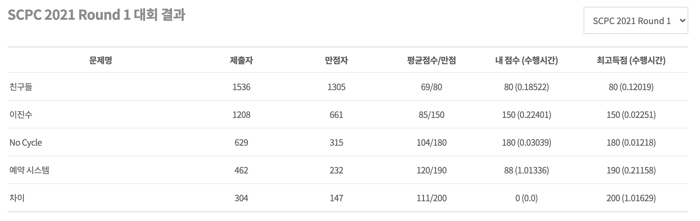

일을 하고 있지만 여전히 학생 신분을 벗어나진 않았기에 삼성전자에서 주관하는 대학생 프로그래밍 경진대회 SCPC(Samsung Collegiate Programming Cup)에 참여하게 되었다. 퇴근하기 직전까지 JS로 코드를 짜다가 C++을 사용하려 하니 ===과 const를 난발했지만, 예선은 시간적으로는 여유가 있기 때문에 구현 속도보다는 생각에 집중하며 진행할 수 있었다. 나는 총 3문제 반 정도를 풀었다.



다 풀지는 못했지만 그래도 나름 푼 문제들이 있기에 푼 방법에 대해서 오랜만에 문제 풀이를 공유를 해보려고 한다.

## 친구들

이 문제는 사람들이 주어지고 각 사람마다 친구의 번호를 가지고 있다. 이때 각 사람은 자신의 친구의 친구들과도 다 친구가 될 수 있다고 할 때 이런 친구들의 disjoint set의 개수를 구하는 문제이다.

union find를 통해 set을 만들고 set의 개수를 출력하도록 했다.

```cpp
#include <cstdio>

int par[100001], T;

int find(int x)
{
    return par[x] == x ? x : par[x] = find(par[x]);
}

int main()
{
    scanf("%d", &T);
    for (int t = 0; t < T; t++)
    {
        int n;
        scanf("%d", &n);

        for (int i = 0; i < n; i++)
            par[i] = i;

        for (int i = 0; i < n; i++)
        {
            int number;
            scanf("%d", &number);
            int next = i + number;
            if (next >= n)
                continue;
            par[find(i)] = par[find(next)];
        }
        int answer = 0;
        for (int i = 0; i < n; i++)
        {
            if (find(i) == i)
                answer++;
        }
        printf("Case #%d\n%d\n", t + 1, answer);
    }
}
```

## 이진수

이 문제 속에서 이진수 a에 문제에서 제공하는 룰을 거치게 되면 이진수 b가 만들어지게 되는데 역으로 b에서 a를 추론해내는 문제이다.

룰을 간단히 설명하면 이진수 a에서 각 자리를 i라고 할 때 i + n의 값이나 i - n의 값이 1이면 b의 i 값은 1이 된다.

이 때 답은 무조건 존재하고, 여러개 존재할 때는 가장 작은 이진수를 출력해야 했다. 이를 위해서 추론하려는 숫자 a의 각 자리(i)의 값을 왼쪽부터 하나씩 구해나갔다. 가장 작은 이진수를 만들기 위해 최대한 1이 오른쪽에(i + n)에 비치되고 i - n 값이 1이라면 i + n에는 추가적으로 1을 주지 않도록 하였다.

그리고 b의 i + n + n의 값이 0이면 a의 i + n 값을 1로 설정하면 안되기에 i - n 값을 1로 한다.(무조건 답이 있다는 전제가 있기 추가적인 검토는 하지 않았다.)

```cpp
#include <cstdio>

int T, n, t, input[50001], answer[50001];

int main()
{
    scanf("%d", &T);
    for (int tc = 0; tc < T; tc++)
    {
        scanf("%d %d", &n, &t);
        for (int i = 0; i < n; i++)
        {
            scanf("%1d", &input[i]);
            answer[i] = 0;
        }

        for (int i = 0; i < n; i++)
        {
            if (!input[i] || (i - t >= 0 && answer[i - t]))
                continue;

            if (i + t < n && ((i + t + t >= n) || (i + t + t < n && input[i + t + t])))
                answer[i + t] = 1;
            else if (i - t >= 0)
                answer[i - t] = 1;
        }

        printf("Case #%d\n", tc + 1);
        for (int i = 0; i < n; i++)
            printf("%d", answer[i]);
        printf("\n");
    }
}
```

## No Cycle

이 문제는 자고 일어나서 샤워하다가 방법이 떠올라서 풀었다. 이 문제는 나름 생각을 많이 했던 문제로 생각을 진행한 과정을 나눠보려 한다.

문제는 Directed Graph가 주어지고 몇개의 방향이 아직 정해지지 않은 edge들이 주어지는데 이 때 사이클이 생기지 않는 선에서 edge들의 방향을 정해주어야 했다. 답은 각각의 edge의 방향을 0아니면 1로 순서대로 나타내어 하나의 문자열로 나타내야 하는데 방법이 여러개인 경우 사전 순에서 가장 빠른 문자열을 출력하도록 해야한다.

사전 순으로 가장 빠른 답을 찾기 위해서 모두 0인 경우부터 재귀적으로 찾으면 총 2^(방향이 없는 노드의 수)\*(사이클 확인에 걸리는 비용)이 걸리기 된다.

최대 node의 수는 500개에 방향이 정해지지 않은 edge의 수는 2000개 가량이기에 무조건 시간을 초과하게 될 것이기에 재귀가 없어야 하나 라는 생각이 들게 되었다. 근데 재귀적으로 하지 않고 순서대로 edge들의 사이클이 발생하지 않도록 방향을 정해 나가다가 어떤 edge가 어떤 방향으로 해도 사이클이 발생할 때를 어떻게 해야하지 라는 생각에 잠기게 되었다. 그러다 edge의 두 방향 모두 사이클을 발생시키는 경우가 있나라는 생각이 들어 바로 그림을 그려보기 시작했다.

그림을 그려보니 방향을 정해줘야 햐는 edge를 추가하기 전에 이미 사이클이 존재하는 상황이 아니라면 edge는 반드시 사이클을 피할 수 있다는 걸 알게 되었다.

그래서 주어진 순서대로 사이클이 발생하지 않는 걸 보장하며 edge의 방향을 정해나간다면 정답을 찾을 수 있었다.

사이클 여부를 확인하는 방식은 dfs를 응용해서 구현했다.

```cpp
#include <cstdio>
#include <vector>
#define pii pair<int, int>

using namespace std;

int T, n, m, k, answer[2001];
int visited[501], recStack[501];
vector<int> edges[501];
vector<pii> undefinedPairs;

int checkCycle(int x)
{
    if (!visited[x])
    {
        visited[x] = true;
        recStack[x] = true;
        for (int i = 0; i < edges[x].size(); i++)
        {
            int next = edges[x][i];
            if (!visited[next] && checkCycle(next))
                return true;

            else if (recStack[next])
                return true;
        }
    }
    recStack[x] = false;
    return false;
}

int run(int index)
{
    if (index == k)
        return true;
    pii undefinedPair = undefinedPairs[index];
    int x = undefinedPair.first, y = undefinedPair.second;
    edges[x].push_back(y);
    for (int i = 0; i <= n; i++)
    {
        recStack[i] = false;
        visited[i] = false;
    }
    int isCycle = checkCycle(x);
    if (isCycle)
    {
        answer[index] = 1;
        edges[x].pop_back();
        edges[y].push_back(x);
    }
    run(index + 1);
    return false;
}

int main()
{
    scanf("%d", &T);
    for (int t = 1; t <= T; t++)
    {
        scanf("%d %d %d", &n, &m, &k);

        for (int i = 0; i <= n; i++)
            edges[i].clear();

        for (int i = 0; i <= k; i++)
            answer[i] = 0;

        undefinedPairs = vector<pii>(k);
        for (int i = 0; i < m; i++)
        {
            int x, y;
            scanf("%d %d", &x, &y);
            edges[x].push_back(y);
        }
        for (int i = 0; i < k; i++)
        {
            int x, y;
            scanf("%d %d", &x, &y);
            undefinedPairs[i] = pii(x, y);
        }
        run(0);

        printf("Case #%d\n", t);
        for (int i = 0; i < k; i++)
            printf("%d", answer[i]);
        printf("\n");
    }
}
```

## 예약 시스템

이 문제는 좀 아쉽다ㅠㅠ 아이디어가 떠오르고 이를 그려보면서 기대감이 컸는데 부분 점수에서 마무리 하게 되었다.

두줄로 되어있는 방들에 사람들을 한명씩 배치해야 한다. 사람들은 5명 이상의 그룹으로 오게 되는데 바로 옆방이나 앞방에 다른 그룹 사람이 오게 되면 스트레스를 받게 된다. 각 사람마다 스트레스 값이 주어질 때 모든 사람의 스트레스 값의 합이 최소가 되는 방법을 찾아야 한다.

어떻게 해야 스트레스를 최소로 할 수 있을까를 고민하다 제일 먼저 떠오른 방법은 같은 그룹 사람들끼리 최대한 뭉쳐 놓는 것이다. 그리고 다른 그룹과 마주치는 지점을 최소화하고 그 위치에 스트레스가 적은 사람들을 배치하게 하는 방법이다.

각 그룹에서 스트레스 값이 가장 작은 4명의 스트레스 값을 a, b, c, d라고 할때, 짝수인 경우 a+b+c+d가 최소값이 되고 홀수인 경우 2\*a+b+c+d가 최소값이 된다.

이 때 주의할 점은 양 끝의 방들의 경우 다른 팀과 접촉점이 없기 때문에 벽이 아닌 반대쪽에 다른 그룹과 접촉하는 2명(a,b)의 스트레스값만 고려하면 된다. 양 끝에는 이렇게 스트레스가 최소화될 수 있는 그룹은 벽과 마주했을 때 가장 스트레스값이 많이 줄어드는 그룹으로, c+d값이 가장 큰 두 그룹을 위치시켰다.

그렇게 모든 그룹의 스트레스 값을 더해주고 이를 출력했다.

아쉽게도 이 방식은 마지막 케이스(그룹 인원이 홀수도 되고 짝수도 되는 경우)는 통과하지 못했다. 양 끝에 위치 시킬 그룹을 못 정해서 인지, 그룹 내의 사람들을 위치 시키는 다른 방법도 고려해야 하는 건지 결국 풀지 못했다.

혹시 이 문제에 대한 풀이를 안다면 댓글 남겨주면 좋겠다 🙏

```cpp
#include <cstdio>
#include <algorithm>

using namespace std;

int T, n, m, l[100001], s[100001];
int endSum[100001], sum[100001], sumDiff[100001];

int findEndIndex()
{
    int index = 0;
    int maxValue = 0;
    for (int i = 0; i < n; i++)
    {
        if (sumDiff[i] <= maxValue)
            continue;

        index = i;
        maxValue = sumDiff[i];
    }
    sumDiff[index] = -1;
    return index;
}

int main()
{
    scanf("%d", &T);
    for (int t = 1; t <= T; t++)
    {
        oddCount = 0;

        scanf("%d %d", &n, &m);
        for (int i = 0; i < n; i++)
        {
            scanf("%d", &l[i]);

            for (int j = 0; j < l[i]; j++)
                scanf("%d", &s[j]);

            sort(s, s + l[i]);

            // 홀수
            if (l[i] % 2)
            {
                endSum[i] = s[0] * 2 + s[1];
                sum[i] = s[0] * 2 + s[1] + s[2] + s[3];
            }
            else
            {
                endSum[i] = s[0] + s[1];
                sum[i] = s[0] + s[1] + s[2] + s[3];
            }
            sumDiff[i] = s[2] + s[3];
        }
        // 두개일 때는 안되지
        int leftEndIndex = findEndIndex();
        int rightEndIndex = findEndIndex();

        long long answer = 0;

        for (int i = 0; i < n; i++)
        {
            if (i == leftEndIndex || i == rightEndIndex)
                answer += endSum[i];
            else
                answer += sum[i];
        }
        printf("Case #%d\n", t);
        printf("%lld\n", answer);
    }
}
```

## 예선 후기

오랜만에 긴장감 속에서 문제를 풀어보니 속도는 느렸지만 나름 욕심도 생기면서 스포츠를 하는 느낌이 들었다. 특히 No Cycle 해결 방법이 떠오르고 딱 풀었을 때는 짜릿했다^^ 다음 라운드에 참여할 수 있을지 모르겠지만 기회가 된다면 또 재밌게 참여해보고 싶다.
