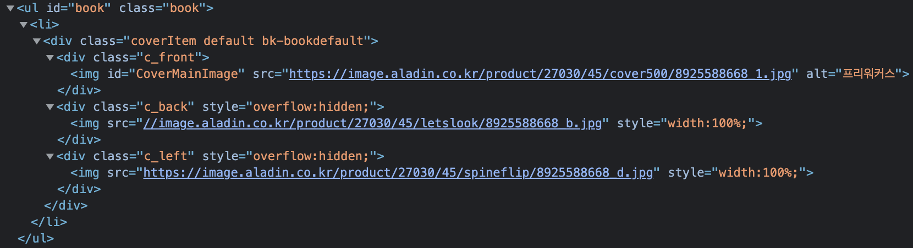

## 💥 동기

회사에서 독서비를 지원해주는 덕에 코로나 한참 전부터 거리두기를 하던 책을 조금씩 읽기 시작했다. 최근에 책을 알아보러 [알라딘](https://www.aladin.co.kr/shop/wproduct.aspx?ItemId=270304512)에 들어가보니 책에 마우스를 올리면 책을 돌려볼 수 있도록 되어있었다.

요즘 three.js에 대해 호기심이 있었는데 이 기회에 three.js 경험해볼 겸 혹시 다른 사이드 프로젝트에서 써먹어볼 수 있지 않을까 하는 마음으로 알라딘의 책을 three.js로 클론해보게 되었다.(알라딘에서 책의 앞, 뒤, 옆면에 사용할 이미지 소스도 구할 수 있어서 너무 좋았다.😊)


클론을 하면서 이런저런 소스를 통해서 three.js를 조금은 이해해볼 수 있게 되었는데 혹시 three.js를 뭔가를 만들어보면서 공부해보고 싶으신 분들을 워해 과제 형식으로 내용을 정리 해보았다.

## 🎮 알라딘 책 클론해보기

### 🤔 과제

알라딘의 책 미리보기를 three.js를 통해 최대한 유사하게 구현해본다.

> 제한시간: 5시간(긴장감을 위해)

### 🧺 준비물

책의 앞, 뒤, 옆면에서 사용할 이미지는 [여기](https://github.com/zoomKoding/3d-book/tree/master/public/images)에서 받을 수 있다. 다른 책의 표지를 얻어오고 싶다면 알라딘에서 원하는 책을 검색해서 아래처럼 개발자 도구를 통해 가져올 수 있다.



### ✅ 요구사항

- [ ] 처음에는 책의 정면이 보여지게 하기
- [ ] 마우스를 책에 올리면 책의 옆면이 살짝 보이도록 돌리기
- [ ] 알라딘 미리보기와 동일한 그림자 구현하기
- [ ] (선택) 클릭 시 책이 180도 회전하게 하기

### 🍄 레퍼런스

- [https://www.youtube.com/watch?v=cghSq_dlgYU&t=733s](https://www.youtube.com/watch?v=cghSq_dlgYU&t=733s)
- [https://threejs.org/docs/index.html#manual/en/introduction/Creating-a-scene](https://threejs.org/docs/index.html#manual/en/introduction/Creating-a-scene)

**아래부터는 내가 만든 방법에 대한 설명이다.(🔥스포주의!)**

<br/><br/>

## 🧠 내가 만든 방법

내가 구현항 방법은 다음 링크에서 볼 수 있다.

- github: [https://github.com/zoomkoding/3d-book](https://github.com/zoomkoding/3d-book)
- demo: [https://zoomkoding.github.io/3d-book](http://zoomkoding.github.io/3d-book/)

내 블로그나 다른 프로젝트에서 사용할지도 모르기에 React로 개발해서 배포해놓았다.

## 🖲 기본 구조 만들기

먼저 three.js로 3D 세상에 세트장을 만들어보자.

### 🌉 Scene

`Scene`은 말그대로 장면을 의미한다. 무언가를 보여주기 위해서는 scene을 먼저 만들어야 한다.

```jsx
const scene = new THREE.Scene();
scene.background = new THREE.Color(style.background);
```

그리고 나서 만든 scene에서 보여줄 여러 요소들을 추가한다.

### 📷 Camera

`Camera`는 말그대로 카메라로 Scene의 어디서, 어디를, 어떻게 보고 있게 할 것인가를 정의할 수 있다. 나는 이번 프로젝트에서 사람의 눈을 가장한 방식의 카메라인 `PerspectiveCamera`를 사용하였다.

```jsx
const camera = new THREE.PerspectiveCamera(70, aspect, 1, 1000);
camera.position.set(0, 0, 6);
```

### 🎥 WebGLRenderer

`Scene`과 `Camera`가 준비되었다면 이제 보여주기를 하기 위한 기본 환경은 준비가 완료되었다. 이를 실제로 보여주기 위해서는 `WebGLRenderer`를 사용해야 한다.

`WebGLRenderer`는 말 그대로 내가 만든 Scene을 WebGL을 활용해서 보여주는 역할을 한다. 나는 renderer를 만들면서 그림자가 보여질 수 있도록 `shadowMap`을 설정해주었다.

```jsx
const renderer = new THREE.WebGLRenderer();
renderer.shadowMap.enabled = true;
renderer.shadowMap.type = THREE.PCFSoftShadowMap;
renderer.setSize(style.width, style.height);
```

그리고 나서 이렇게 아래와 같이 animate 함수를 통해 `render`를 진행하면 screen에 변화되는 내용을 지속적으로 그릴 수 있게 된다. 여기서 setInterval이 아닌 `requestAnimationFrame`를 사용하는 이유는 많지만 특히 브라우저의 다른 탭으로 이동했을 때는 반복이 잠시 멈춰서 쓸데없는 배터리 소모가 없다고 한다.

```jsx
function animate() {
  requestAnimationFrame(animate);
  renderer.render(scene, camera);
}
animate();
```

## 📦 물체 추가하기

그럼 이제 본격적으로 물체들을 추가해보자. `Mesh`는 Object의 기본틀이다. Mesh에 여러 Material을 추가하면서 물체를 만들 수 있다. 이 과제를 해결하기 위해서 추가해야하는 Mesh는 뭐가 있을까? 언뜻 생각하면 책만 있으면 될 것 같지만 책에 있는 그림자가 보여지기 위해 그림자가 비추어질 물체도 필요하다.

### 🌘 plane (그림자를 위한 배경)

혹시 추가 구현인 회전을 위해서 그림자를 보여줄 물체는 특정 색깔을 가지고 있지 않고 그냥 그림자만 보여줄 수 있다면 최고일 것이다. 이를 위해서 그림자만을 받고 다른 부분들을 모두 투명한 상태인 `ShadowMaterial`을 활용했다.

```jsx
const planeGeometry = new THREE.PlaneGeometry(500, 500, 32, 32);
const planeMaterial = new THREE.ShadowMaterial();
planeMaterial.opacity = 0.5;

const plane = new THREE.Mesh(planeGeometry, planeMaterial);
plane.receiveShadow = true;
scene.add(plane);
```

### 📓 cube (책)

책을 만들기 위해서는 육면체인 `BoxGeometry`에 사이즈를 정해 책의 형태를 만들고 책의 6개의 면에 들어갈 Material를 `getBookMaterials` 함수를 통해 구현하였다.

```jsx
const geometry = new THREE.BoxGeometry(3.5, 5, 0.5);
const cube = new THREE.Mesh(geometry, getBookMaterials(bookCovers));
cube.castShadow = true;
cube.position.set(0, 0, 0);
scene.add(cube);
```

책의 육면에 들어갈 Material을 정의하는 함수는 다음과 같다. 6개 면을 돌면서 각 면에 해당하는 image Url이 넘어오면 Image를 `TextureLoader`를 통해 이미지를 넣어서 면에 해당하는 Material을 반환하고 없다면 흰색 Material을 반환하도록 구현하였다.

```jsx
const getBookMaterials = (urlMap) => {
  const materialNames = ['edge', 'spine', 'top', 'bottom', 'front', 'back'];
  return materialNames.map((name) => {
    if (!urlMap[name]) return new THREE.MeshBasicMaterial(0xffffff);

    const texture = new THREE.TextureLoader().load(urlMap[name]);

    // to create high quality texture
    texture.generateMipmaps = false;
    texture.minFilter = THREE.LinearFilter;
    texture.needsUpdate = true;

    return new THREE.MeshBasicMaterial({ map: texture });
  });
};
```

### 💡 Light

그럼 이제 조명을 설치해보자. 조명의 위치와 각도를 잘 조정해줘야 책 뒤에 자연스러운 그림자가 생겨날 것이다. 이를 위해서 특정 지점에서 빛을 쏘는 `DirectionalLight`를 활용하였다.

```jsx
const light = new THREE.DirectionalLight(0xffffff, 1);
light.position.set(-10, 10, 10);
light.castShadow = true;
scene.add(light);
```

## 🤸‍♂️ 회전시키기

이제 책에 마우스를 호버했을 때 책이 움직이도록 해보자. 근데 알라딘의 책이 움직이는 걸 보면 책이 움직임에 따라 우측에 보이던 그림자가 갑자기 사라지는 것을 볼 수 있다. 조명이 좌상단에 있다면 책을 돌린다고 그림자가 사라지면 안되는데 뭔가 이상했다. 같은 구도로 실제로 책과 조명을 위치시키고 책을 돌리다가 이게 불가능하다는 것을 알게 되었다.

그러다 책을 돌리는 것이 아니라 내 눈의 위치를 바꿔야한다는 것을 알게 되었다. 이런 부분은 2D 세계에서 고민해보지 못했던 것이라 신기했다ㅎㅎ

먼저 마우스가 올라와있는지 여부를 확인하기 위해 `eventListener`를 추가했다.

```jsx
let isMouseOver = false;
refCurrent.addEventListener('mouseover', () => {
  isMouseOver = true;
});
refCurrent.addEventListener('mouseleave', () => {
  isMouseOver = false;
});
```

그럼 마우스가 위에 있으면 최대 135도까지 카메라를 회전시키고 마우스가 떠나면 다시 원래 위치로 서서히 돌아오도록 만들었다. 여기서 카메라의 위치가 바뀌어도 계속 scene을 보고 있도록 lookAt 함수를 활용했다.

```jsx
const animate = () => {
  requestAnimationFrame(animate);
  isMouseOver ? rotate() : rotateBack();
  camera.lookAt(scene.position);
  renderer.render(scene, camera);
};
```

카메라와 물체의 거리를 유지한 상태로 각도만 바꾸기 위해서 오랜만에 삼각함수를 활용하여 x와 z 값을 구했다.
책과의 거리는 `distanceTo` 함수를 사용하면 간단하게 구할 수 있었다.

```jsx
const distance = camera.position.distanceTo(cube.position);

const rotate = () => {
  if (degrees < 135) {
    degrees += 2;
    const radian = degrees * (Math.PI / 180);
    camera.position.x = Math.cos(radian) * distance;
    camera.position.z = Math.sin(radian) * distance;
  }
};

const rotateBack = () => {
  if (degrees > 90) {
    degrees -= 2;
    const radian = degrees * (Math.PI / 180);
    camera.position.x = Math.cos(radian) * distance;
    camera.position.z = Math.sin(radian) * distance;
  }
};
```

## ⚡️최종 코드

이렇게 구현한 [3d-book](https://github.com/zoomkoding/3d-book)의 최종 코드는 다음과 같다!

```jsx
import React, { useEffect, useRef } from 'react';
import * as THREE from 'three';

const Book = (props) => {
  const mountRef = useRef(null);

  useEffect(() => {
    const { bookCovers, style } = props;
    const aspect = style.width / style.height;

    const getBookMaterials = (urlMap) => {
      const materialNames = ['edge', 'spine', 'top', 'bottom', 'front', 'back'];
      return materialNames.map((name) => {
        if (!urlMap[name]) return new THREE.MeshBasicMaterial(0xffffff);

        const texture = new THREE.TextureLoader().load(urlMap[name]);

        // to create high quality texture
        texture.generateMipmaps = false;
        texture.minFilter = THREE.LinearFilter;
        texture.needsUpdate = true;

        return new THREE.MeshBasicMaterial({ map: texture });
      });
    };

    const refCurrent = mountRef.current;
    const scene = new THREE.Scene();
    scene.background = new THREE.Color(style.background);

    const planeGeometry = new THREE.PlaneGeometry(500, 500, 32, 32);
    const planeMaterial = new THREE.ShadowMaterial();
    planeMaterial.opacity = 0.5;

    const plane = new THREE.Mesh(planeGeometry, planeMaterial);
    plane.receiveShadow = true;
    scene.add(plane);

    const light = new THREE.DirectionalLight(0xffffff, 1);
    light.position.set(-10, 10, 10);
    light.castShadow = true;
    scene.add(light);

    const geometry = new THREE.BoxGeometry(3.5, 5, 0.5);
    const cube = new THREE.Mesh(geometry, getBookMaterials(bookCovers));
    cube.castShadow = true;
    cube.position.set(0, 0, 0);
    scene.add(cube);

    let isMouseOver = false;
    refCurrent.addEventListener('mouseover', () => {
      isMouseOver = true;
    });
    refCurrent.addEventListener('mouseleave', () => {
      isMouseOver = false;
    });

    let degrees = 90;

    const camera = new THREE.PerspectiveCamera(70, aspect, 1, 1000);
    camera.position.set(0, 0, 6);

    const renderer = new THREE.WebGLRenderer();
    renderer.shadowMap.enabled = true;
    renderer.shadowMap.type = THREE.PCFSoftShadowMap;
    renderer.setSize(style.width, style.height);

    const distance = camera.position.distanceTo(cube.position);

    const rotate = () => {
      if (degrees < 135) {
        degrees += 2;
        const radian = degrees * (Math.PI / 180);
        camera.position.x = Math.cos(radian) * distance;
        camera.position.z = Math.sin(radian) * distance;
      }
    };

    const rotateBack = () => {
      if (degrees > 90) {
        degrees -= 2;
        const radian = degrees * (Math.PI / 180);
        camera.position.x = Math.cos(radian) * distance;
        camera.position.z = Math.sin(radian) * distance;
      }
    };

    const animate = () => {
      requestAnimationFrame(animate);
      isMouseOver ? rotate() : rotateBack();
      camera.lookAt(scene.position);
      renderer.render(scene, camera);
    };

    refCurrent.appendChild(renderer.domElement);
    animate();

    return () => {
      refCurrent.removeChild(renderer.domElement);
    };
  }, [props]);

  return <div ref={mountRef} style={props.style} />;
};
export default Book;
```

## 🤩 느낀점

뭔가 새로웠다. 여태까지의 개발은 모니터라는 단면에서 보여지는 세상을 그리는 느낌이었다면 이번 개발은 뭔가 세트장을 꾸며놓고 보여질 장면을 촬영하는 느낌이었다. 안 쓰던 삼각함수도 좀 써보고 실제로 책도 돌려보면서 만들어내다보니 개발하다보니 재미도 있고 보람도 있었다.

이게 어떻게 쓰일지 모르겠지만 3d로 만들어 볼만 한 것들을 좀 고민해봐야겠다ㅎㅎ

```toc

```
