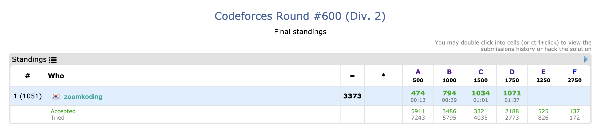
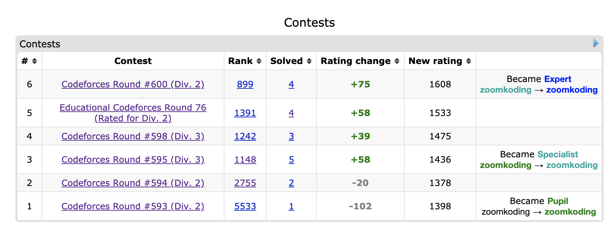

## 후기

- 블루의 문턱에 가까워지고 있음을 느끼며 쳤던 시험..
- 등록하는 걸 깜빡해서 추가 신청하고 허둥지둥 시험을 쳐버렸다.



- 결과는... 4문제를 풀어 3373점으로 역대 최고점...!!!!
- 블루 넘나 싶었는데 아니나 다를까 이번 휴학의 하나의 목표인 **코드포스 블루**를 찍어버렸다!!ㅎㅎㅎ



- 간단하게 문제 풀이를 해보도록 하겠다!

## A. Single Push

[문제 링크](https://codeforces.com/contest/1253/problem/A)

- 이 문제는 차이가 같은 구간이 1개 이하로 있다면 YES 아니면 NO를 출력하면 되는 문제이다.
- 마음이 급하다 보니 간단한 구현 문제인데도 허둥지둥했다.
- 다행히 10분만에 제출한 게 정답이 됐다.

```cpp
#include <cstdio>
int k, n, a[100001], b[100001];
int main(){
    scanf("%d", &k);
    while(k--){
        int dif = 0, valid = 1, start = 0, end = 0;
        scanf("%d", &n);
        for(int i = 0; i < n; i++)scanf("%d", &a[i]);
        for(int i = 0; i < n; i++)scanf("%d", &b[i]);
        for(int i = 0; i < n; i++){
            if(start == 0 && dif != a[i] - b[i]){
                start = 1;
                dif = a[i] - b[i];
                if(dif > 0){
                    valid = 0;
                    break;
                }
            }
            else if(start == 1 && a[i] - b[i] == 0){
                end = 1;
                dif = 0;
            }
            else if(start == 1 && a[i] - b[i] != dif){
                valid = 0;
                break;
            }
        }
        if(valid)printf("YES\n");
        else printf("NO\n");
    }
}
```

## B. Silly Mistake

[문제 링크](https://codeforces.com/contest/1253/problem/B)

- 이 문제도 어떻게 보면 현재 오피스에 오늘 사람들이 한번만 들어왔다가 잘 나갔는지 확인해주면서 사무실에 아무도 없을 때 날짜를 바꿔버리면 되는 구현 문제이다.
- 근데 문제는 구현하면서 또 마음이 급하니까 실수가 많아진다는 것이다. 문제 제목대로 silly mistake가 많아진다.
- 다 돌았는데도 오피스에 사람이 있다면 그건 안되는 상황인데 처리를 안해줘서 두번 제출해버렸다.

```cpp
#include <cstdio>
#include <vector>
using namespace std;
int n, arr[1000001], cur, date = 1, valid = 1, office[1000001], day[1000001];
vector<int> v;
int main(){
    scanf("%d", &n);
    for(int i = 0; i < n; i++)scanf("%d", &arr[i]);
    for(int i = 0; i < n; i++){
        int who = 0;
        if(arr[i] < 0){
            who = -arr[i];
            if(office[who] == 0){
                valid = 0;
                break;
            }
            cur--;
            office[who]--;
            if(cur == 0){
                v.push_back(i);
                date++;
            }
        }
        else{
            who = arr[i];
            if(office[who] == 1){
                valid = 0;
                break;
            }
            if(day[who] == date){
                valid = 0;
                break;
            }
            office[who]++;
            day[who] = date;
            cur++;
        }
    }
    if(cur != 0)valid = 0;
    if(valid){
        printf("%lu\n", v.size());
        printf("%d ", v[0] + 1);
        for(int i = 1; i < v.size(); i++){
            printf("%d ", v[i] - v[i - 1] );
        }
    }
    else printf("-1");
}
```

## C. Sweets Eating

[문제 링크](https://codeforces.com/contest/1253/problem/C)

- 일단 이 문제를 이해하는데 10분이 걸렸다.. 영어는 너무 힘들다ㅠㅠㅠㅠ
- k일때의 값을 가장 작게 하기 위해서는 일단 sorting한 다음에 k번째부터 1번까지 순서대로 먹어줘야 한다.
- 왜냐하면 날이 갈 수록 당도가 날수 만큼 곱해진다고 했기 때문에 더 작은 값에 곱을 해서 먹는게 penalty가 적을 것이기 때문이다.
- 이 때, 이걸 미리 i번째 까지의 sum을 arr[i]에 저장해놓고 각 최소 값을 담은 ans[i]에다가 i-m번째에서 구해놓은 답을 이용해 arr[i] + ans[i - m] 값을 저장해줬다.

```cpp
#include <cstdio>
#include <algorithm>
using namespace std;
long long n, m, arr[200001], ans[200001];
int main(){
    scanf("%lld %lld", &n, &m);
    for(int i = 0; i < n; i++)scanf("%lld", &arr[i]);
    sort(arr, arr + n);
    for(int i = 1; i < n; i++)arr[i] += arr[i - 1];
    for(int i = 0; i < m; i++)ans[i] = arr[i];
    for(int i = m; i < n; i++)ans[i] = arr[i] + ans[i - m];
    for(int i = 0; i < n; i++)printf("%lld ", ans[i]);
}
```

## D. Harmonious Graph

- 이 문제까지 오는데 걸린 시간 1시간... 1시간 잡고 있으면 어떻게든 풀지 않을까하고 집중하고 풀기로 했다.
- 문제는 보고 disjoint set이 떠올랐다. union-find를 이용해서 부모를 찾아 저장해주면 되지 않을까 했다 ㅎㅎ
- 근데 여기서 문제는 우리가 원하는 거는 각 set에 있는 제일 큰 값을 알아야 한다.
- 그래야 각 set을 연결할 필요가 있는지 없는지 알 수 있기 때문이다.
- 먼저 들어오는 edge로 set을 만들어준다. 이 때 par에 저장되는 값은 제일 큰 값이다.
- 모든 edge에서 set을 만든 후에 1번 노드부터 n번 노드까지 돌면서 현재까지 발견된 par값중에 제일 큰 값을 cmp에 저장한다.
- cmp보다 현재 index가 크면 그냥 현재 par[i]를 cmp에 저장한다.
- 현재 index가 cmp보다 작으면 i가 속한 set의 최대값을 px에 저장하고 아래 과정을 진행한다.
- cmp가 현재 px과 같으면 패쓰, 다른데 cmp보다 작으면 par[px] = cmp로 바꿔주고 edge를 하나 추가해준다.
- cmp보다 px가 크면 par[cmp]를 px로 바꿔준다.

```cpp
#include <cstdio>
#include <algorithm>
using namespace std;
int n, m, par[200001], cmp, ans;

int find(int x) {
    if (x == par[x])return x;
    return par[x] = find(par[x]);
}

int main(){
    scanf("%d %d", &n, &m);
    for(int i = 1; i <= n; i++)par[i] = i;
    for(int i = 0; i < m; i++){
        int v1, v2;
        scanf("%d %d", &v1, &v2);
        int p1 = find(v1), p2 = find(v2);
        if(p1 == p2)continue;
        if(p1 < p2)swap(p1, p2);
        par[p2] = p1;
    }
    cmp = find(1);
    for(int i = 2; i <= n; i++){
        int px = find(i);
        if(i > cmp)cmp = px;
        else{
            if(px == cmp){
                continue;
            }
            else if(px < cmp){
                ans++;
                par[px] = cmp;
            }
            else {
                ans++;
                par[cmp] = px;
                cmp = px;
            }
        }
    }
    printf("%d", ans);
}
```

## 느낀점

- 드디어 블루다... 이렇게 빨리 도달할지는 몰랐지만 너무 기분이 좋다!!ㅎㅎㅎ
- 당분간은 PS는 좀 쉬면서 인턴 준비에 박차를 가해야겠다!! 고생했다!

```toc

```
