## 🤓 이 글의 목적

입사하기 전 한달 조금 넘는 기간 동안 개인 프로젝트를 진행했다. 이 프로젝트는 찐 개인 프로젝트로 기획, 디자인, 개발, 홍보, 유지보수까지 다 직접 진행하여 현재 서비스하고 있다. 이 글을 통해 이 프로젝트의 과정과 경험을 나눠보고자 한다.

## 🧩 대학시간은..!

대학시간은 수강신청을 도와주는 웹사이트로, 1월 중순에 배포하여 유지보수를 진행하고 있다.


- [웹사이트 링크](http://www.timetable.college/handong)
- [깃헙레포 링크](https://github.com/zoomKoding/college-timetable)

감사하게도 한학기 학생 수의 절반이 넘는 1600명이 대학시간을 이용했다!🌝

먼저, 개발에 사용한 기술스택은 다음과 같다.

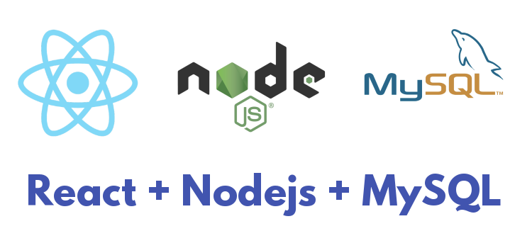

## 🎨 직접 기획하고 디자인하기

작년 우아한테크캠프에서 만났던 해민이와의 프로젝트 이후에 디자인에 대한 욕심이 생겼고 당시 해민이가 추천해줬던 디자인 레퍼런스 사이트인 [Dribbble](https://dribbble.com/)을 활용해서 웹 디자인에 도전하게 되었다.

### 💅 디자인 도전기

일단 내 눈을 높여 놓자는 마음으로 이 프로젝트를 기획하는 일주일 동안 Dribbble을 참고해서 눈을 높이는데 집중했다. 그리고 참고할 만한 디자인을 찾아 스크랩하게 되었다.


처음에는 Dribbble에 있는 디자인을 고대로 따라하려 했지만 완전 도일한 서비스가 아니다보니 적용이 쉽지 않았다...ㅎㅎ 결국 계속 부분부분을 참고하며 직접 디자인을 진행하게 되었고 이것저것을 추가해보면서 괜찮다 싶은 디자인을 찾게 되었다. (딱보면 이쁜 건 있는데 막상 만들고 보면 뭔가 아쉽다..ㅋㅋ)

특히 이번 프로젝트에서는 모바일 경험에 집중하게 되었다. 그 이유로 수강신청 준비는 사실 검색과 시간표를 한번에 보는 것이 편리하기 때문에 당연히 컴퓨터를 이용해서 진행할 것이라는 예상과는 달리 사람들은 모바일에 집중했다. 실제로도 Mobile Web 사용자가 훨씬 많았다. 그래서 모바일에서 사용감을 좋은 디자인을 찾기 위해 노력했다.


### 🐥 첫 디자인

디자인을 진행할 때는 Figma나 Sketch와 같은 툴을 사용하지 않고 바로 CSS 작업을 진행하게 되었다. 아무래도 디자인 툴들은 아직 잘 못 다루다 보니 오히려 CSS를 바로 작업하면서 변화를 직접 관찰하는 편이 편했다. 그렇게 계속해서 조금씩 디자인을 바꾸다 보니 디자인이 조금씩 나아지기(?) 시작했다..! 아래는 CSS로 완성된 첫 디자인결과물이다.

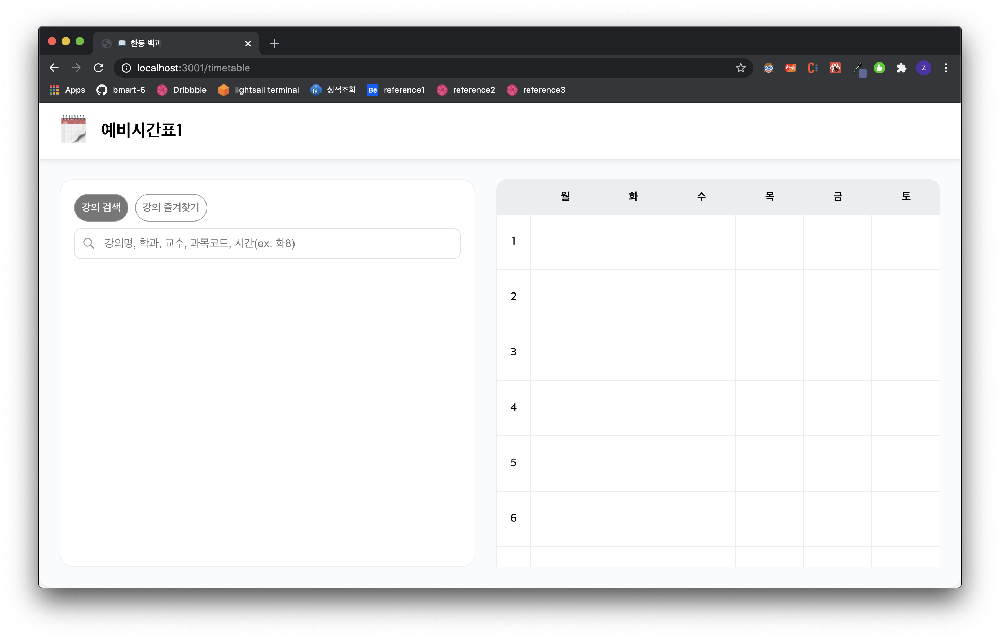

### 🐓 현재 디자인

고민하고 이것저것을 적용하며 만들어진 최종 디자인의 모습이다.

<center><strong>데스크탑 뷰</strong></center>

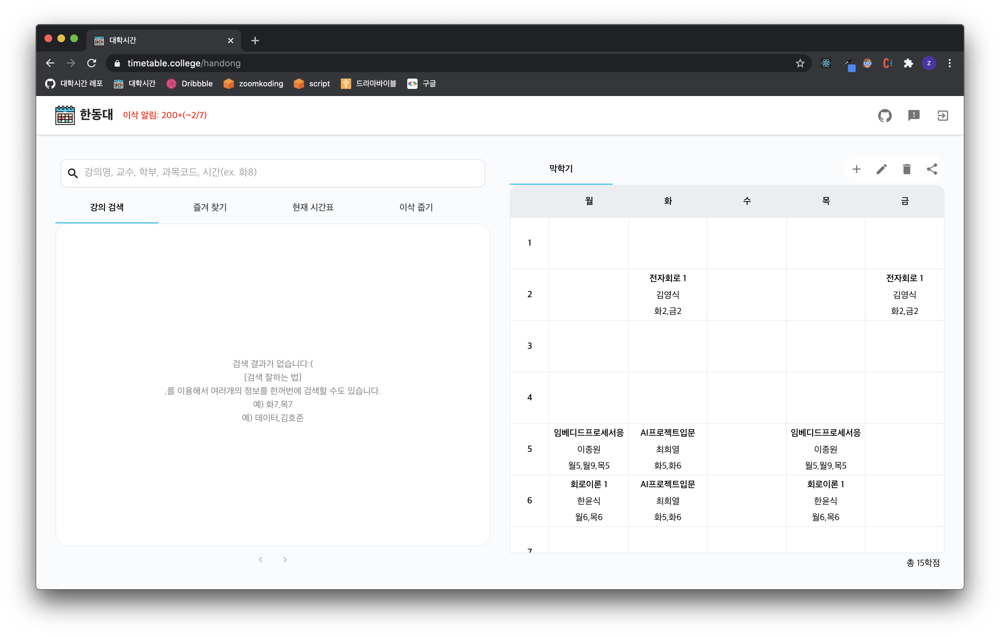

<br/>

<center><strong>모바일 뷰</strong></center>

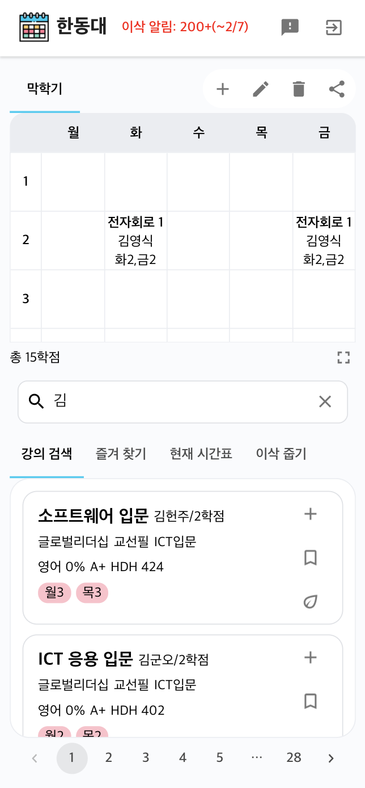

<br/>

## 📱기술 스택 정하기

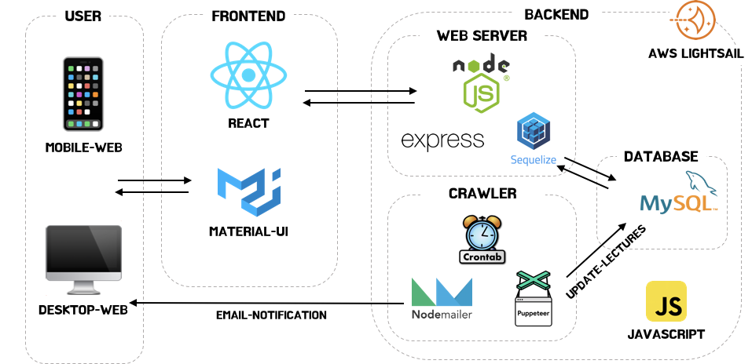

### 프론트엔드

나는 웹 프론트엔드 개발자로 채용이 되었지만 사실 나는 express와 모바일 앱 프레임워크인 Flutter가 더 친숙하다. 그나마 우아한테크캠프를 통해 바닐라js와는 좀 더 친해진 것 같은데 아직 React와는 어색하다.

그래서 이번 프로젝트의 프론트엔드는 React로 진행하며 조금 친해져보고자 했다. 프로젝트를 진행하며 전 회사의 Web 코드를 많이 참고했다(잘 짜놓으셔서 많이 배웠다!). 회사 코드는 [Material-UI](https://material-ui.com/)에서 제공하는 여러 컴포넌트를 많이 활용했는데 기본적으로 컴포넌트들이 커스터마이징이 어렵지 않은듯 해서 이번 기회에 한번 사용해보기로 했다.

### 백엔드

백엔드는 여러 프로젝트에 지속적으로 사용해 온 express를 활용해서 구성했고, node의 ORM이자 나와 친한 sequelize를 이용해서 DB와 통신하도록 구현하였다.

뿐만 아니라 나는 계속해서 학교의 최신 개설 과목 정보를 받아와야 했기에 Linux의 스케쥴러인 Crontab을 활용하여 주기적으로 DB를 업데이트 해주도록 하였다. 그리고 변동 사항을 확인하여 이삭을 발견하고 Nodemailer를 통해 이메일 알림을 보내게 되었다.

웹서버와 크롤러는 월 20달러짜리 Lightsail instance를 사용하고 있다!(이거 충분히 투자할 가치가 있다 ㅎㅎ)

<br/>

## 🤔 프론트엔드 구조 잡기

### models

여러 모델의 내용 뿐만 아니라 관련된 API 함수들도 가지고 있다.

아래는 User 모델의 예시이다.

```jsx
import { Axios } from '../lib/axios';
import { Timetable, BookmarkedLecture, SpikeLecture } from '.';

export default class User {
  constructor(raw) {
    this.id = raw.id;
    this.email = raw.email;
    this.timetables = raw.timetables.map(
      (timetable) => new Timetable(timetable, raw.bookmarks, raw.spikes),
    );
    this.bookmarks = raw.bookmarks.map((lecture) => new BookmarkedLecture(lecture));
    this.spikes = raw.spikes.map((lecture) => new SpikeLecture(lecture));
  }

  static getUser = async () => await Axios().get(`/user`);
  static getAuth = async () => await Axios().get('/auth');
  ...
}
```

### components

컴포넌트는 순수하게 렌더링만 담당하도록 구현하였고 props를 전달 받는 식으로 구현되었다.

우아한테크캠프 마지막 프로젝트인 bmart를 React로 구현하였는데 이때 사용했던 atomic design pattern은 개념은 간단한 듯 하나 실제 구현을 하다보니 컴포넌트의 depth를 정의하는데 조금은 어려움이 있었다. 그래서 이번에는 상위 컴포넌트를 정의하고 그 내부에 여러 컴포넌트가 존재한다면 디렉토리를 생성하여 하위 컴포넌트를 정의하도록 했다.

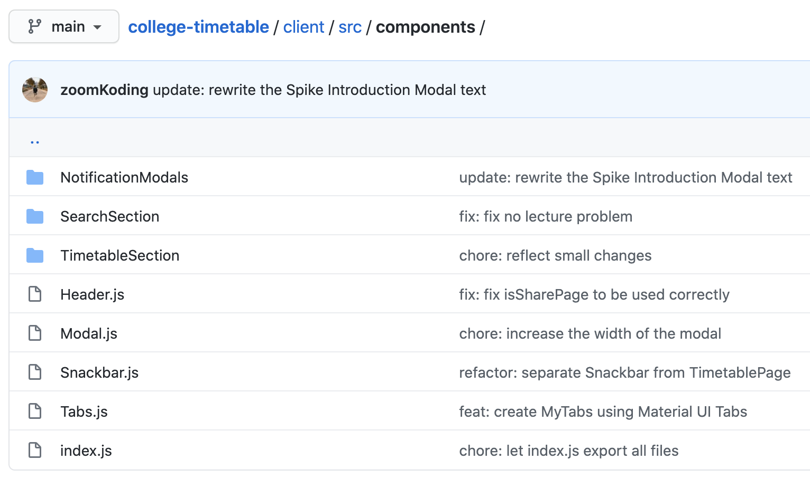

### pages

이곳은 각 페이지의 렌더를 담당하는 총사령관(Controller)들이 모여있다.

이곳에 정의 되어있는 페이지는 여러 컴포넌트를 조립하고 필요한 데이터를 모델의 함수을 통해 받아 유저에게 보여준다. 뿐만 아니라 유저의 여러 이벤트에 필요한 핸들링은 이곳에 정의 되어 있다.

이 프로젝트의 핵심은 TimetablePage인데 여러 유저와 소통할 수 있는 기능들이 모여있다보니 handler가 상당히 많지만 하나의 함수를 따라가보면 무슨 일이 벌어지고 있는지 알 수 있을 것이다.

[Pages/TimetablePage.js](https://github.com/zoomKoding/college-timetable/blob/main/client/src/pages/TimetablePage.js)

<br/>

## 👨‍💻 빠른 첫 배포와 유저 피드백 반영하기

그렇게 본격적으로 개발을 진행하게 했고, 1월 중순에 v1.0.0을 배포하게 되었다. 첫 배포에 쉽게 피드백을 전달할 수 있는 기능을 넣었다.

### User-Driven Development

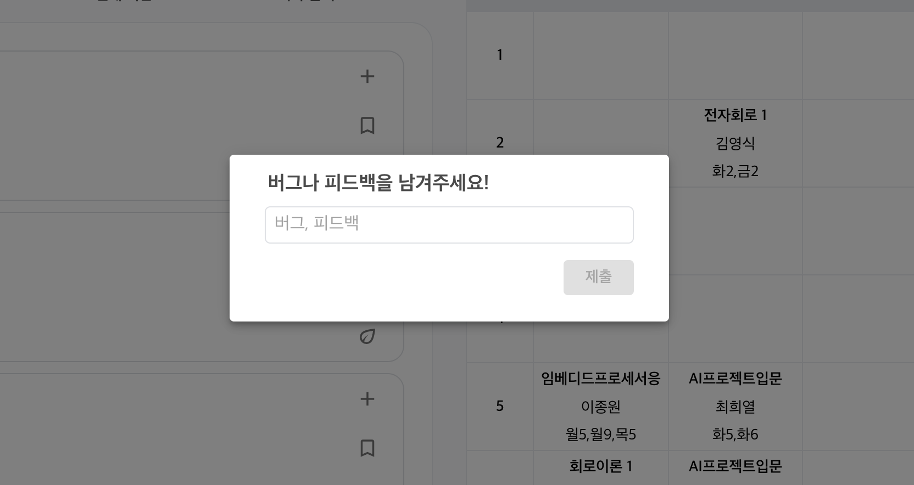

이 부분은 이전에 Picky를 배포하고 성장하는 과정에서 많이 배운 점을 참고한 것이다. 당시 앱을 배포하고 나서 대표님은 만드는 사람이 원하는 게 아니라 `사용자들이 원하는 것을 만들어야 한다`는 점을 강조하셨다. 그래서 본인의 감보다는 유저의 행동이나 피드백에 귀를 기울이셨고 거기에 맞춰서 방향을 잡으셨다. 유저의 피드백을 최대한 많이 듣기 위해 피드백 기능을 첫 배포에 추가했고 유저의 피드백과 추가적으로 지인들의 피드백을 수렴해서 서비스를 발전시켜 나갔다.


프로젝트 하는 내내 적극적으로 도움을 줬던 현섭이와 수현이에게 고맙다ㅋㅋㅋ


이를 통해 버그 리포트 뿐만 아니라 기능적인 개선점도 많이 발견했고, 이를 반영해서 지속적으로 배포했다.

## 🌱 이삭 줍기 알림 개발

### 💡 아이디어와 개발

어차피 나는 계속해서 개설 시간표를 업데이트하는 상황이었고 이를 위한 Cronjob을 구현하려던 참에 있었다. 만일 이 때 수강 공석이 발견되면 알려주는 건 어떨까 라는 생각에 개발을 진행하게 되었다. 그리고 이메일로 알려주는 방법을 알아봤는데 Nodemailer를 활용하면 그렇게 어렵지 않게 무과금으로 이메일을 전송할 수 있었다.

아래와 같이 Nodemailer를 import하고 아래 함수를 활용하면 인자를 전달해주면 손쉽게 이메일을 보낼 수 있다.

```jsx
const sendEmail = ({ user, pass, from, bcc, subject, text, html, onError, onSuccess }) => {
  const nodemailer = require('nodemailer');

  const transporter = nodemailer.createTransport({
    service: 'gmail',
    auth: { user, pass },
  });

  const mailOptions = { from, bcc, subject, html, text };

  transporter.sendMail(mailOptions, function (error, info) {
    if (error) onError(error);
    else onSuccess();
  });
};
```

<br/>

### 🎙 홍보 및 알림 모달

기능이 잘 돌아가는 것을 어느정도 확인한 후에 제대로 서비스 해보자는 마음으로 기능 소개용 모달도 구현하고 홍보를 진행했다.

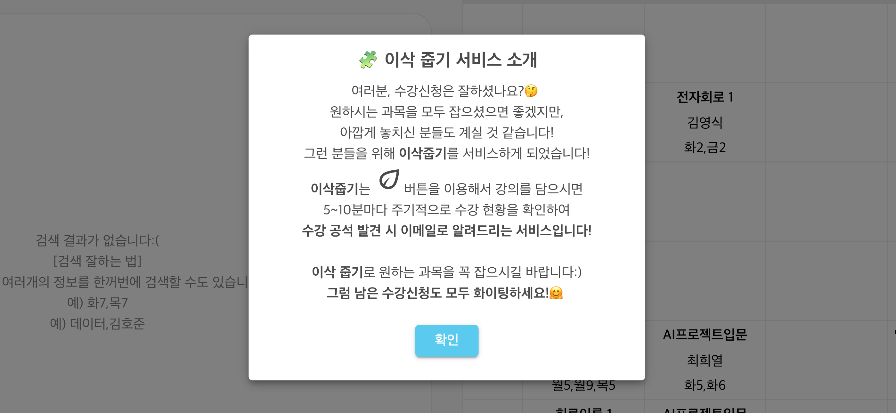

### 👍 반응

생각보다 이삭줍기 알림에 대한 반응이 좋았다. 현재까지 약 400개의 알림 메일을 발송했고, 알림 덕에 수강신청을 할 수 있다는 연락을 여럿으로 부터 받았다..! 기쁜 것도 기뻤지만 서비스를 믿고 이용해주신 여러 분들에게 감사했다.

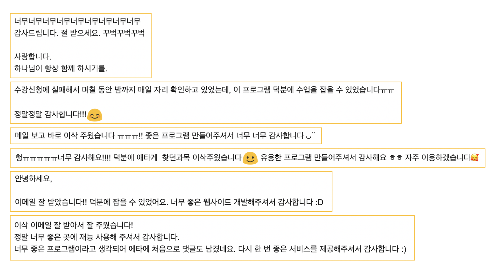


<br/>

## 🚀 라이브 서비스하기 (#기록하기 #모니터링)

라이브 서비스를 안정적으로 운영하기 위해 나 나름의 대비책을 간구했다. 이전 개인프로젝트와 스타트업에서 일하며 여러 아찔한 상황들을 경험해봤다. 물론 다 내가 너무 당연한 것을 간과해서 발생한 문제들이었지만 여전히 내가 모르는 예상치 못한 문제들이 많을 것이므로, 긴장감 속에서 서비스를 계속해서 모니터링하고 만일의 상황에 대비했다.

### ✍️ 기록하기(유저 정보는 소중하니까)

유저의 Authentication 여부에 따라서 API 사용을 제한되지만 내가 알지 못하는 암흑의 경로로 들어와 데이터를 날릴 수 있기에 두가지 대비를 진행했다. 하나는 sequl pro의 export 기능을 활용해서 그냥 데이터베이스의 내용을 sql문으로 저장해놓았다.

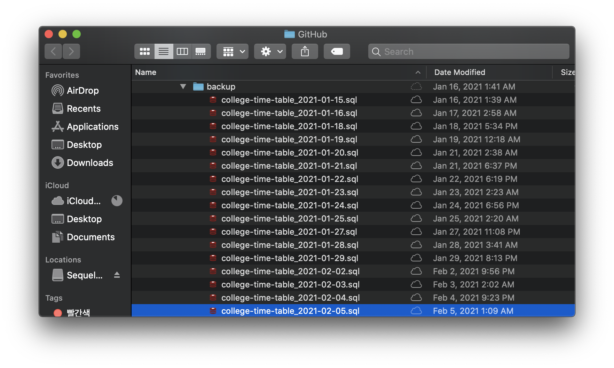

뿐만 아니라 Lightsail에서 지원하는 `Automatic snapshot`을 활용하면 주기적으로 백업 데이터를 모을 수 있었다!


아직 데이터가 날아간 적은 없지만 혹시 날아간다면 이런 준비를 안해놓은 것을 엄청나게 후회할 것이다...😭

### 👀 모니터링하기(#GA #Telegram)

유저의 사용량과 서비스의 모니터링 하기 위해 두가지를 사용했다. 먼저 Google Analytics(GA)를 통해 실시간으로 모니터링을 진행했다. 사실 이걸로 큰 도움은 안되지만 유저 수가 지금 어떠한지 보는 맛이 쏠쏠했다.


그리고 주기적으로 개설 과목의 정보를 크롤링해서 DB에 넣기 때문에 문제가 발생하는지 확인하는 방법이 필요했다. 나는 간단하게 **[텔레그램의 봇](https://core.telegram.org/bots/api)**을 활용해서 해서 크롤러의 동작 상황을 전달하게 했다.(무료이며 구현이 매우 간단하기 때문에 이를 활용했다!)

```jsx
try {
  ...
} catch (err) {
  sendTelegramMessage("[🚨 수강현황 업데이트 실패]\n\n" + err);
	...
}
```

이 방법을 이용해서 아래와 같이 지속적으로 업데이트와 이삭줍기 알림 전송 상황을 확인하며 크롤러가 열일하고 있는지 알 수 있다.

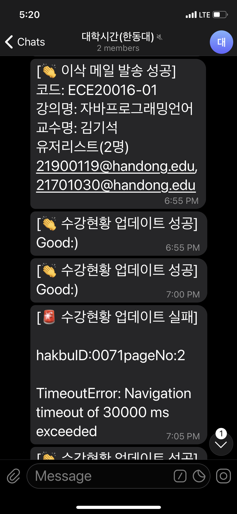

**물론 서비스가 잘 돌고 있는지 확인하려는 목적도 있지만 그냥 심심할 때 들어가서 사람들이 잘 쓰고 있는지 보는 맛이 있었다..ㅎㅎ**

## 🌝 후기

### 👏 의미 있는 프로젝트

이번 프로젝트는 의미가 있어서 좋았다. 학교에서 배워서 남주자를 강조하며 컴퓨터 공학을 시작했지만 사실 하면서는 점점 나에게 도움이 되는 일, 보상이 확실한 일을 찾기에 관심을 가지게 되었다. 이번 프로젝트는 아무런 보상이 없지만 사람들이 내 서비스에 감사함을 표하고 응원해주는 걸 보면서 느끼는 보람이 매우 컸다. 다음에도 이런 의미 있는 프로젝트를 진행할 수 있는 기회가 있다면 흔쾌히 참여할 것 같다.

### 👨‍🎤 재밌었던 1인극

뿐만 나디자인부터 개발, 홍보까지 전 과정을 혼자 진행해본 것은 이번이 처음이었다. 사실 혼자 하다보니 많이 서투른 부분도 있었지만 다른 사람들에게 도움도 되고 개발 이외의 분야도 새로이 경험해 봤기에 좋은 기억으로 남을 것 같다. 계속해서 피드백을 주고 응원해 준 분들 모두 감사했다. (특히 바쁜 와중에도 열심히 도와준 유진이에게 특히 고맙다🙏)

```toc

```
