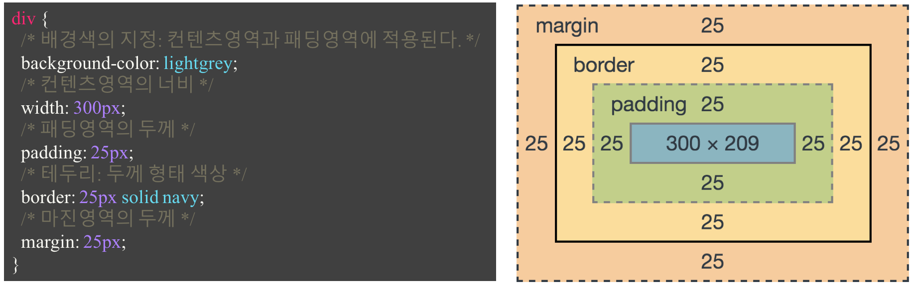
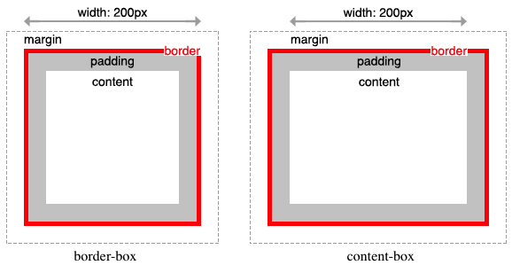
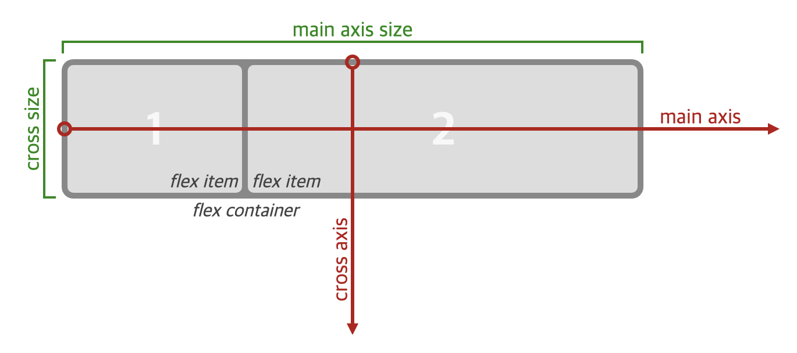
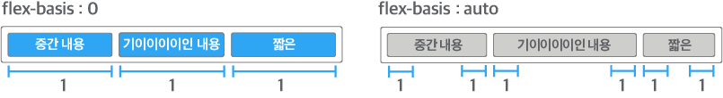
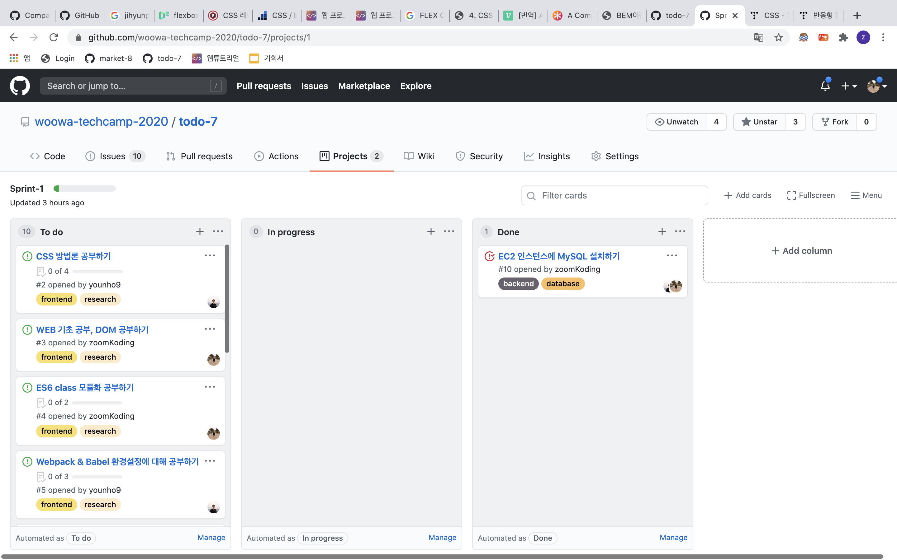
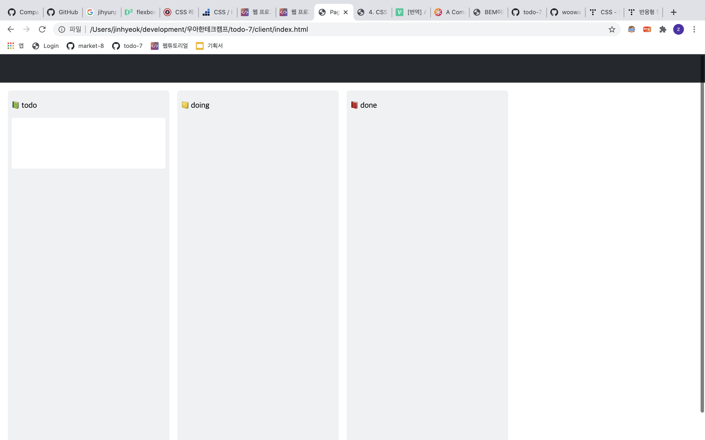
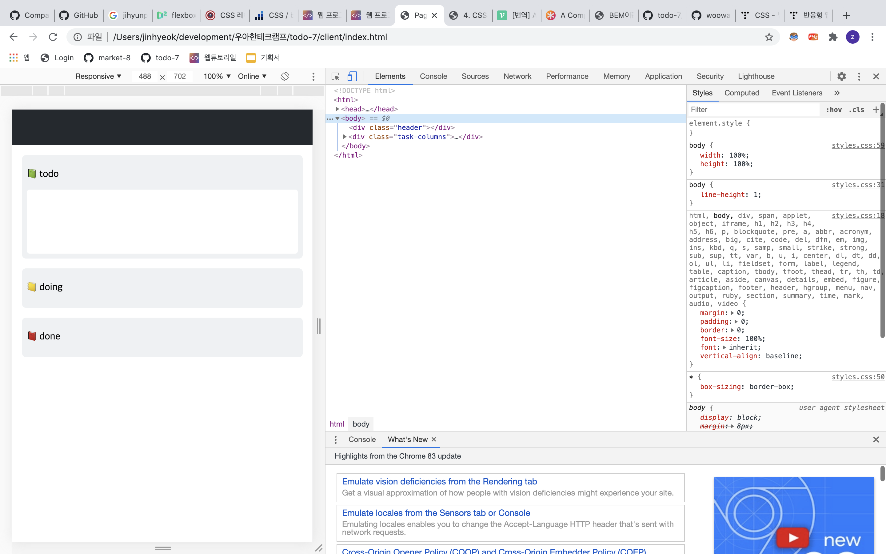

## 🤔 목적

css를 진짜 많이 얕봤다.. flutter를 이용해서 UI 구현해내는 일에 이제 익숙해졌기 때문에 스타일링 하는 것은 진짜 가볍게 여겼다가 큰코 다쳤다. 이번에 겸손한 마음으로 css 기초부터 반응형으로 레이아웃을 잡는 여러 좋은 방법들에 대해 조사해봤고 마지막으로 간단하게 github project를 따라하며 실습을 진행했다.

<br>

## 📗 참고 자료

[poiemaweb 튜토리얼](https://poiemaweb.com/)

[flex box로 만들 수 있는 10가지 레이아웃(네이버 D2)](https://d2.naver.com/helloworld/8540176)

<br>

## 📦 Box Sizing



브라우저는 박스모델의 정보를 근거로 렌더링을 진행한다.

여기서 **width와 height는 박스의 전체 사이즈를 말하는 것이 아니라 파란색 영역인 contents 영역의 너비와 높이만을 의미**한다.

이 말인 즉슨 만일 width 100%를 주고 padding이나 border 값을 주면 `width = 100% + padding, border 값`이 되어 box가 예상했던 공간 밖으로 삐져나오게 된다.

이 상태에서 박스의 사이즈를 제대로 측정하려면 contents 너비 + 양쪽 padding 값 + 양쪽 border 값을 구해야 한다... 이걸 계산해서 레이아웃을 잡기란 쉽지 않다. 😭

<br>

**❓ 그렇다면 박스를 이용해서 레이아웃을 잡으려면 어떻게 해야할까?**

이럴 때 사용하면 좋은게 **border-box** 이다!

contents의 size만으로 width를 설정했던 box-sizing은 content-box로 box-sizing의 default 값이다.

<br>

**border-box는 아래 그림과 같이 박스의 margin을 제외한 양쪽 border 값 + 양쪽 padding 값 + contents 너비를 width로 표현하기 때문에 박스끼리의 레이아웃을 잡기 상당히 편하다.** 🍏



그래서 웹에서 다음과 같이 default box-sizing을 border-box로 바꿔놓기도 한다.**(github도 마찬가지이다.**🐙**)**

```css
* {
  box-sizing: border-box;
}
```

<br>

## 💪 Flex Box

**❓ 만일 3개의 박스를 웹 페이지의 너비에 맞춰서 1:1:1 비율로 띄우고 싶다면?**

이 때 block, float 이런 애들을 사용하면 생각보다 구현이 쉽지 않을지도 모르겠다.

**이럴 때 쓸 수 있는게 바로바로 Flex Box이다.**

<br>

**Flex box**는 실제 width와 height를 주지 않고도 비율로 layout을 구성할 수 있기 때문에 동적으로 페이지를 보여주고 싶은 레이아웃에서 아주 유용하게 사용된다.

flex는 크개 두가지로 구성되어 있다. 바로 비율로 이루어진 **Flex Item**과 이들을 포함하고 있는 **Flex-container**이다.



이미지 출처: [http://book.mixu.net/css/4-flexbox.html](http://book.mixu.net/css/4-flexbox.html)

<br>

### 🐓 Flex Container

flex Container은 flex item을 담는 container이다.

이 친구 사용하는 방법은 다음과 같다.

```css
.flex_container {
  display: flex;
  flex-direction: column; /* 방향 */
}
```

display를 flex로 설정해주고 flex-direction에서 flex의 방향을 정해준다.

<br>

### 🐥 Flex Item

flex-item은 flex container가 품고 있는 block이다.

```css
.flex-item {
  flex-grow: 1; /* 주어진 공간에 따라 커질꺼야 말꺼야 (x > 0 ? 커져 : 고정) */
  flex-shrink: 1; /* 주어진 공간에 따라 줄어들꺼야 말거야 (x > 0 ? 줄어들어 : 고정) */
  flex-basis: 0;
}
```

flex-grow, shrink는 주어진 flex container에 따라 줄어들지 늘어날지를 결정하는 값이다.

flex-basis는 기존 사이즈를 어떻게 할지 정하는 것으로 flex-base를 0으로 하면 무조건 비율로, auto이면 각 flex item의 contents 너비에 맞춰 사이즈를 달리한다.



이미지 출처: [https://d2.naver.com/helloworld/8540176](https://d2.naver.com/helloworld/8540176)

<br>

이 때 flex 자체를 특정 정수로 주면 그 값은 flex-grow의 값이 되고 flex-shrink는 1, flex-basis는 0이 된다.

```css
.flex-item {
  flex: 3; /* flex-grow : 3, flex-shrink: 1, flex-basis: 0 */
}
```

그리고 만일 사이즈가 고정되야 하는 친구에게는 none을 주고 그 옆 오른쪽 끝에 다음 item이 딱 붙게 할 수도 있다. (header나 footer에 많이 쓰인다!)

```css
.flex-container {
  display: flex;
}

.flex-item {
  flex: none;
  /* flex: 0 0 auto */
}

.flex-item-right {
  margin-left: auto;
}
```

<br>

## 📱viewport & media query

**❓html에 다음과 같은 메타태그는 무슨 역할을 할까?**

```html
<meta name="viewport" content="width=device-width, initial-scale=1.0" />
```

viewport는 사용자에게 보여지는 영역을 말한다. 웹을 모바일 기기에 렌더하게 되면 사이즈가 다른 웹의 내용을 제대로 전달할 수가 없다. 이를 해결하기 위해서 위와 같은 설정을 통해 실제 렌더링되는 영역과 뷰포트의 크기를 조절할 수 있다.

위와 같이 width=device-width를 추가함으로써 전체적인 웹 페이지의 width가 설정되고 media query를 사용하면 width의 범위에 따라 css가 적용되어 결과적으로 반응형 웹을 만들 수 있다.

<br>

**❓사이즈에 따라 어떻게 반응하게 만들까?**

다음과 같이 width가 max-width를 넘어가지 않으면 즉 모바일에서 볼때 css를 달리하도록 코드를 작성 한다.

```css
@media (max-width: 544px) {
  .task-columns {
    flex-direction: column;
  }

  .task-column {
    margin-right: 0px;
    margin-bottom: 16px;
  }
}
```

<br>

## github project page 클론하기

그럼 깃헙 프로젝트 페이지를 여때까지 공부한 방법을 이용해서 layout을 잡아보자.



일단 css를 [http://meyerweb.com/eric/tools/css/reset/](http://meyerweb.com/eric/tools/css/reset/)를 참고해서 초기화 해줬고, 이어서 간단하게 페이지를 구현했다.

간단하게 따라 구현한 결과 페이지이다.



<br>

**페이지 너비에 따라 다음과 같이 반응하기도 한다.** 👏



<br>

## 회고

물론 아직 많이 미숙하지만 지난주 겪었던 css 울렁증을 조금 극복한 것 같아 만족스럽다. 😄

```toc

```
