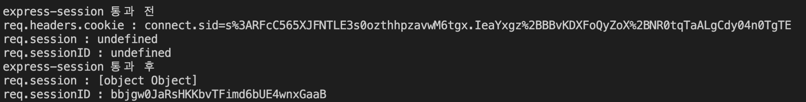
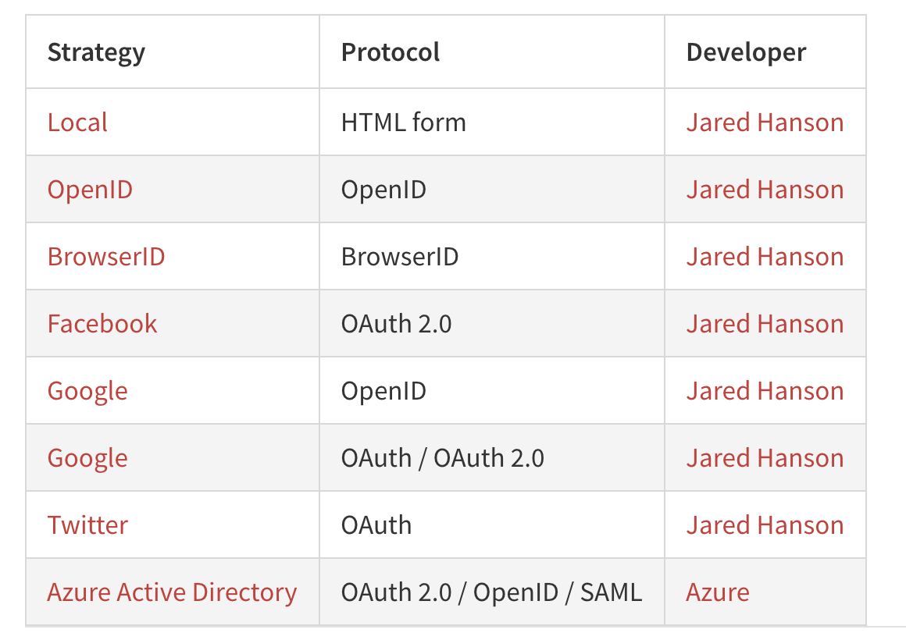
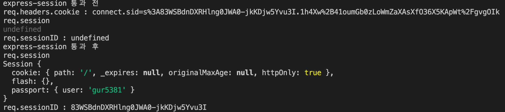
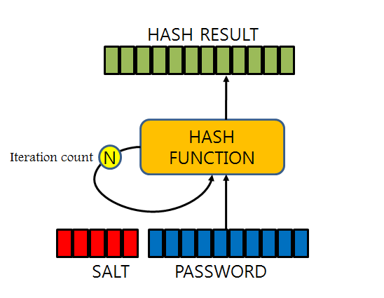
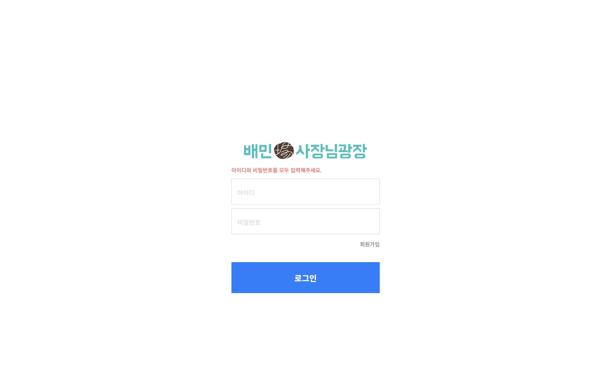

## 🧩 목적

express의 특징에 대해서는 [Node 개발자라면 알아야 할 기본 지식 포스팅](https://zoomkoding.github.io/node/2020/06/04/node-developer-basic.html)을 통해 정리했으니 이번에는 express generator로 생성되는 여러 미들웨어와 로그인 프로그램 구현에 사용된 미들웨어를 정리해보려고 한다.

<br>

## 📽️ 프로젝트 깃헙 레포지토리

[[우아한테크캠프] 배민상회 회원가입/로그인 구현 프로젝트](https://github.com/woowa-techcamp-2020/market-8)

<br>

## 🏭 Express 주요 미들웨어

### [pug](https://pugjs.org/api/getting-started.html)

Express는 런타임에 템플릿 엔진을 이용해서 여러 변수가 있는 static한 템플릿 파일에 실제 값을 넣어 html 파일을 생성한다.

Pug는 가장 대표적인 템플릿엔진으로 템플릿이 있는 디렉토리를 views에 정해주고 view engine으로 pug로 설정해주면 사용할 수 있다.

<br>

app.js에 view engine 종류와 template directory를 정해주고

```jsx
app.set('views', './views');
app.set('view engine', 'pug');
```

다음과 같이 **index.pug** 를 만들어 주고 title에 대한 변수값을 전달받는 template을 설정하고

```jsx
extends layout

block content
  h1= title
  p Welcome to #{title}
```

**router.js** 에서 res.render 함수를 통해 사용할 template과 변수 값을 전달해주면

```jsx
router.get('/', function (req, res, next) {
  res.render('index', { title: 'Express' });
});
```

template에 변수 값을 넣어서 해당하는 페이지를 유저에게 전달된다.

<br>

### [morgan](https://www.npmjs.com/package/morgan)

morgan은 이름에서 바로 알 수 없지만 request를 logging을 해주는 아주 유용한 미들웨어이다.

```jsx
var logger = require('morgan');

// ···

app.use(logger('dev');
```

<br>

morgan을 사용할 때 parameter로 format 값을 보내줄 수 있다.(이 미리 정해진 format은 tiny, common, short 등 다양하다.)

dev format는 request를 다음과 같은 형식으로 console에 기록해준다.

```
:method :url :status :response-time ms - :res[content-length]
```

<br>

dev format을 사용했을 때의 모습이다.


<br>

morgan을 사용하면 에러가 어떤 요청에서 발생했는지 확인할 수 있어서 매우 유용하다. 근데 만일 실제 서비스를 배포한 상태에서 서버의 상태를 콘솔로만 확인한다면 로그를 모두 확인하는데 어려움이 있다.

<br>

🍯**꿀팁** 🍯

**morgan은 console 대신 file에 logging 하도록 설정이 가능하다.**

**rotating-file-stream이라는 미들웨어를 사용하면 매일 다른 파일에 로깅을 할 수 있도록 설정할 수 있고 심지어는 console에는 에러 요청만 기록하도록 하고 파일에는 모든 요청을 다 기록하도록 설정할 수도 있다.**

다음은 그 예시이다!

```jsx
var express = require('express');
var morgan = require('morgan');
var path = require('path');
var rfs = require('rotating-file-stream'); // version 2.x

var app = express();

// create a rotating write stream
var accessLogStream = rfs.createStream('access.log', {
  interval: '1d', // rotate daily
  path: path.join(__dirname, 'log'),
});

// log only 4xx and 5xx responses to console
app.use(
  morgan('dev', {
    skip: function (req, res) {
      return res.statusCode < 400;
    },
  }),
);

// log all requests to access.log
app.use(
  morgan('common', {
    stream: fs.createWriteStream(path.join(__dirname, 'access.log'), { flags: 'a' }),
  }),
);
// ···
```

<br>

### [express-session](https://www.npmjs.com/package/express-session)

express-session은 서버가 세션을 이용하게 해주고 유저 쿠키에 세션 정보를 담을 수 있게 해주는 매우 유용한 미들 웨어이다.

유저 쿠키에 세션 정보를 담을 때는 세션의 모든 정보를 담는 것이 아니라 **세션의 아이디 값을 저장**하고 서버에서 데이터를 관리하게 된다.

이때 여러 옵션을 정해줘야 하는데 주요 옵션의 특징은 다음과 같다.

**secret** : session Id를 hash하기 위해 사용되는 key 값이다.(해쉬한 값이 connect.sid에 저장된다.)

**resave** : 세션을 접속할 때마다 새로운 세션을 발급할지 말지 정하는 곳이다.(true 설정시 race condition을 발생 시킬 수 있다고 한다. 대부분의 경우 false가 적절하다고 한다.)

**saveUninitialized** : 세션 ID를 발급하지 않는 세션도 다 기록할지 정한다.(로그인에 사용할 때는 서버 메모리 사용을 줄여주기 위해 false로 설정한다.)

**storage** : 세션을 어디에 저장할지 정한다.(기본 값은 MemoryStore를 사용하기 때문에 production에 사용하면 memory leak이 발생할 수도 있다. [세션을 저장할 수 있는 다양한 storage](https://www.npmjs.com/package/express-session#compatible-session-stores)가 존재한다.)


그럼 간단히 어떻게 돌아가는지 확인해보자.

다음 코드는 session 미들웨어를 지나가면서 어떤 req에 어떤 내용이 생기는지 보는 코드이다.

```jsx
var express = require('express');
var session = require('express-session');

var app = express();

function logSessionInfo(req) {
  console.log(`req.session : ${req.session}`);
  console.log(`req.sessionID : ${req.sessionID}`);
}

app.use(function (req, res, next) {
  console.log(`express-session 통과 전`);
  console.log(`req.headers.cookie : ${req.session}`);
  logSessionInfo(req);
  next();
});

app.use(
  session({
    secret: 'keyboard cat',
    resave: false,
    saveUninitialized: true,
  }),
);

app.use(function (req, res, next) {
  console.log(`express-session 통과 후`);
  logSessionInfo(req);
  next();
});

// ···
```

<br>

출력 결과는 다음과 같다.



<br>

🗒️**정리** 🗒️

express-sesssion은 req.headers.cookie에 주어진 sid를 sessionID로 번역하고 그 sessionID에 해당하는 session 값을 req.session에 저장하게 된다!

**즉, 세션의 정보 값은 쿠키에 전달되지 않고 해쉬화된 sid만 유저의 쿠키에 저장되고 요청이 들어오면 sid를 번역하고 얻은 session ID에 해당하는 session 값을 req.session에 넣어주어 next함수에서 사용할 수 있게 해준다!!(이제 좀 알겠다...ㅋㅋㅋ)**

<br>

## 🤝 본격 express로 로그인 구현하기

그럼 이제 로그인 구현의 express의 middleware을 알아보고 로그인 페이지를 구현해보자.

### [passport](http://www.passportjs.org/docs/)

passport는 node에서 가장 많이 쓰이는 authentication 미들웨어이다. 간단하게 username과 password를 제공하는 로그인 방법부터 OpenID와 OAuth 전략도 제공하기 때문에 매우 유용하게 사용할 수 있다.

passport에서 제공하는 여러 strategy를 설치해서 사용할 수 있다.



다음과 같이 passport와 하나의 Strategy를 가져와서

```jsx
const passport = require('passport');
const localStrategy = require('passport-local').Strategy;
```

어떤 식으로 strategy의 구체적인 내용을 정의하고 passport에 넣어준다.

```jsx
passport.use(new LocalStrategy(
	//verify callback 함수
  function(username, password, done) {
    User.findOne({ username: username }, function (err, user) {
      if (err) { return done(err); }
			// 아이디 없음
      if (!user) {
        return donnull, false, { message: 'Incorrect username.' });
      }
			// 비밀번호 틀림
      if (!user.validPassword(password)) {
        return done(null, false, { message: 'Incorrect password.' });
      }
			// 성공
      return done(null, user);
    });
  }
));
```

그리고 passport.authenticate를 다음과 같이 login request에 사용할 수 있다.

```jsx
app.post('/login', passport.authenticate('local'), function (req, res) {
  // If this function gets called, authentication was successful.
  // `req.user` contains the authenticated user.
  res.redirect('/users/' + req.user.username);
});
```

passport.authentication 함수가 성공하면 req.user에 유저 정보를 넣어서 콜백 함수를 실행하지만 로그인 실패시 바로 401 authentication error 메시지를 전달한다.

<br>

**❓그럼 로그인 여부는 어디서 결정 될까?**

위의 코드에서 username, password, done을 파라미터로 받는 함수는 verify callback라고 하는데 여기서 authentication 성공과 실패 여부를 **done함수**로 전달한다. (이때 전달된 값이 req.user에 넣어진다.)

성공시에는 done의 두번째 인자로 유저 정보로 실패시에는 false를 반환한다.

에러 발생시에는 첫번째 인자에 에러를 넣어서 반환한다. // done(err);

<br>

**❓로그인 세션을 사용하고 싶다면?**

passport 또한 session을 사용할 수 있다.

무조건 session 미들웨어를 이용한 후에 passport의 session을 사용한다.

```jsx
app.use(express.session({ secret: 'keyboard cat' }));
app.use(passport.initialize());
app.use(passport.session());
```

세션을 이용하기 위해서는 serializeUser와 deserializeUser 함수를 정의해줘야 한다.

```jsx
passport.serializeUser(function (user, done) {
  done(null, user.id);
});

passport.deserializeUser(function (id, done) {
  User.findById(id, function (err, user) {
    done(err, user);
  });
});
```

<br>

📩 **serializeUser**

verify callback가 유저 정보를 전달하면 실행되는 함수로, 성공한 유저의 정보를 session에 추가한다.

<br>

📤 **deserializeUser**

deserializeUser은 Cookie에 저장된 passport session 정보를 이용해서 User정보를 가져오는 함수이다.  
앞에서 session과 같이 cookie에는 구체적인 유저정보가 담기지 않고 passport session id가 저장되어 있다.

🎈session 사용량을 줄이기 위해서 user의 id만 저장하고 요청이 오면 id에 해당하는 유저정보를 가져와서 쓰면 좋다.

<br>

**❓그럼 passport session은 유저에게 어떻게 저장될까?**

passport용 세션이 새로 생기는 게 아니라 express session에 하나의 property로 들어가게 된다.  
cookie에 들어있는 express session이 생성한 connect.sid을 풀면 그 안에 passport session 정보가 들어있는 걸 볼 수 있다.



<br>

**❓로그인 상태에 따라 페이지 접근 제어하기!**

마이페이지와 같은 페이지에 접근할 때는 유저의 로그인 상태에 따라서 페이지를 달리 해줘야 한다.

이런 상황에는 passport에 의해 req에 생성된 isAuthenticated를 이용할 수 있다. 함수의 형태는 다음과 같다.

```jsx
req.isAuthenticated = function () {
  var property = 'user';
  if (this._passport && this._passport.instance) {
    property = this._passport.instance._userProperty || 'user';
  }

  return this[property] ? true : false;
};
```

위의 함수를 이용하면 다음과 같은 함수를 만들어서 페이지를 보여주기 전에 로그인 상태를 확인하여 로그인 되지 않은 req를 login page로 redirect 해줄 수 있다.

```jsx
function isAuthenticated(req, res, next) {
  if (req.isAuthenticated()) return next();
  return res.redirect('/login');
}

// ···

router.get('/mypage', isAuthenticated, (req, res) => res.render('mypage', { user: req.user }));
```

<br>

### [bcrypt](https://www.npmjs.com/package/bcrypt)

bcrpyt는 비밀번호를 쉽게 암호화해주는 미들웨어이다.

hash를 생성할때는 bcrypt의 hash 함수를 이용하고 비밀번호를 확인할 때는 compare 함수를 이용한다.

```jsx
const saltRounds = 10;
user.passwordHash = await bcrypt.hash(password, saltRounds);
const match = await bcrypt.compare(password, user.passwordHash);
```

<br>

**❓bcrpyt가 근데 뭐지요? [비밀번호 암호화 관련 사진 출처 및 참고자료](https://d2.naver.com/helloworld/318732)**

비밀번호를 단방향으로 hashing 만으로 생길 수 있는 유추 가능성이나 빠른 속도로 인해 해커들에게 편의성을 제공할 수 있다.

이를 해결하기 위해 salt를 비밀번호에 더한 후에 hashing을 진행하여 다이제스트를 생성한다.  
bcrypt는 이에 더해 다이제스트를 생성하는 과정을 몇번 진행할지 결정하는 'work factor'(여기서는 **saltRounds**이다)를 조정하는 것 만으로 **시스템 보안성을 증가**시킨다고 한다.



<br>

### [flash](https://www.npmjs.com/package/connect-flash)

flash는 세션에서 메시지를 저장할 때 사용하는 특별한 공간이다.

flash에 작성된 메시지는 한번 유저한테 display되면 바로 삭제된다.

<br>

**❓어디에 쓸까? 로그인 실패 메시지 전달에!**

주로 redirect와 많이 사용되는데 특히 로그인 실패 이유 메시지를 띄울 때 사용하면 매우 유용하다 ㅎㅎ

passport는 flash를 이용해서 message를 띄우는 걸 지원한다.

verify callback 함수를 보면 다음과 같이 message를 같이 보내주게 된다. 이 부분은 flash에 저장되게 된다.

```jsx
// ···
if (!user) {
  return done(null, false, { message: 'Incorrect username.' });
}
if (!user.validPassword(password)) {
  return done(null, false, { message: 'Incorrect password.' });
}
// ···
```

그리고 req.flash()를 이용해서 해당 값을 유저에게 전달할 수 있다!**(한번 보여주면 사라진다.)**

```jsx
router.get('/login', (req, res) =>
  req.isAuthenticated()
    ? res.redirect('/mypage')
    : res.render('login', { failureMsg: req.flash().error }),
);
```



<br>

## 📄 로그인 정보 저장용 파일 기반 디비 구현하기

이전에 사용했던 sequelize와 같은 ORM과 유사하게 테이블 형태를 정의하고 create, update, getById 함수를 내장한 모델 클래스를 만들어보았다.

validate 함수를 통해 유저가 입력한 값이 테이블의 attributes의 타입과 일치하는지 확인하는 함수도 구현해봤다 ㅎㅎ

```jsx
const fs = require('fs');
const path = require('path');

class Model {
  static sync = function () {
    if (fs.existsSync(this.fileName)) {
      const data = fs.readFileSync(this.fileName, 'utf8');
      this.items = JSON.parse(data);
    }
  };

  static init = (attributesTypes, { tableName, sync }) => {
    this.tableName = tableName;
    this.dirname = path.join(__dirname, `../database`);
    this.fileName = `${this.dirname}/${tableName}.json`;
    this.attributesTypes = attributesTypes;
    this.items = [];
    if (sync) this.sync();
  };

  static write = function () {
    const data = JSON.stringify(this.items);
    if (!fs.existsSync(this.dirname)) fs.mkdirSync(this.dirname);
    fs.writeFileSync(this.fileName, data, 'utf8');
  };

  static validate = function (item) {
    const data = {};
    for (const [key, value] of Object.entries(item)) {
      if (!this.attributesTypes[key] || !value) continue;

      switch (this.attributesTypes[key]) {
        case 'date':
          data[key] = Date(value);
          break;
        case 'boolean':
          data[key] = value == 'on' || value == 1;
          break;
        case typeof value:
          data[key] = value;
          break;
        default:
          throw new Error('User Input Error');
      }
    }
    data.createdAt = Date.now();
    data.updatedAt = Date.now();
    return data;
  };

  static getById = (id) => this.items.find((item) => item.id === id);

  static create = function (item) {
    const validatedItem = this.validate(item);
    this.items.push(validatedItem);
    this.write();
    return validatedItem;
  };

  static update = function (item) {
    const id = this.items.findIndex(item.id);
    item.updatedAt = Date.now();
    this.items[id] = item;
    this.write();
  };

  static delete = function (item) {
    const id = this.items.findIndex(item.id);
    item.updatedAt = Date.now();
    if (id) this.items[id] = null;
    this.write();
  };
}

module.exports = Model;
```

그리고 User table을 위의 모델를 기반으로 만들었다:)

```jsx
const Model = require('./model');

class Users extends Model {
  static init() {
    return super.init(
      {
        id: 'string',
        pw: 'string',
        email: 'string',
        name: 'string',
        phoneNo: 'string',
        address1: 'string',
        address2: 'string',
        zipCode: 'string',
        isAdAgreed: 'boolean',
      },
      {
        tableName: 'Users',
        sync: true,
      },
    );
  }
}

module.exports = Users;
```

<br>

## 📽️ 프로젝트 깃헙 레포지토리

[[우아한테크캠프] 배민상회 회원가입/로그인 구현 프로젝트](https://github.com/woowa-techcamp-2020/market-8)

<br>

## 💭 회고

- 이번 기회를 통해서 세션이 어떻게 동작하고 특히 passport에서 세션이 어떻게 이용되는지 좀더 잘 이해할 수 있었던 것 같다.
- 다음에는 morgan을 파일로 로깅하는데 까지 사용해봐야겠다.
- 모르고 사용해서 사실 불안한 부분들이 많았는데 이번 기회에 그런 불안함이 많이 해소된 것 같아 보람차다.
- **❓무엇보다 프론트엔드는 너무 부족하니 다음 기회에는 프론트엔드 공부에도 더 많이 신경써봐야겠다!**

> 잘못 정리된 점이나 피드백 있으면 말씀해주세요!

```toc

```
