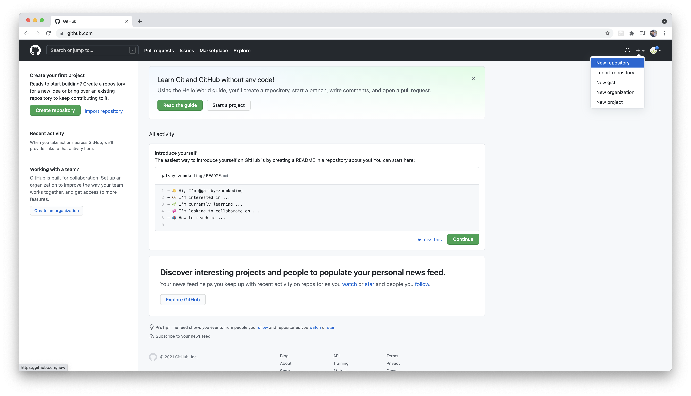
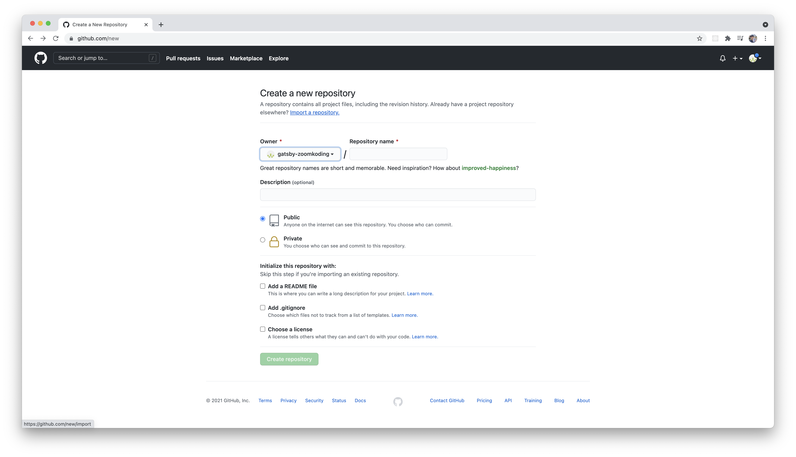
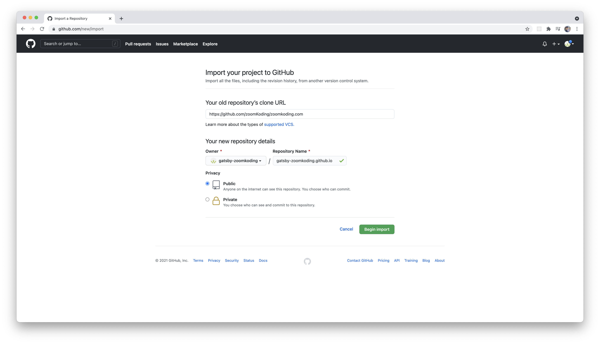
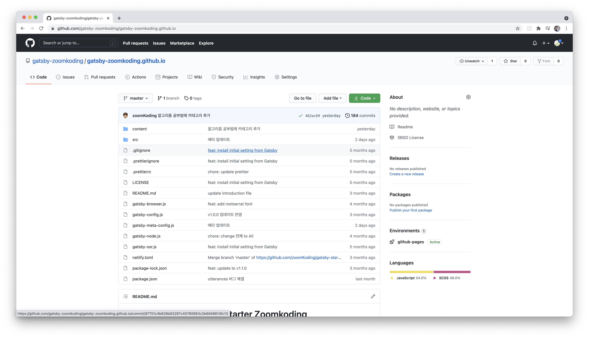
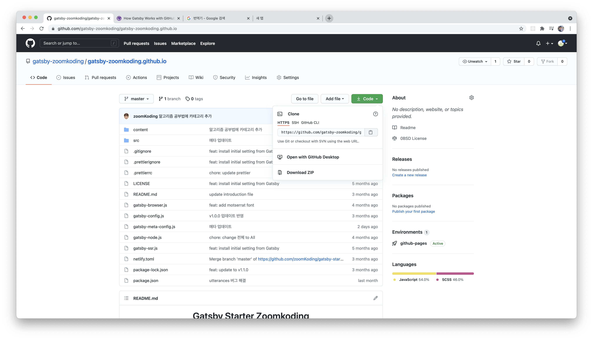
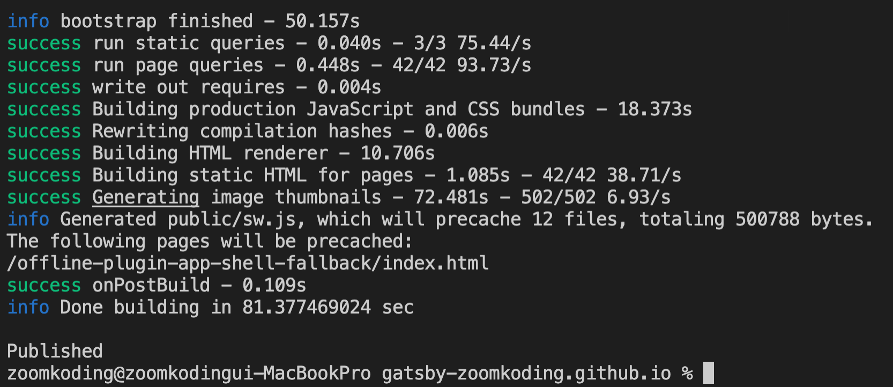
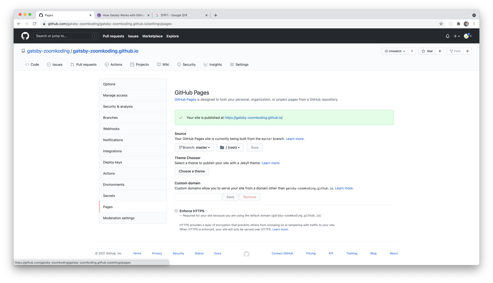
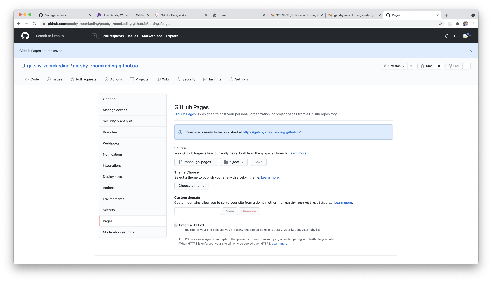
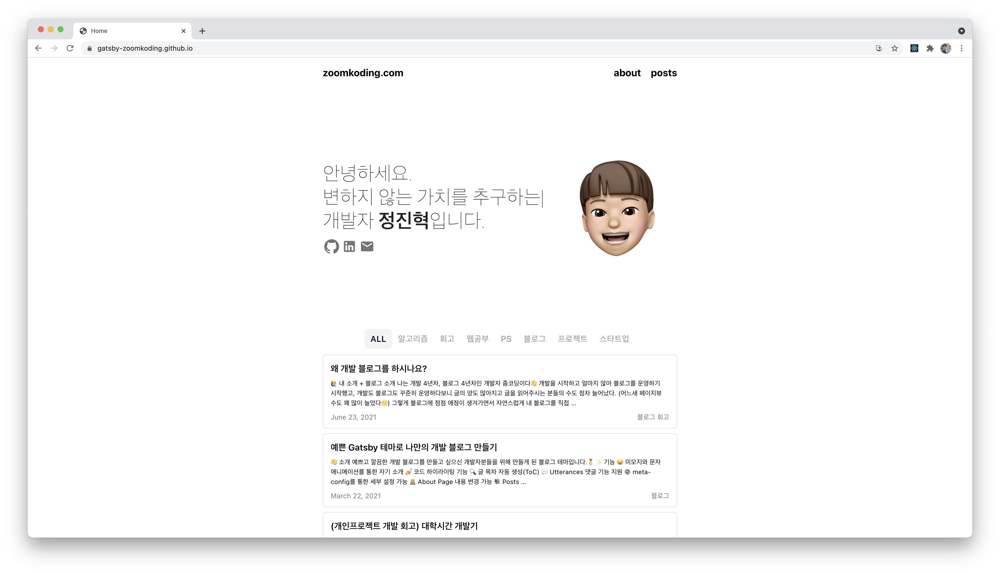

제 블로그의 테마나 Gatsby의 다른 테마를 활용해서 Github Blog를 만들고 싶은 분들이 계실텐데요! 이런 분들에게 도움을 드리고자 이 글을 쓰게 되었습니다. 잘 안되는 부분이나 궁금한 점을 댓글로 남겨주면 확인해보고 답변 드리도록 하겠습니다!

## 1. Repository 생성하기

GitHub Blog를 만들려면 Github에 Repository를 생성해야 합니다.



GitHub에 로그인 한 뒤에 우측 상단에 있는 New Repository 버튼을 클릭하면 repository 생성 페이지로 이동하게 됩니다. 이 때 Import a repository 버튼을 클릭합니다.



아래 페이지에 도달하시면 두 가지 정보를 넣어주셔야 하는데, Your old repository's clone URL에는 사용하고자 하는 gatsby 테마가 있는 repository의 주소를 넣어주시면 됩니다.

제 블로그 테마를 쓰고 싶으신 분들은 여기에 [https://github.com/zoomKoding/zoomkoding.com](https://github.com/zoomKoding/zoomkoding.com)를 넣어주세요!



그럼 이제 Repository Name을 입력해줍니다. 이 때 주의할 점은 Repository명은 꼭 [GitHubID].github.io로 설정하셔야 합니다.

그리고 Begin Import 버튼을 클릭하고 조금 기다리면 선택하신 블로그 테마를 import한 Repository가 생성되게 됩니다.



## 2. Repository 가져오기

이제 실제로 수정하고 배포할 수도록 내 컴퓨터(local)에 Repsitory를 가져와볼 건데요! 먼저 Repository에서 아래와 같이 초록색 Code 버튼을 클릭하면 링크가 나오게 되는데, 이 링크를 복사합니다.



그리고 아래 명령어를 수행하여 블로그를 다운로드합니다.

```bash
cd [Repository를 저장할 폴더]
git clone [복사한 주소]
```

## 3. Blog 설치하기

이제 블로그를 동작시킬 수 있도록 패키지들을 다운로드 해야하는데, 다음 명령어를 실행하시면 받을 수 있습니다.

```bash
cd [Repository 주소]
npm install
```

## 4. Blog 배포 준비하기

그리고 이제 Gatsby 테마를 GitHub 페이지에 올리기 위해 gh-pages라는 패키지를 설치해야 합니다. 설치는 다음 명령어를 실행하시면 됩니다.

```bash
npm install gh-pages --save-dev
```

그리고 나서 package.json에 다음을 추가합니다.

```json
{
  "scripts": {
    "deploy": "gatsby build && gh-pages -d public" // 추가
  }
}
```

## 5. Blog 배포하기

드디어 배포 준비는 다 끝났습니다. 이제 다음 명령을 실행하시면 github page에 배포하실 수 있습니다.

```bash
npm run deploy
```

조금 기다리신 후에 다음과 같이 `Published`라는 메시지를 받으셨다면 배포는 잘 끝났습니다!

> 🙋‍♂️ 제 블로그 템플릿을 사용하시는 분들을 `node 버전이 14 이상`이어야 합니다.
> node -v를 통해 node 버전을 확인하신 후 낮은 버전이라면 업그레이드를 진행해주세요!

> 💡 혹시 그 외에 다른 에러가 발생하신다면 아래에 댓글로 에러 내용을 알려주세요!



## 6. Repository Source Branch 변경하기

마지막으로 GitHub 페이지가 작동하려면 GitHub의 Repository 설정에서 배포 할 Branch를 선택해야 합니다. 이를 위해서 Repository에 있는 Settings를 클릭하고 죄측 메뉴에서 Pages를 클릭하여 Github Pages 설정 페이지로 이동합니다.



여기서 Source에 있는 Branch를 master(main)에서 gh-pages로 변경한 후에 저장합니다.



## 7. 배포된 페이지 확인하기

이제 실제로 잘 배포가 되었는지 확인해봅시다. 여태까지 문제가 없으셨다면 [GitHubID].github.io에 접근했을 때 블로그가 잘 보이는 것을 확인하실 수 있으실 겁니다.



## 8. 수정하고 배포하기

블로그를 수정하시는 방법은 각 블로그 테마마다 다를텐데요. 그에 맞춰서 변동사항을 commit하신 후에 아래 명령어를 실행하시면 변동사항이 블로그에 배포됩니다!

```bash
npm run deploy
```

<br/>

## ⭐️ 이 블로그 테마를 이용하고 싶으시다면!

마지막으로 제 블로그 테마를 활용하고 싶으시다면 아래 링크를 참고해주세요!
[https://www.zoomkoding.com/gatsby-starter-zoomkoding-introduction](https://www.zoomkoding.com/gatsby-starter-zoomkoding-introduction)

궁금하신 점이 있으시다면 [이슈](https://github.com/zoomKoding/zoomkoding-gatsby-blog/issues/new)로 남겨주시면 최대한 빠르게 답변 드리도록 하겠습니다!🙋‍♂️

> 🤔 혹시 특정 기능이 없어서 테마 사용을 망설이시거나 제안하고 싶으신 기능이 있으시다면,  
> 👉 [여기](https://github.com/zoomKoding/zoomkoding-gatsby-blog/issues/40)에 댓글 남겨주세요! 적극적으로 반영하겠습니다 :)

<br/>

**위 과정을 따라하시면서 궁금하신 점이 있다면 아래 `댓글`로 남겨주세요!👇**

```toc

```
