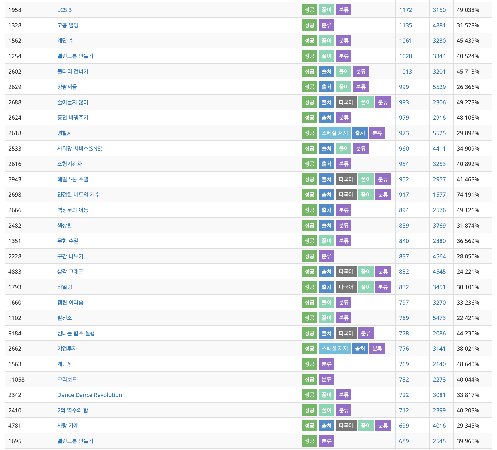
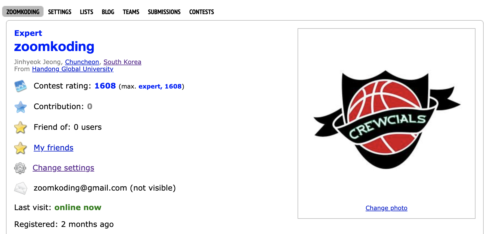
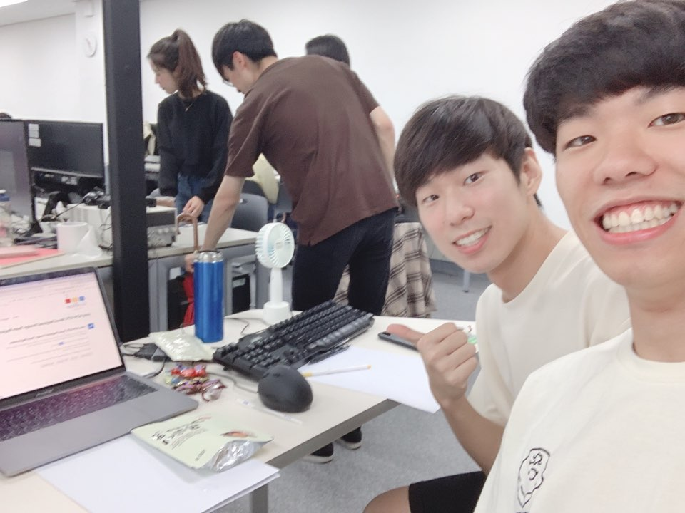

## 목적

요즘은 IT 기업에 개발자로 취업하기 위해서 코딩테스트라는 관문을 통과해야하는 경우가 허다하다. 이러한 기업들의 요구 때문인지 자연스럽게 **코딩테스트를 위한 알고리즘 공부**를 중요시 하고 있고 심지어 코딩테스트를 대비하기 위한 알고리즘 학원과 300만원이 넘는 방학 집중 코스까지 생겨났다.


나도 알고리즘을 시작하려던 때에 어떻게 하면 알고리즘을 제대로 효율적으로 배울까를 고민하며 알고리즘 공부법에 대한 블로그글, 유투브 영상 등을 찾아다녔고 알고리즘학원에 직접 전화해보기도 했다. 나와 같은 고민을 하는 분들에게 내가 공부했던 **비효율적이지만 효율적인 알고리즘 공부법**을 소개하고자 한다.

<br>

## 알고리즘 공부법을 찾는 당신에게

`어떻게` 공부할까를 정하는 문제는 선택이 필요하고 그에 따른 책임과 리스크가 따르기 때문에 고민이 되기 마련이다. 특히 취업을 위한 코딩테스트를 준비하고 있는 상황이라면 최대한 짧은 시간 내에 좋은 성과를 내야한다는 생각이 고민을 더 어렵게 만든다.

나는 알고리즘을 공부하는 방법을 찾고 있는 사람들에게 직접적인 방법보다 이런 이야기를 해주고 싶다.

> **_효율적인 공부보단 재밌는 공부를 하라._**

물론, 이렇게 알고리즘 공부법을 찾아 볼 정도로 고민하고 있는 사람이라면 효율성에 관심이 있는 분들이 대다수 일 것 같다. 나 또한 알고리즘을 처음 공부할 당시에는 효율적인 공부 방법을 찾기 위해 힘썼다. 고민하던 끝에 나는 효율적인 방법보다는 재밌게 할 수 있는 방법을 택하기로 했다.

알고리즘을 공부하기 위해서 필요한 시간이 적어도 몇달 이상이라면, 그렇게 긴 기간을 꾸준히 열심히 하기 위해서는 **동기**가 필요하다. 나는 그 동기는 다른 것이 아닌 **배우는 즐거움**에 있다고 생각했고 이 생각은 변하지 않았다.

아래는 내가 알고리즘을 배우는 즐거움을 찾기 위해 6개월간 힘썼던 공부 과정이다.

<br>

## 입문기

나는 지난 학기에 알고리즘 수업을 들었다. 이제 막 BFS와 DFS의 원리에 대해서 노드를 그려가며 공부하던 중에 프로그래머스에 대한 광고를 보고 [프로그래머스 고득점 킷](https://programmers.co.kr/learn/challenges)을 접하게 되었다.

문제의 난이도와 레벨이 적혀있는 것을 보고 '나는 어느정도 클라스지?'하고 가장 많은 사람이 푼 문제인 Level1 완주하지 못한 선수를 풀어보려했다. 한시간 넘게 붙들고 있다가 결국 이 문제가 속한 카테고리인 해시를 공부하고 돌아와야 겠다고 맘 먹었다. 해시를 검색해보니 블로그에 글이 넘쳐났다. 그중에 내가 이해하기 좋은 글을 골라 개념을 차근차근 이해하고 C++ 사용법을 공부했다. 이렇게 공부를 하니까 어느정도 문제 풀이 방법이 생각났고 이를 코드로 옮겨냈다.


그리고 남긴 나의 첫 후기를 보면 알겠지만 기본 문제도 못 푸는 나를 보면서 자극을 받았고 `고득점 킷`을 정복해보고 싶은 욕심이 생겼다. 그리고 무엇보다 문제 푸는 게 생각보다 재미 있었다. 그래서 학기 중에는 다음을 반복했다.

- 문제 바로 풀어보기(풀수 있으면 바로 풀기)
- 카테고리에 해당하는 알고리즘 공부하기
- 풀릴 때까지 붙들고 씨름하기(정 안되면 `질문하기`에서 힌트 얻기)
- 블로그에 문제 풀이 작성하기

한문제 한문제 풀며 완성되어가는 코득점 킷을 보며 하루하루 열심히 달렸다. 아무래도 문제 풀이에는 집중이 중요했기 때문에 몰입할 시간이 필요했다. 학기 중에는 이런 시간을 만들기 위해 다른 것을 많이 포기해야만 했다.

<br>

## 몰입기

결국 방학 동안에 캡스톤을 준비하려고 했던 것을 포기하고 알고리즘을 더 공부하기로 맘먹게 되었다. 미련없이 선택할 수 있었던 것은 그렇게 중요하다는 알고리즘이 그렇게 생각보다 재밌었기 때문이다.

이제 온라인 저지를 프로그래머스에서 백준으로 넘어갔다. 어떻게 공부할까 고민하던 중에 `jh05013 문제집2`를 풀어보기로 했다. 이유는 그 문제집에 써있는 알고리즘 리스트가 내가 모르는 알고리즘이 많았기 때문이다. **이 기간 동안에는 새로운 알고리즘을 내 글로 정리하고 다른 사람의 코드를 복기하며 내 코드를 리팩토링했다. 개인적으로 이것 하면서 알고리즘 이해 뿐 아니라 코드의 질도 많이 늘었던 것 같다.**

그리고 함께 공부하던 친구와 함께 **DP 데이, 탐색 데이**를 잡고 몇일 동안 합숙하면서 같은 카테고리 분류에 있는 문제를 쭉 풀어내려갔다. 집중해서 몇일하고 나면 그 알고리즘에 대한 감이 확실히 잡혔다. 한 문제를 풀기 위해 고생하면 다음 문제가 수월한 것을 느낄 때 성취감이 컸다.



방학이 끝난 후에도 여전히 공부하는 재미와 더 해보고 싶은 욕심은 사그러들지 않았다. 결국 알고리즘을 위한 휴학을 결정했다. 포항에서 나와 공부하는 친구와 집을 구해 단둘이 알고리즘 공부에 매진하기로 했다. 그리고 마침 있는 ACM-ICPC와 여러 코딩 테스트도 **그동안 잘해왔는지 점검해보는 용도**로 참여하게 되었다.

[카카오 블라인드 1차 코테 후기](2019-09-07-2020-kakao-blind.md)
[카카오 블라인드 2차 코테 후기](2019-09-23-2020-kakao-blind-2.md)
[ACM-ICPC 지역예선 참가 후기](2019-10-05-2019-ACM-ICPC-1.md)
[네이버 핵데이 코테 후기](2019-10-12-2019-naver-hackday-1.md)
[카카오 인턴 윈터 코테 후기](2019-11-09-2019-kakao-winter-intern-1.md)

<br>

## 슬럼프 (좋은 성적 vs. 과정의 즐거움)

대회와 코딩테스트 일정이 다가오자 점점 알고리즘 공부의 목적이 흔들리기 시작했다. 그동안은 배우는 과정의 즐거움에 집중했다면 갑자기 나도 모르게 대회와 시험에서의 좋은 성적이 우선이 되기 시작했다. 부족한 내 실력에 스트레스를 받고 좌절하기도 했다. **잘하고 싶은 마음이 낳은 초조함과 부담감은 결국 알고리즘을 즐거움의 대상에서 스트레스의 대상으로 바꿨다**. 언젠가 부터 나는 잘하는 사람이 되어서 뭔가 결과로 보여주고 싶어졌다. 그리고 대회가 끝나고 나면 알고리즘 공부를 이어나가기 쉽지 않아졌다.

<br>

## 현재

결국 나는 **잘하는 사람이 되야한다는 강박**에서 벗어나기 위해 노력해야 했다. 다음 사진은 부끄럽지만 한창 슬럼프에서 적었던 내 메모이다.


다시 느꼈던 즐거움을 회복하기 위해 재밌는 부분을 찾아나섰다. 그동안 들어만 봤고 도전해보지 않았던 codeforces에 대해서 듣게 되었고 매주 있는 대회에 참여하며 이에 따라 rank를 높여나갈 수 있는 그런 시스템이었다. 개인적으로는 백준에서 푸는 문제들보다 문제의 질도 좋고 Editorial도 있기 떄문에 모를 때 공부하기도 수월했다. 그 후로 codeforces에서 대회를 참가하거나 가상 대회를 직접 생성해서 시험을 쳐보고 정리하고 있다. 지금은 목표로 했던 블루를 성취하고 퍼플을 또 도전해볼까 공부하는 중에 있다.



<br>

## 결론

배움의 즐거움을 많이 느낀다고 해서 코딩테스트에서 좋은 성적을 거뒀을 때의 성취감이 적은 것은 아니다. 나는 그 때 느끼는 성취감도 나에게 매우 큰 동기로 작용한다. 좋은 결과를 추구하는 것이 잘못됐다고 하는 것이 아니다. 하지만 지금 공부를 시작하는 당신에게 꼭 말해주고 싶다. **자신만의 즐거운 공부법을 찾아보라!**

> 누구든지 웬만한 정도의 상식과 경험만 있다면, 자기의 삶을 자기 방식대로 살아가는 것이 가장 바람직하다. 그 방식 자체가 최선이기 때문이 아니다. 그보다는 자기 방식대로 사는 길이기 때문에 바람직하다는 것이다.
>
> \- 존 스튜어트 밀

공부의 즐거움을 느끼며 꾸준히 공부한다면 누군가에 눈에는 비효율적이게 보일 수 있는 당신의 공부법이 생각보다 효율적이게 좋은 결과와 엄청난 성취감을 가져다 줄 것이다. 당신의 알고리즘 공부도 즐겁고 보람차기를 진심으로 바란다.

**마지막으로 6개월간 함께 즐겁게 공부해준 내 친구이자 이제는 웹 개발자가 된 최진혁에게 감사의 말을 전한다.**



```toc

```
