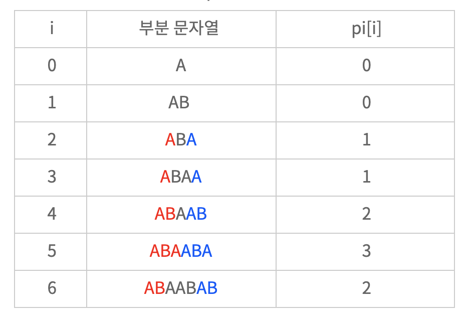

## 참고 자료

- 본 글은 내가 정리하기 위해 따로 해놓은 것으로
- 나는 [갓멍멍님의 글](https://bowbowbow.tistory.com/6)을 참고했다.

## KMP 알고리즘

- KMP 알고리즘은 문자열(텍스트)에서 특정 문자열(패턴)을 **효율적으로** 찾아내기 위한 방법이다.
- 문자열(T)에서 패턴(P)를 찾아내는데 필요한 시간이 O(N\*M)이라고 할때 이 알고리즘을 사용하면 O(N+M)만에 처리 가능하다!
- 문자열의 i번째부터 패턴 j번째와 비교할 때 다를 경우에 문자열의 i+1 과 패턴의 0번째 부터 비교를 하는 것이 아니라 이미 같았던 부분 중 패턴을 굳이 처음부터 하지 않아도 되는 경우는 j를 0이 아닌 pi\[j\]에서 진행하도록 한다.

## 쓸만한 정보 Pi(접두사와 접미사)

- 이 알고리즘에서 가장 중요한 부분이 바로 이 검색에 앞서 만들어둔 pi이다.
- pi\[i\]는 패턴의 길이가 i일때 접두사와 접미사가 같은 개수를 의미한다.
- 예를 들어 패턴을 "ABAABAB"라고 할 때 pi는 다음과 같이 표현 할 수 있다.



- 그 후 pi를 이용해서 문자열을 n만큼만 훑으면 끝나버린다.

## 코드

- 다음은 [백준 찾기 문제](https://www.acmicpc.net/problem/1786)에 KMP를 적용한 예제이다.

```cpp
#include <cstdio>
#include <string.h>

char t[1000002], p[1000002];
int ans[1000002], pi[1000002], tn, pn, an;

void make_pi(){
    int j = 0;
    for(int i = 1; i < pn; i++){
        while(j > 0 && p[i] != p[j]) j = pi[j-1];
        if(p[i] == p[j]) pi[i] = ++j;
    }
}

void do_KMP(){
    int j = 0;
    for(int i = 0; i < tn; i++){
        while(t[i] != p[j] && j > 0)j = pi[j - 1];
        if(t[i] == p[j])j++;
        if(j == pn - 1)ans[an++] = i - pn + 3;
    }
}

int main(){
    fgets(t, 1000002, stdin);
    fgets(p, 1000002, stdin);
    tn = strlen(t), pn = strlen(p);
    make_pi();
    do_KMP();
    printf("%d\n", an);
    for(int i = 0; i < an; i++)printf("%d ", ans[i]);
}
```

### do_KMP()

```cpp
void do_KMP(){
    int j = 0;
    for(int i = 0; i < tn; i++){
        while(t[i] != p[j] && j > 0)j = pi[j - 1];
        if(t[i] == p[j])j++;
        if(j == pn - 1)ans[an++] = i - pn + 3;
    }
}
```

- 일단 pi가 준비됐다는 전제하에 진행한다.
- 문자열의 길이인 tn 까지 한바퀴를 반복하면서
- 문자열의 i번째와 패턴의 j번째를 비교하면서
- **둘이 다르다면 j를 pi[j-1]로 바꿔주고 다시 비교하기를 반복한다.(j가 0이면 무한루프에 빠지기 때문에 j가 0이 되면 그만 둔다.) -> 최대한 멀리 뛰기 위해서 이렇게 한다.**
- 둘이 같으면 그냥 j를 1을 추가시켜서 다음 문자와 패턴을 비교하도록 한다.
- 그 아래는 문제를 위한 처리이다.

### make_pi()

- 이 함수는 pi를 만들기 위함이다.
- 만약 pi를 그냥 찾는다면 다음과 같이 할 수 있다.

```cpp
void make_pi(){
    for(int i = 1; i < pn; i++){
        int max = 0;
        for(int j = i - 1; j >= 0; j--){
            int cnt = 0, x = i, y = j;
            while(p[x] == p[y]){
                cnt ++;
            if(y == 0){
                if(max < cnt)max = cnt;
                break;
            }
            x --, y --;
            }
        }
        pi[i] = max;
    }
}
```

- 이것은 3개의 반복문이 필요해 어쩌면 pi를 만들다가 오히려 시간이 더 오래 걸리게 될지도 모르겠다.
- 이를 또 m번만에 끝내버리는 것이 다음 코드이다.

  void make_pi(){
  int j = 0;
  for(int i = 1; i < pn; i++){
  while(j > 0 && p[i] != p[j]) j = pi[j-1];
  if(p[i] == p[j]) pi[i] = ++j;
  }
  }

- 여기서 pi를 만들때는 또 pi를 이용한다.
- 만일 p\[i\]가 p\[j\]와 같다면 j를 늘려주고 그 값을 pi\[i\]에 넣는다.
- 근데 만약에 p\[i\]하고 p\[j\]하고 다르면 j를 pi\[j\]로 빠꾸시키기를 반복하여 마지막으로 같았던 때로 돌려놓는다.
- 이 과정을 반복해서 pi를 만들어준다.

## 느낀점

- 아직도 완벽히 이해가 된 것 같지는 않다.
- pi를 만드는 과정이 어렴풋이 이해가 되는데 완벽히 이해하기 까지는 시간이 좀 필요할 것 같다.
