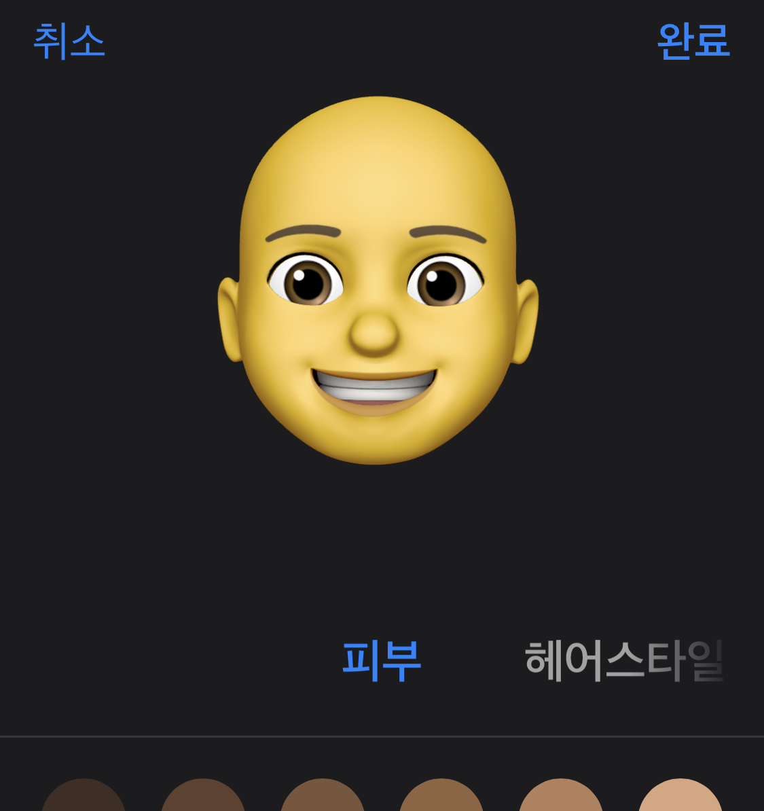
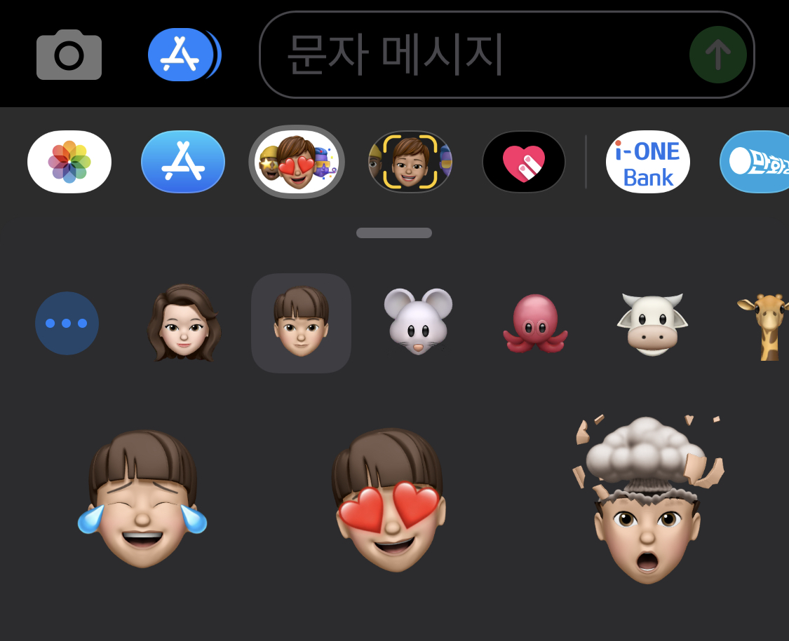
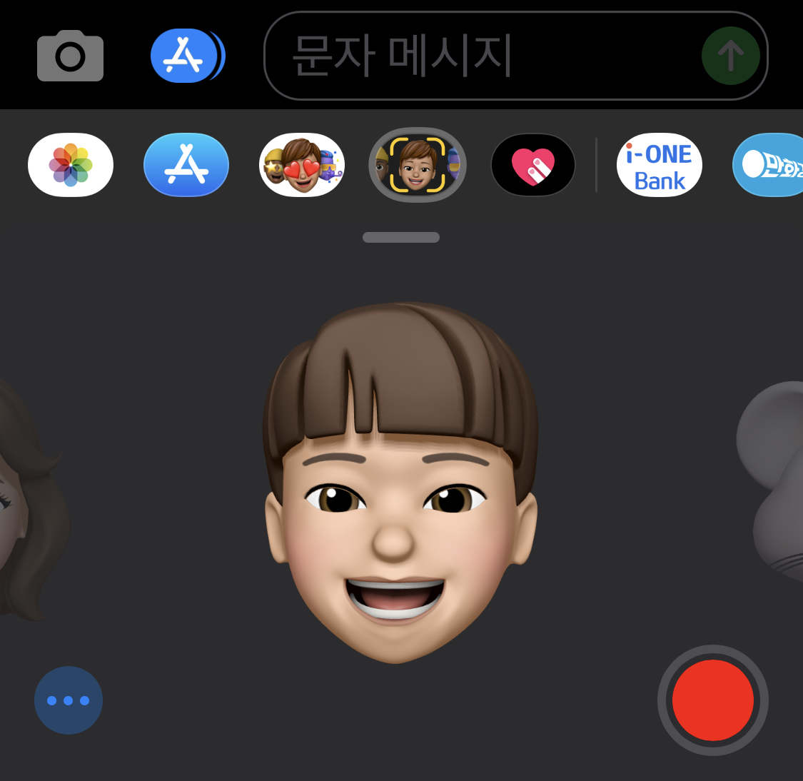
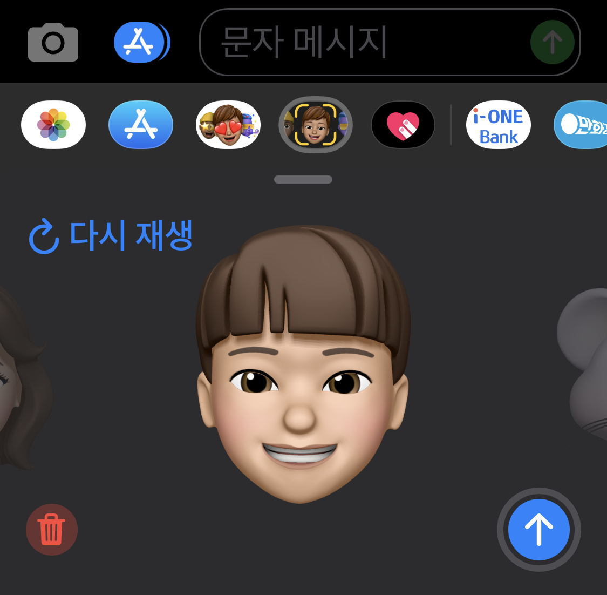
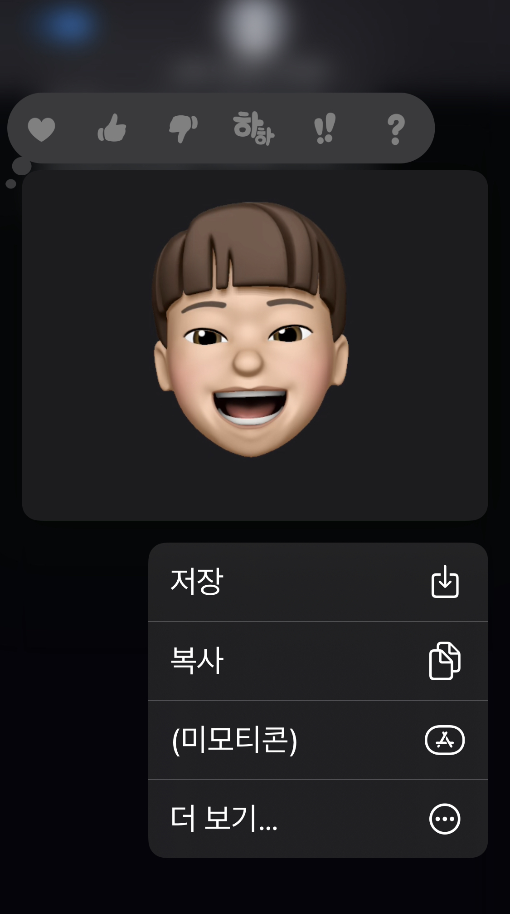
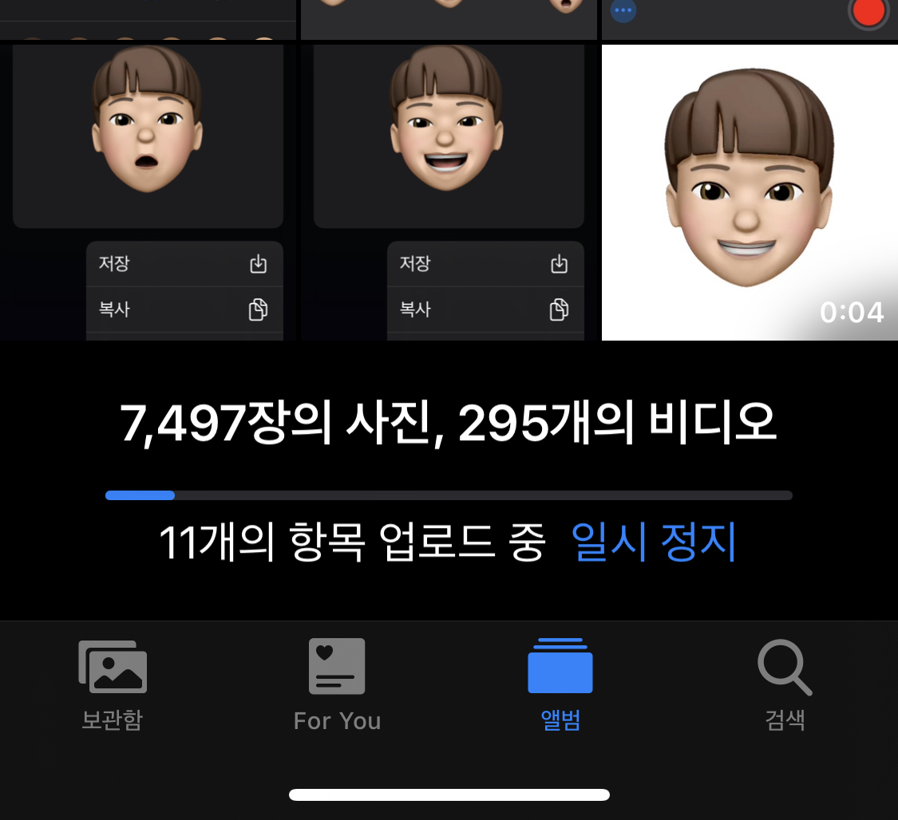
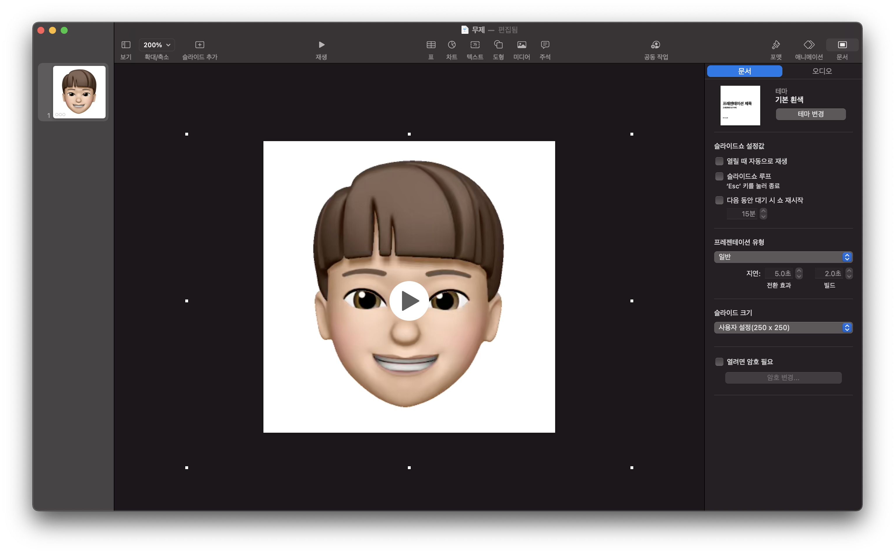
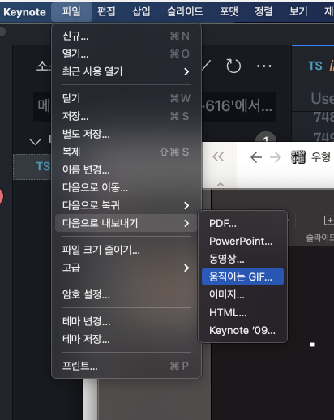
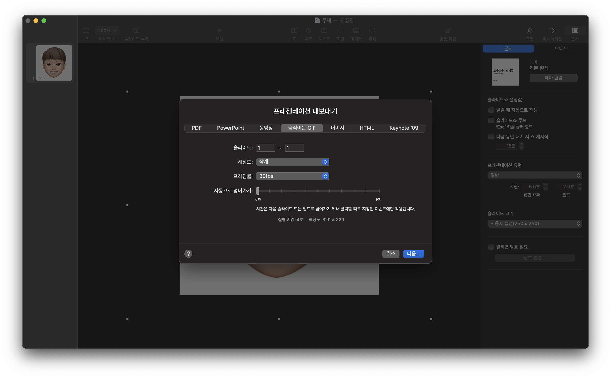

## 미모티콘 생성하기

미모티콘을 생성하시려면 먼저 아이폰 메시지에 들어가시면 메시지앱에 다음과 같은 옵션이 있습니다. 여기서 앱스토어 옆에 있는 버튼을 클릭하면 아래와 같은 미모티콘들이 나오는 걸 볼 수 있습니다.

미모티콘 리스트 맨 왼쪽에 위치한 플러스 버튼을 클릭하시면 아래와 같이 나만의 미모티콘을 커스터마이징 할 수 있는 페이지가 나오게 됩니다.

이 과정을 쭉 진행하고 나시면 아래와 같이 방금 생성한 미모티콘이 추가 되있는 것을 확인하실 수 있습니다.

## 움직이는 미모티콘 만들기

미모티콘을 만드셨다면 이제 움직이는 미모티콘을 만들어보도록 하겠습니다. 동일하게 메시지앱에서 이번에는 앱스토어 버튼 옆옆 버튼을 클릭합니다. 그리고 휴대폰을 응시하시면 내 얼굴의 움직임에 따라 미모티콘이 움직이는 것을 확인할 수 있습니다.

여기서 우측하단에 있는 녹화 버튼을 눌러서 움직임을 녹화합니다. 녹화를 완료하면 다음과 같은 화면이 나오게 되는데요. 여기서 우측 하단에 있는 전송 버튼를 눌러 메시지를 전송합니다.

전송을 완료했다면 아래처럼 전송된 미모티콘을 꾹 눌러봅니다. 그럼 아래와 같은 화면이 나오는 것을 보실 수 있으실텐데 옵션 중에 저장버튼을 클릭합니다.

저장이 완료되면 해당 동영상은 **배경이 없는 MOV 파일로 사진첩에 저장**됩니다.

## MOV를 GIF로 변환하기

MOV를 GIF로 변환하는 방법은 다양하지만 제가 써본 방법 중 제일 성능이 좋았던 방법을 소개해보록 하겠습니다. 저도 인터넷에 무료 MOV GIF 변환 툴들을 많이 사용해봤지만 그중 키노트의 export 기능을 활용했을 때 성능이 제일 좋았습니다.(맥이 아니신 분들은 파워포인트에도 동일한 기능이 있으니 활용해보시길 바랍니다!)

키노트로 빈 프레젠테이션을 생성하고 우측 상단에 문서를 클릭합니다.

그리고 슬라이드 크기에서 슬라이드 크기 사용자화를 클릭하고 슬라이드 크기를 설정합니다. 이때 설정하는 슬라이드 크기는 추후에 사용될 gif의 크기가 될 예정이기 때문에 원하시는 사이즈로 설정하면 됩니다.

(블로그 테마에서 사용하고 싶은 분들은 높이와 너비를 모두 250pt로 맞추시면 됩니다!)

여기에 아까 만든 MOV 파일을 추가하고 슬라이드에 미모티콘이 꽉차도록 위치 시킵니다.

여기서 좌측 상단 메뉴에서 파일 > 다음으로 내보내기 > 움직이는 GIF를 선택합니다.

그리고 나서 다음에서 설정을 진행합니다. 물론 해상도를 최대로 하고 프레임률도 가장 높으면 좋겠지만 웹사이트나 사용되는 곳에서 로드 되는 속도를 최소화하기 위해서 값을 조정해가면서 적정선을 찾으시면 됩니다. (블로그에서 사용하기 위해서는 해상도는 작게 하고 프레임률을 최대로 했을 때가 제일 괜찮았습니다!)

그리고 나서 내보내기를 클릭하면 원하시는 배경없는 미모티콘 GIF파일을 받으실 수 있습니다!

### GIF 변환 시 고려할 점들

맥을 사용하시는 분들은 이 과정을 따라하시면 되겠지만 그렇지 않으신 분들은 아마 여러 방법을 찾아 헤매시고 계실거라는 생각이 듭니다. 이때 고려할 점들을 조금 정리해보자면 다음과 같습니다.

- 해상도는 사용하시는 곳에 맞춰서 설정한다.
- 프레임률을 높여야 버벅임이 줄어들지만 용량이 증가한다.
- 용량이 크면 로드되는 시간이 길어진다.

이를 잘 고려하셔서 원하시는 퀄리티의 GIF를 만들 수 있으시길 바랍니다!👍
