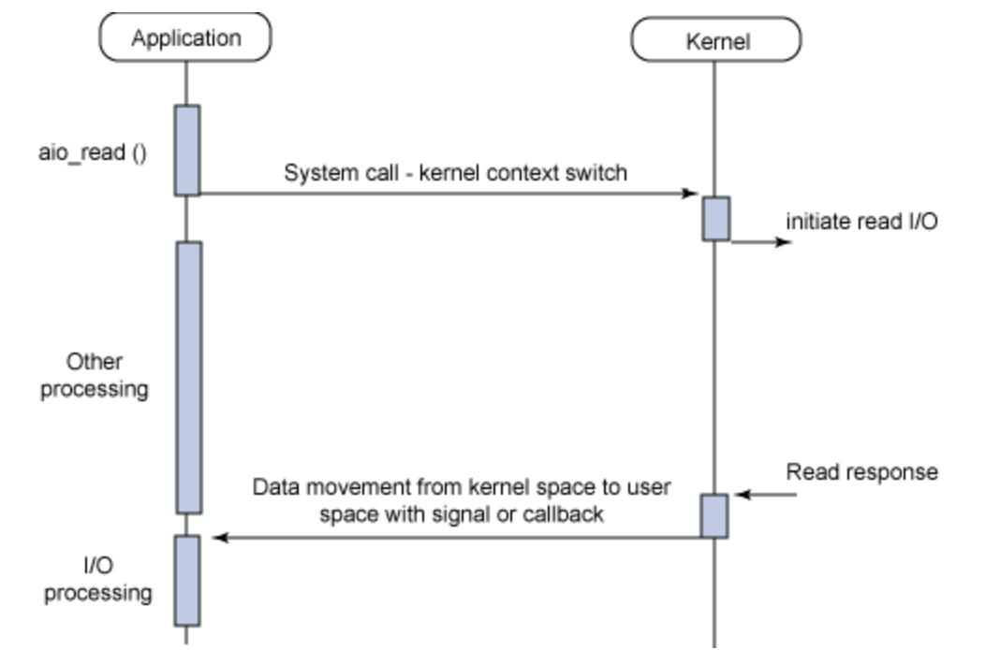
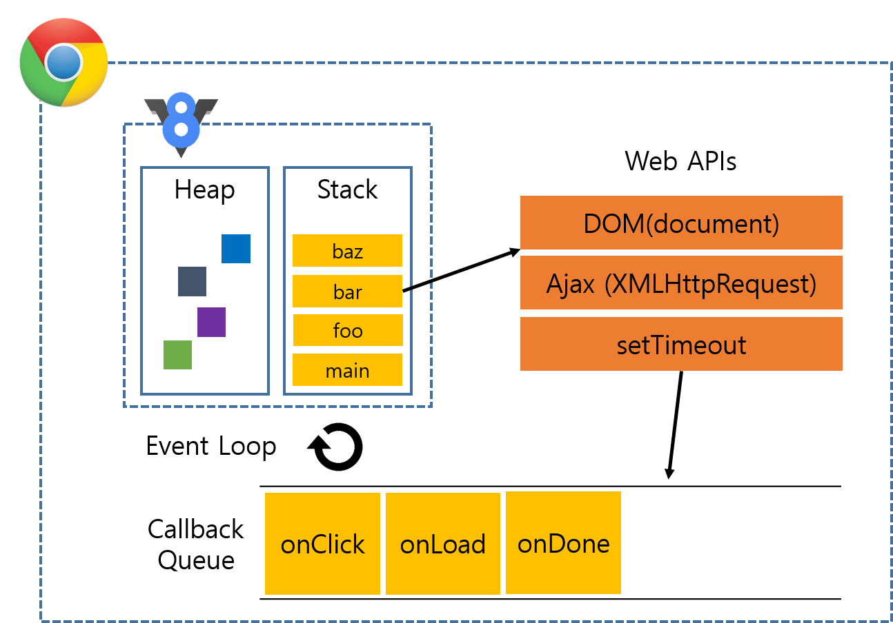

## 배경

면접에서 다음과 같은 질문을 받게 됐다.

> **노드를 이용해서 개발을 여러번 진행하셨는데, 자바스크립트와 노드의 특징에 대해 알고 있나요?**

'비동기', '싱글스레드', '이벤트루프'...?

머리속에 여러가지 개념들이 막 돌았다. 근데 막상 이 여렴풋이 아는 개념을 제대로 설명을 하려니 말문이 막혔다.

면접이 끝난 후에 면접을 세게 맞았지만 그렇다고 그냥 모르는 대로 있을 순 없다.

그래 이왕 이렇게 된 거 자바스크립트와 노드의 특징에 대해서 집고 넘어가자.

<br>

## Javascript란?

### 1. 자바스크립트는 스크립트 언어다.

자바스크립트는 **웹 브라우저에서 동작하는 스크립트 언어**이다.

한번에 모든 코드를 기계어로 번역하는 컴파일 언어와 달리 자바스크립트는 스크립트 언어로 한줄씩 코드를 번역하고 실행한다.

이런 스크립트 언어에서 오는 장점은 다음과 같다.

- 실행 속도는 컴파일 언어보다 느리지만 코드 수정시 **바꾼 부분만 번역하고 실행**한다.(컴파일 언어의 경우 컴파일을 새로 진행해야 한다.)
- 이벤트에 따라서 다른 페이지를 띄우지 않고도 바뀐 내용을 실시간으로 보여줄 수 있게 해준다.(이 때문에 **Event-driven 프로그래밍 언어**라고 불리기도 한다.)

<br>

### 2. 자바스크립트는 싱글스레드로 비동기적으로 동작한다.

**왜 굳이 싱글스레드?**

- 멀티스레드인 여러 다른 프로그래밍 언어는 동기화와 락에 대한 이해가 필요했기 때문에 생산성이 떨어지는 문제를 가지고 있었다.
- 뿐만 아니라 스레드 풀의 스레드 개수는 제한적인데, IO가 진행되는 동안 스레드는 CPU를 사용하지 않는 wait 상태에 빠지게 된다.

자바스크립트는 이를 해결하기 위해 **스레드 하나로 비동기식 논블로킹으로 IO를 처리**한다.

<br>

**비동기식 논블로킹이란?**



위의 표를 보면 어플리케이션이 커널에 시스템콜을 이용해서 IO를 시작하게 하고 그동안 어플리케이션은 다른 업무를 보게 된다. 그리고 커널의 작업이 마무리 되면 signal이나 callback을 통해 데이터를 어플리케이션으로 반환한다. 이 과정에서 프로세스는 다른 일을 할 수 있고 IO는 다른 이들(웹 API나 서버의 경우 C++ 라이브러리)에게 맡기고 일이 끝나면 이를 받아서 처리한다.

그렇다면 이 프로세스는 **정확히 어떻게 동작**할까?

<br>

## 자바스크립트 동작

이부분을 제대로 집고 넘어가지 않는다면 자바스크립트의 비동기 지옥에 빠져 자바스크립트를 싫어하게 될지도 모른다. 이 동작 원리를 이해하기 위해서 개인적으로 아래에 있는 유투브 영상을 강력추천한다. 그렇게 길지 않은 영상이지만 보고나면 자바스크립트의 동작 방식이 머리에 그려질 것이다.

[What the heck is the event loop anyway?](https://www.youtube.com/watch?v=8aGhZQkoFbQ)

### 런타임

런타임은 다음과 같이 구성되어 있다.



**스택**

스택은 호출되는 함수가 쌓이는 곳이다.

함수가 호출되면 푸쉬되어 쌓이게 되고 함수가 끝나면 스택에서 팝하게 된다. (리컬시브하게 계속 같은 함수를 호출하게 되면 스택에 계속 푸쉬되어 Maximum call stack size exceeded라는 에러 메시지를 보기 될 것이다.)

**콜백 큐**

말 그래도 콜백 함수가 들어있는 큐이다.

웹 API는 작업이 끝나게 되면 콜백 큐에 콜백 함수를 푸쉬한다.

**이벤트 루프**

이벤트루프는 스택과 콜백 큐 사이에서 중간 다리 역할을 하게 된다.

<br>

### 동작 과정

그럼 line by line으로 코드를 진행하는데 **시간이 오래 걸리는 작업인 블로킹**을 마주했다고 해보자.

가뜩이나 쓰레드는 하나 밖에 없는데 블로킹이 스택에 올라오면 말 그대로 서비스는 응답없음 상태에 빠지게 될 것이다.

자바스크립트는 이런 작업를 웹 API와 이벤트 루프를 활용해서 해결한다.

사실 우리가 알고 있는 대부분의 블로킹(setTimeout, Dom, Ajax 등등)은 Web API를 이용하게 된다.

즉 Engine 자체가 그 일을 하는 것이 아니다. 그럼 굳이 내가 하는 일도 아닌데 아무것도 안하고 기다릴 수는 없다.

자바스크립트는 블로킹을 Web API에 맡기고 해당 함수를 스택에서 팝하고 자기 일을 하러 간다.

그럼 웹 API가 일이 끝날때 까지 나는 다른 일을 하고 있게 되고 웹 API는 작업이 끝나는 대로 콜백 큐에 콜백 함수를 푸쉬한다.

이벤트 루프의 역할은 스택이 빌때까지 기다렸다가 콜백 큐에 있는 함수를 스택에 올린다.

<br>

## Node란?

구글에서 개발한 C++ 기반의 V8 엔진으로 빌드된 이벤트 기반 자바스크립트 런타임이다.

<br>

### 특징

작성 언어가 자바스크립트이기 때문에 앞서 말한 자바스크립트의 장점을 고스란히 가지고 있다. 뿐만 아니라 웹 프론트엔드에 주로 사용되는 언어가 자바스크립트이기 때문에 노드는 웹 풀스택 개발자들에게 많이 활용되고 있다.

풀스택에서 오는 장점을 극대화 하기 위해 위해 네이버는 식당, 펜션, 항공권, 호텔 등 여러 서비스를 또한 노드를 활용하고 있다고 한다.(내가 참여했던 핵데이 프로젝트의 부서 이기도 하다..ㅎㅎ)

[Naver - 빠르게 서비스를 개발할 수 있는 Node.js](https://d2.naver.com/helloworld/4994500)

뿐만 아니라 노드의 패키지 매니저인 NPM을 활용하면 다른 개발자의 코드를 사용함으로써 개발 시간을 엄청나게 단축할 수 있게 된다.

<br>

### 주의할 점

만일 Web API나 C++ API가 아닌 Engine에게 할일을 엄청 많이 주면 어떻게 될까? 그럼 Engine은 single thread이기 때문에 혼자 모든 일을 감당하게 되는 상황이 발생할 것이다. 이러한 이유로 IO가 많고 상대적으로 CPU 작업이 적은 어플리케이션에 Javascript를 사용한 노드가 적합하다고 한다.

**노드는 싱글 스레드로 설계되어있지만 사실 멀티 코어의 장점을 아예 사용하지 못하는 건 아니라고 한다.**

> Node.js 는 스레드를 사용하지 않도록 설계되지만 멀티 코어 환경의 장점을 얻지 못한다는 의미는 아닙니다. child_process.fork() API를 사용해서 자식 프로세스를 생성할 수 있습니다. 같은 인터페이스로 만들어진 cluster을 사용하면 다수의 코어에 로드 밸런싱이 가능하도록 프로세스 간에 소켓을 공유할 수 있습니다.
> \- Node 공식 문서에서

<br>

## Express란?

그렇다면 이번에는 Node에서 가장 많이 쓰이는 프레임워크 중에 가장 큰 Express에 대해 알아보자.

Express의 장점은 서버를 쉽게 실행/운영할 수 있고 내장된 라우터로 코드를 쉽게 재사용 가능하다. 나도 이런 이유로 빠르게 서버를 개발할 수 있었다. Express 공식 문서를 보며 Express의 특징에 대해 알아보자.

<br>

### 라우팅

> 라우팅은 URI(또는 경로) 및 특정한 HTTP 요청 메소드(GET, POST 등)인 특정 엔드포인트에 대한 클라이언트 요청에 애플리케이션이 응답하는 방법을 결정하는 것을 말합니다.

이때 Express의 인스턴스인 app을 사용하면 라우팅을 손쉽게 해결할 수 있다.

형식은 다음과 같다.

```jsx
app.METHOD(PATH, HANDLER);
```

- METHOD : http 요청 메소드 (POST, GET, PUT, DELETE)
- PATH : 경로(서버에서의 경로를 의미)
- HANDLER : 해당 경로에 도달했을 때 실행되는 함수를 의미한다.

간단한 예를 들어보면 다음과 같다.

```jsx
app.put('/user', function (req, res) {
  res.send('Got a PUT request at /user');
});
```

위의 코드에서 요청된 메소드는 put이고 경로는 /user이며 해당 경로로 요청이 들어오면 function으로 정의된 부분을 실행하게 된다.

또한 app은 완전한 미들웨어이기도 해서 일치하는 경로를 받았을 때 파이프처럼 또다른 경로로 연결해주는 역할을 할 수 있다. 결국 아래와 같은 코드 진행이 가능하다.

**product.js**

```jsx
var express = require('express');
var router = express.Router();

// middleware that is specific to this router
router.use(function timeLog(req, res, next) {
  console.log('Time: ', Date.now());
  next();
});
// define the home page route
router.get('/', function (req, res) {
  res.send('Product home page');
});
// define the about route
router.get('/about', function (req, res) {
  res.send('About Product');
});

module.exports = router;
```

**app.js**

```jsx
var productRouter = require('./product');
...
app.use('/product', productRouter);
```

위의 과정에서 /product/about 경로로 get 함수를 호출하게 되면 '/product'로 productRouter에 도달하고 product 내부의 여러 경로 중에 '/about' 경로에 도달하게 된다.

<br>

### 미들웨어

미들웨어는 무엇인가 그럼?

> 미들웨어 함수는 요청 오브젝트(req), 응답 오브젝트 (res), 그리고 애플리케이션의 요청-응답 주기 중 그 다음의 미들웨어 함수 대한 액세스 권한을 갖는 함수입니다. 그 다음의 미들웨어 함수는 일반적으로 next라는 이름의 변수로 표시됩니다.

미들웨어는 요청이 들어와서 나가기 전에 통과하는 파이프 같은 친구다. 미들웨어에 도달한 요청은 다음과 같은 상황을 맞이하게 된다.

- 모든 코드를 실행.
- 요청 및 응답 오브젝트에 대한 변경을 실행.
- 요청-응답 주기를 종료. (파이프를 통과하다 응답을 해버릴 수도 있다는 이야기다!)
- 스택 내의 그 다음 미들웨어를 호출.

미들웨어에서 응답을 하지 않으면 주로 next라는 function을 호출해서 그 다음 미들웨어 함수에 응답을 전달하게된다.

이런 미들웨어는 파이프의 역할을 하기 때문에 전처리를 해야하거나 에러 핸들링에 많이 사용된다. 그리고 요청을 처리한다기 보다는 파이프 역할을 하기 때문에 중간에 파이프를 하나 더 추가하는 것이 수월하다. 이런 특징 때문에 손쉽게 **써드 파티의 미들웨어**를 사용함으로써 개발 비용을 줄일 수 있다.

```bash
$ npm install cookie-parser
```

```jsx
var express = require('express');
var app = express();
var cookieParser = require('cookie-parser');

// load the cookie-parsing middleware
app.use(cookieParser());
```

<br>

## 생각

면접에서 제대로 답하지 못한게 내가 알고 있지만 정리를 하지 못했기 때문이라고 라고 생각했지만 알고보니 제대로 알지 못한 부분들이 많았다. 찾아보면서 조금은 정리도 되고 몰랐던 새로운 사실을 알아보며 재밌기도 했다. 다음에 같은 질문에 대해 답할 기회가 있으면 더 잘 설명할 수 있으면 좋겠다 ㅎㅎ

```toc

```
