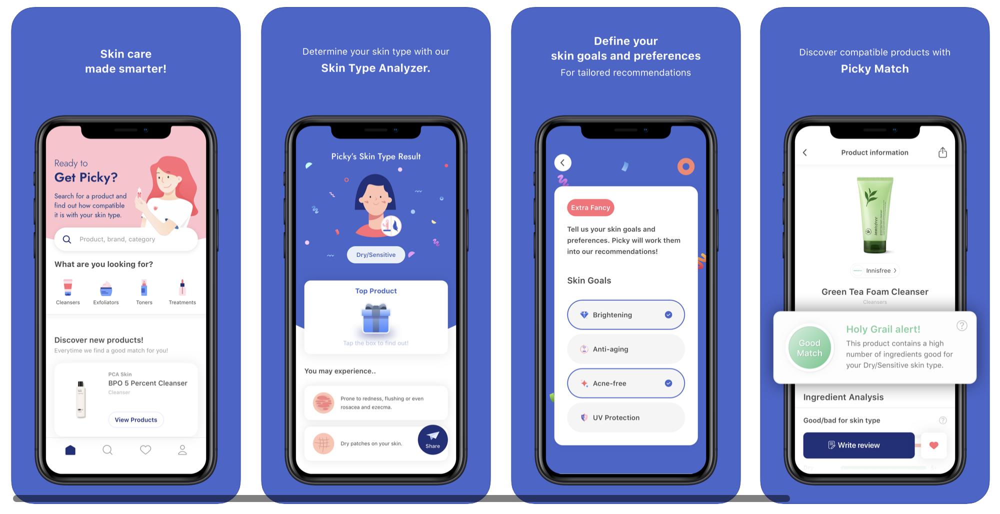
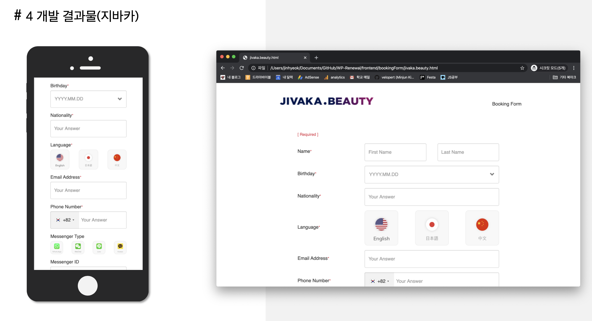
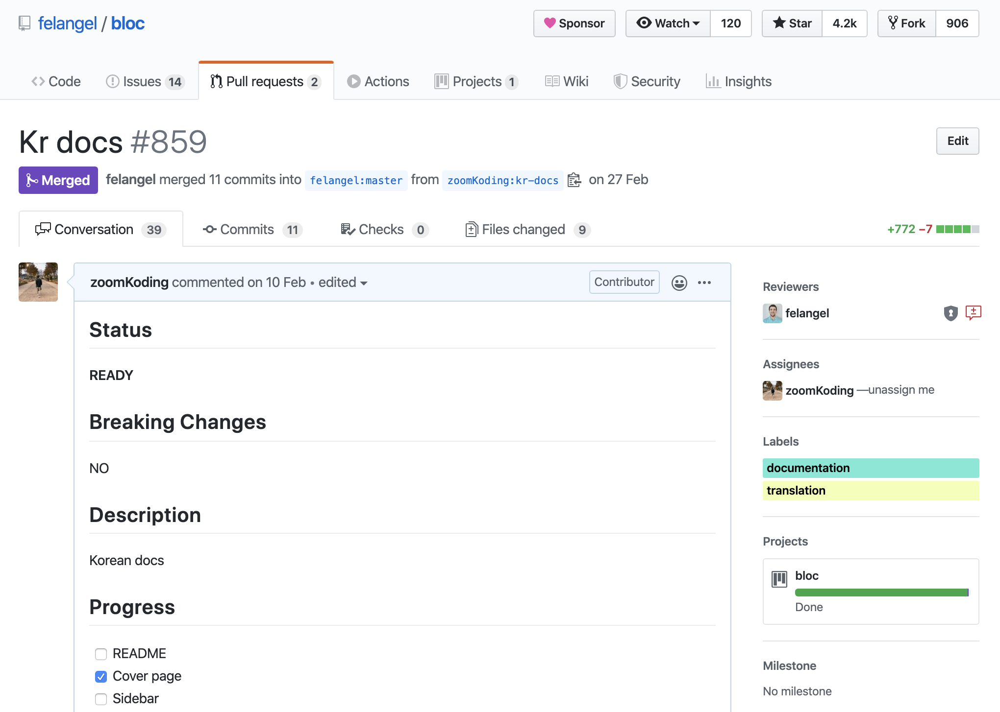
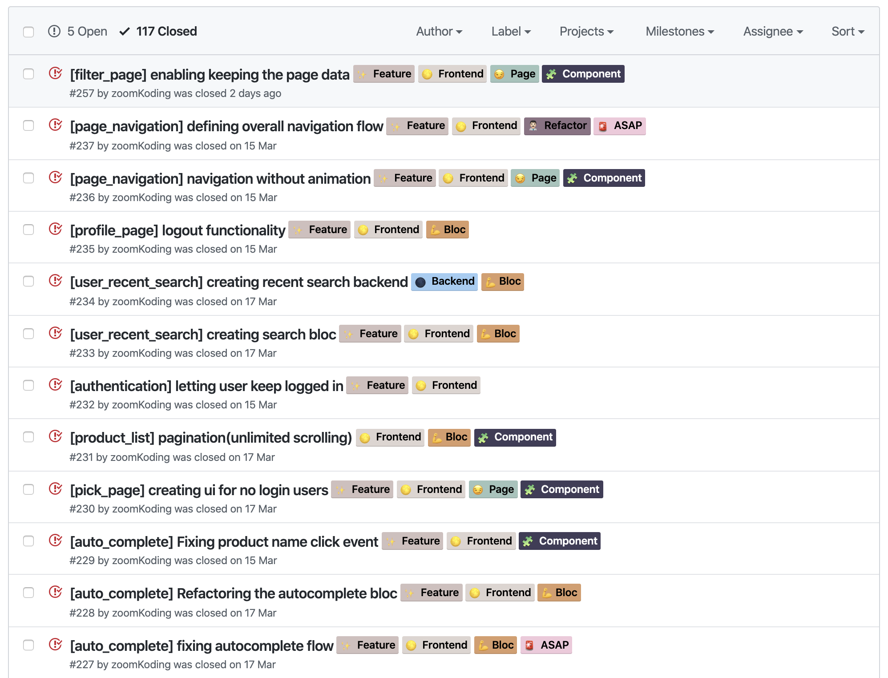
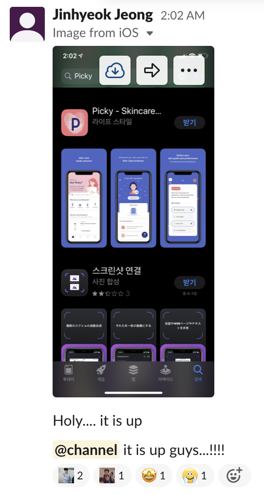

## 목적

개발자를 꿈꾸는 사람이라면 실제 취업을 하기 전에 인턴을 할까 개발 캠프에 참여해야 하나 이런 저런 고민이 많아질 것이다. 개발자를 필요로 하는 곳이 많기 때문에 그만큼 기회도 많고 어떤 게 나에게 제일 좋은 기회일지 고민하고 있을지도 모르겠다. 이런 고민 속에서 혹시 `스타트업 인턴`에 관심이 있을 이들에게 개인적인 경험을 나누고자 한다.

<br>

## 결과적으로 나는

나는 대학교 3학년으로 작은 스타트업의 개발 인턴이다. 채용은 웹 프론트엔드 개발 인턴으로 채용되었지만 2달 만에 회사가 사업 방향을 바꾸게 되면서 얼떨결에 1인 개발자로 풀스택(?) 앱개발을 진행하게 되었다. 그리고 한달 반 동안 5명의 팀원들과 함께 시간을 갈아넣은 끝에 IOS 앱을 배포하였다.(안드로이드 배포는 앱이 좀 더 완성도가 있어지면 배포할 예정이다.) 지금은 배포 2주전에 합류한 프론트엔드 개발자와 함께 버그 픽스 버전 배포를 준비하고 있다.

[App Store Link](https://apps.apple.com/kr/app/picky-skincare-made-smarter/id1504197356)



<br>

## 왜 인턴? 하필 스타트업?

[네이버 핵데이](https://zoomkoding.github.io/codingtest/naver/2019/10/12/2019-naver-hackday-1.html)에서 만난 친구들을 보며 내 깊이에 대한 회의가 왔다. 나름 방학프로젝트로 웹도 만들어서 배포도 해봤는데 내가 아는 수준은 다른 친구들에 비해서 너무 얕았구나를 느꼈고 웹을 제대로 공부해 보고 싶은 욕심과 오기가 생겼다 되었다. 그래서 노마드 코더스 강의를 듣고, 자바스크립트 책도 읽으며 공부할 방법을 찾던 중에 학교 선배에게 이 회사를 추천을 받았다. 마침 웹과 앱을 만들 계획이 있는 회사였고, 사수는 아니지만 구글에서 10년 넘게 일한 경력이 있는 선배가 있다고 했다. 사수가 없지만 좋은 멘토를 통해 배울게 많겠다는 생각으로 즉시 지원했고 일하게 되었다.

<br>

## 다이나믹 스타트업 시작

나는 웹 프론트엔드 개발자로 채용되어 웹 개발을 진행할 예정이었으나 내가 회사에 온 1달 반동안 웹 프로젝트의 필요성을 놓고 전전긍긍하며 나에게는 웹 개발 이외의 개발 일들(예약 시스템 자동화 등)이 주어졌다.



나는 이 시기에 미리 백엔드를 공부하고 리서치하면서 웹에 필요한 웹 백엔드를 미리 만들어보며 어떻게든 배우기 위해 힘썼지만 결국 웹 프로젝트는 무산되었다. 웹 프로젝트가 무산됐다는 말에 한숨이 절로 나왔다. 나의 이런 힘빠진 모습을 본 대표님은 저녁 식사를 제안하셨고 식사 중에 웹 프로젝트가 무산된 이유와 함께 고민 중이신 앱 아이템에 대해서 이야기해주셨다. 막걸리를 살짝 마신 나는 텐션이 살짝 올라있던 중에 역으로 제안을 드렸다.

> **_고민 할 시간에 한번 만들어보시죠!_**

결국 대화는 새로운 프로젝트에 대한 기획으로 이어졌고 대표님, 디자이너, 마케터와 나 이렇게 소수 정예로 해당 프로젝트를 진행하는 것에 대해 이야기를 나누게 되었다. 이 대화가 얼마나 영향이 있었을지는 모르겠지만 몇 일 뒤에 대표님은 회사에 이 프로젝트에 대해서 공식적으로 알리셨고, 그 후 몇 일이 지나 인원 조정과 지금하고 있는 서비스의 종료에 대한 이야기를 발표하셨다. 하고 있는 사업이 나쁘지 않았기에 피벗으로 진행하실 줄 알았는데 대표님은 올인을 결정하셨고 나도 모르게 책임감과 동시에 부담을 느끼게 되었다. 하지만 이미 시작됐고 이왕 시작한 거 제대로 만들어 보자는 마음으로 개발을 시작하였다.

<br>

## 1인 앱 개발(플러터 + 노드)

내 첫 프로덕트 이기 때문에 잘 만들고 싶었다. 혼자하기 때문에 더더욱 욕심이 생겼다. 기획부터 목표로 한 버전 1.0 배포까지 약 1달반의 시간이 주어졌다. 시작할 때부터 기획이 조금 명확해 지기 까지 Flutter의 상태관리 툴인 BLoC에 대해 공부하고 **(번역도 참여해서 Contributor가 됐다 ㅎㅎ)**

<br>



<br>

리서치와 수소문(?) 끝에 AWS, DB structure, MVC 모델, ORM, testing에 대한 나름의 방법을 정하게 되었다. 그리고 혼자 프로젝트를 진행하지만 Github issue, project를 사용해서 task를 정리하고 리서치한 branch 전략을 따라 셀프 Pull Request를 날리면서 Github을 잘 써보려고 노력했다.

<br>



<br>

개발자가 혼자였기 때문에 개발에 들어가는 모든 것을 신경써야 했다. 새로운 feature를 추가할 때면 필요한 API를 직접 구현하고, 해당 기능에 필요한 BLoC을 만들고 UI를 구현했다. 그리고 미리 짜놓은 타임라인에 맞춰 기능을 하나씩 구현하고 `TestFlight`를 이용해 한번씩 새로운 페이지나 기능을 추가한 테스트 버전을 배포하여 팀원들고 앱의 상태를 공유했다.

디자인을 최대한 반영하면서 모든 기능을 살리려고 하다 보니 시간이 말도 안되게 부족했지만 잘 만들어 보고 싶은 욕심에 퀄리티를 포기할 수는 없었다. 결국 야근이 일상이 됐고 주말에도 개발을 진행했다. 그렇게 한달 반을 보내면서 앱스토어 등록까지 완료하게 되었다.



<br>

## 회고

### 빠른 개발 vs 깊이 있는 개발

나는 결과물이 완성도 있게 나오게 되면 인정 받을 수 있을 것이라 막연히 생각했었다.

> **_"한달 반만에 이렇게 만들었어요!"_**

하고 보여주면 사람들이 인정해줄 줄 알았다. 그리고 우리팀도 빠르게 시장에 앱을 배포하는 것에 목표를 두고 있었기에 최대한 시간 대비 효율이 높은 방법으로 짜기 위해 힘썼다. 그렇게 앱은 예정된 날에 팀이 원했던 퀄리티 이상으로 만들어졌다. 다 만들고 나서 앱을 여러 아는 개발자 형들에게 보여주며 내가 개발한 것에 대한 피드백을 받았다. **그 분들은 얼마나 빨리 개발했어 보다 어떻게 개발했는지에 더 관심이 많았고 내가 고민하지 않은 기술적인 부분들에 대해 물었다.** 이야기를 나누다보니 여전히 나는 내가 아는 범주안에서 개발했고 앱을 배포까지 해본 시점에도 나의 깊이가 얕음을 느꼈다.

> **_"그래서 코드는 잘 짠 것 같아?"_**

나한테 자존심 상 아니라고는 말 못할 것 같지만 "네!" 라고 답은 못할 것 같다. 이 기회로 잘 짜는게 중요한 것 같다는 것을 인지했다. 하지만 여전히 잘 짜는 방법이 뭔지 모르고 그렇게 개발해본 경험이 없다. 사수가 있다면 방법에 대해서 터득하기 쉽겠지만 내 환경은 그렇지 않기에 배우기 위해 더욱 노력해야 한다. 남은 인턴 기간 동안 앱 개발 초기에 공부하고 새로운 걸 터득했던 것처럼 배우는 데 힘쓰고 도전해야 겠다.

<br>

### 같이 일하기 좋은 사람

내가 스타트업에 들어와서 가장 많이 배웠고 또 가장 필요한 능력을 뽑으면 협업 능력인 듯하다. 회사에 오기 전에 나는 개발자는 개발을 엄청나게 잘하면 된다는 생각이 있었다. 그래서 어느 순간부터 다른 것들보다 개발 능력만을 기르기 위해 힘쓰기 시작했다. 하지만 막상 회사에 와서 일을 하다보니 협업 능력은 개발 능력 만큼이나 중요하게 느껴졌다.

> **_진혁님과 같이 일하고 싶어요!_**

스타트업이기에 나는 개발 뿐만 아니라 기획에 참여했고 디자인을 구현하기 위해서 디자이너와 계속해서 소통해야 했다. 물론 다른 회사를 경험해보지는 않았지만 이 회사에서 나는 계속해서 내가 맡은 일에 대해 알려야 하고 설득해야 하고 이해하고 수용해야한다. 이 과정에서 개발자로서 다른 분야인 사람들과 소통하는 방법, 좋은 동료가 되는 방법에 대해서 고민하게 되었다. 나는 감정적이어서 `상대방이 기분 나쁘지 않게 이야기 하기`, `다른 사람들의 피드백에 감정적으로 대응하지 않기`와 같은 점에 대해서 특히 많이 고민하고 있다. 이런 관점에서 나는 아직 많이 부족하다는 생각이 든다. 좀 더 `같이 일하기 좋은 사람`이 되기 위해 아니 `좀 더 나은 사람`이 되기 위해 계속 노력해야 할 것 같다.

<br>

### 스타트업 학교

회사가 사업 아이템을 바꾸면서 자연스럽게 스타트업의 극초기 단계부터 경험해보게 되었다. 이 시간을 겪으면서 창업 과정과 대표, 디자이너, 마케터의 역할을 자연스럽게 볼 수 있었다. 또 우리 팀에 맞는 개발 Cycle, Sprint 방식, 소통하는 툴(slack, notion)과 회의 방식(Daily Stand Up, Weekly Wrap Up)을 정하고 개선하는 과정을 참여하면서 많이 배울 수 있었다. 그리고 대표님과 이야기를 많이 나눌 수 있어서 너무 좋았다. 대표님은 내가 가지고 있는 생각에 대해서 단정 짓지 않고 깊이 들어주셨고, 대표님의 경험도 많이 나눠주셨다. 이 과정에서 내 생각이 정리되기도 했고 일 뿐만 아니라 관계, 돈, 꿈 등에 대해 깊게 고민해 볼 수 있었다.

<br>

## 끝으로

개발자로 많이 성장했는가에 대해서 이야기하자면 고민이 많이 된다. 하지만 그냥 많이 배웠는가에 대해서 묻는다면 그렇다고 이야기해주고 싶다. 물론 좋은 개발 문화가 있는 회사에서 일하며 개발적인 성장이 있다면 좋겠지만 내가 속한 이 곳에서는 또 다른 성장이 있는 것 같다. 언제까지 이 곳에 머무를지 모르겠지만 있는 동안 더 많이 배우고 성장하고 싶다.


```toc

```
