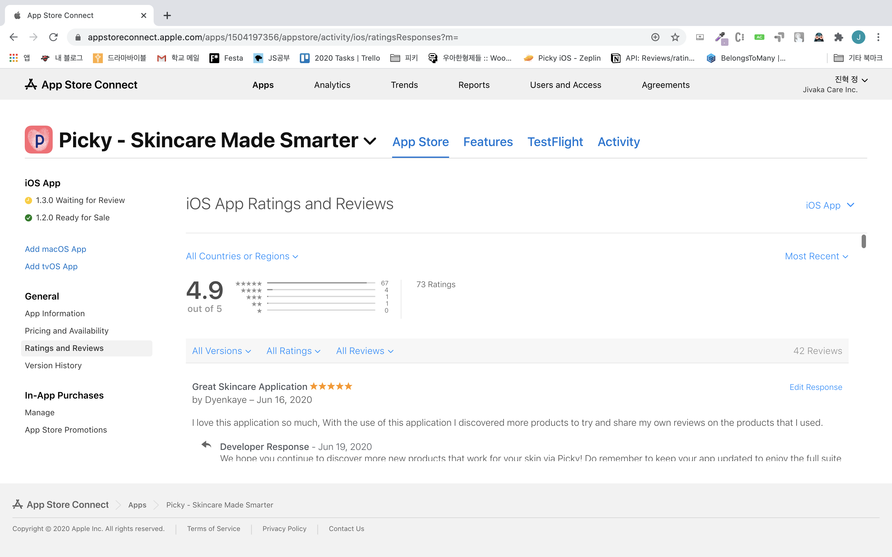
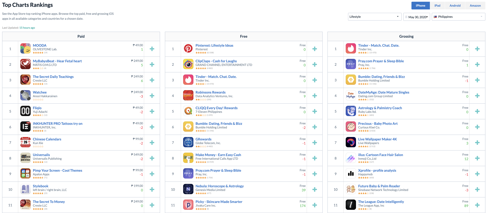
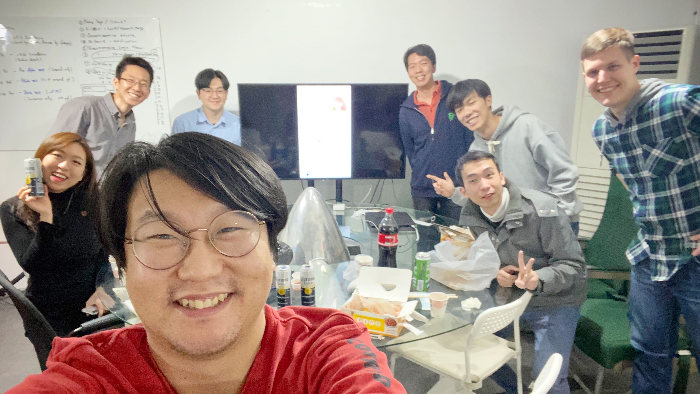
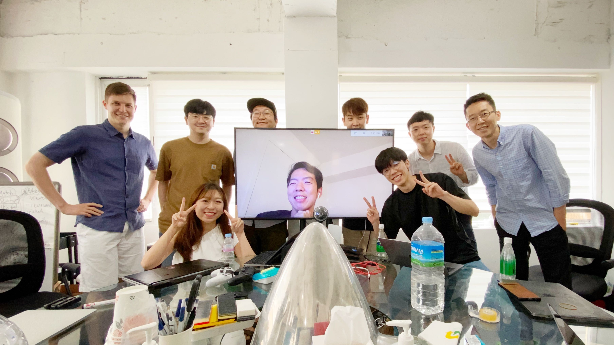

## 이 글의 목적

[나의 스타트업 앱 개발 후기에 대한 글](https://zoomkoding.github.io/%EC%8A%A4%ED%83%80%ED%8A%B8%EC%97%85/%ED%9A%8C%EA%B3%A0/2020/03/25/start-up-app-development.html)을 읽었다면 알겠지만 나는 패기롭게 도전한 스타트업에서 우연한(?) 기회로 홀로 **피키**라는 앱을 개발하고 배포하게 되었다.

이제는 6개월 간의 피키에서의 시간을 마무리하고 다음 여정을 준비하고 있다. 이 글을 통해 그동안 나는 어떤 것들을 배웠는지 내가 왜 이런 피키를 떠나게 됐는지를 정리하고 나눠보려고 한다.

## 배포 이후 피키는

그동안 나는 들어온 개발자들과 함께 최근까지 2달 동안 열심히 버그를 고치고, 새로운 기능을 추가하는 사이클을 반복하며 앱을 성장시켰다. 그동안 로그인 유저 수는 2000명을 넘겼고 앱에 대한 리뷰도 긍정적이었고 앱은 꾸준히 성장하고 있다.



그리고 하루는 갑작스런 필리핀 사람의 TicTok 홍보 덕에 필리핀 Free App 다운로드로 순위권 진출하기도 했다!



## 나는 코어 개발자!?

일단 개발의 과정과 코어와 상관없이 나는 팀의 `코어 개발자`였다. 구글 출신 CTO님과 함께 시작한 개발 과정이었지만 CTO님은 나에게 자율성을 최대한 보장해주셨다.

이 안에서 나는 내가 개발하고 싶은 대로 스스로 고민하며 모든 개발을 진행했다. 뿐만 아니라 앱을 만들기 위한 기획에도 참여했고 디자이너와 소통하는 것 또한 나의 담당이었다. 그리고 미리 정해진 배포 날짜에 맞춰 제한된 시간 속 내가 아는 선에서 가장 효율적이고 적절한 방법을 찾아 앱을 개발해나갔다. 결과적으로는 제 시기에 앱은 원했던 기능을 최대한으로 갖춘 상태로 앱스토어에 전달되게 되었다. 그리고 나는 자연스럽게 핵심 기능을 모두 구현해낸 피키의 `코어 개발자` 가 되었다.



## 근데 나 코어 개발자 해도 돼?

앱을 배포할 때 즈음 새로운 앱 개발자가 들어왔다.(이 분 또한 플러터에 익숙한 개발자가 아니었다.) 문제 없이 돌아가는 앱을 보며 내가 짜놓은 코드들마저 문제가 없겠거니 하고 생각하고 있었다.

그나마 처음 투입된 개발자는 우여곡절 끝에 내가 짜놓은 플러터 코드를 최대한 습득해냈고 정말 앱의 UI 정도를 쳐내는데는 문제 없는 상태가 되었다. 하지만 앱의 UI 이외의 부분과 다른 분들이 일을 진행하는데 있어서 내 도움이 없으면 진행이 되지 않는 부분들이 많았고 이에 따라 나는 회사에서의 대부분의 시간을 다른 사람들이 필요한 부분들을 구현하는 데 쓰게 되었다.

그리고 외주로 잠깐 잠깐 웹 개발을 진행하시던 갇도형님(진짜 충격적으로 잘하시는 분이시다...)이 앱 개발도 도움을 주기로 하며 백엔드 코드를 본격적으로 봐주기 시작했다. 이 당시 나는 **내 코드와 사랑에 빠져 있었기에** 그 분이 지적하는 부분들에 대해서 굉장히 방어적으로 대응했다. 그러나 도형님이 말씀하신 부분에 리서치를 조금하고 나서 다시 코드를 보니 문제가 있음을 알게 되었다.

## 아직 많이 부족해. 배우고 오자.

본격적으로 내가 공부를 더해야 겠다는 마음이 들었던 것은 이 시점부터 였던 것 같다. 도형님이 본격적으로 내 코드를 들여다 보기 시작하면서 내가 미처 고민하지 못했던 부분들에 대해서 지적해주셨다. 지적을 해주시고 그 지적하신 점들을 수정하는 과정에서 `"아 이런게 중요하구나.."` 하고 깨달음을 얻었던 순간들이 많았고 지속적인 참교육 시간을 반복하면서 내가 모르고 있는 세계에 대한 두려움과 동시에 좀 더 배우고 와야겠다는 생각이 생겨났다.

내 열정도 중요하지만 열정을 뒷받침해줄 실력이 있다면 너무 좋을 것 같았다. 그 공부 방법이 어떤 게 좋을지는 잘 모르겠었지만 배우고 싶은 욕구가 크게 다가왔다. 하지만 피키와 여러 공부할 수 있는 기회와 **내 롤모델이 제안한 프로젝트(이게 대박이었다...)** 속에서 엄청나게 고민했다.(한 두주 동안 퇴근하고 아무것도 못한 것 같다...)

그리고 결국 회사를 퇴사하기로 마음을 먹었고 최종으로 올랐던 `우테캠(우아한테크캠프)` 와 `치명적인 제안` 사이에서 고민하게 되었다.(또 한 주를 이거 고민하는데 날렸다) 후자는 **좋은 사수와 함께 일을 하며 돈과 실력을 둘다 얻을 수 있는 좋은 기회였지만 배우는 데만 조금 더 집중하기 위해 나는 결국 우아한테크캠프를 선택하게 되었다.**

지홍님(CEO)과 앤드류님(CTO)께 내 의사를 말씀드렸고 두분 모두 아쉬워하셨지만 나의 결정을 존중해주시고 응원해주신다고 하셨다. 그리고 6월 한달 동안 내가 짠 코드를 최대한 리팩토링하고 내 피키에서의 마지막 기능인 알림 기능을 구현하고 마무리하기로 했다.

## 백엔드 리팩토링(퇴사 전 최후의 발악)

리팩토링의 목적은 사실 다른 게 아니었다. 회사를 떠나기로 인수인계를 말로 하는 것보다 코드를 잘 짜놓고 가는게 더 낫겠다는 생각이 들어서였고 코드가 부족하단 걸 알았는데 그냥 던지고 가기에는 자존심이 상했었다.

기능 개발과 병행해서 진행해야 했기에 생각보다 시간이 오래 걸렸다. 조금씩 수정하고 도형님께 피드백을 받으며 코드 방향을 조금씩 수정해 나갔다. 내가 잘못 쓰고 있던 MVC 패턴을 바로 잡고 의존성이 강했던 코드를 분리시키고, 조금 다르게 반복적으로 사용되는 코드를 함수화 하여 코드를 간결하게 만드는 과정을 진행했다. 그리고 각 함수마다 try catch를 설정하는 것이 아니라 미들웨어를 활용하여 에러를 처리하고 각 에러에 맞게 에러 코드와 메세지를 전달했다. 그리고 도형님, 앤드류님, 그리고 개발자 분들로 부터 박수를 받았다.


## 퇴사. 마무리.

퇴사라는 경험 또한 나에게는 굉장히 의미있는 경험이었다. 좋은 마무리를 하고 싶었지만 생각보다 내가 짜놓은 불완전한 코드(?)를 던지고 가는게 불안했고 솔직히 다른 개발자들에게 미안했다. 원래 나만 알고 있던 코드를 인수인계 받던 개발자 분의 한숨 소리가 내 마음을 너무 아프게 했다. 내가 아직 대학생이라는 상황과 빠르게 개발이 진행된 상황을 이해한다고 이야기했지만 내 코드를 보며 힘들어하는 개발자를 보면서 나도 같이 마음이 어려워졌다.

이런 상황을 본 앤드류님(CTO)님은 나에게 여러 좋은 이야기를 해주셨다. 여러 큰 오픈소스 프로젝트나 서비스의 초기 개발자가 짠 코드가 변하고 아예 다시 짜여지기도 하는 상황들을 알려주시면서 이 상황이 매우 자연스러운 일이고 내가 짠 코드들이 나를 대변하지 않는다고 말씀해주시며 힘을 실어주셨다. 그 덕에 어찌어찌 마지막 주까지 열심히 달린 끝에 내 할일을 마무리하게 되었다.

그리고 마지막으로 사람들과도 마무리하는 자리를 여럿 가졌다. 술도 안 마시는 나지만 그 동안 고마웠던 낯간지러운 이야기를 꺼내기 위해서 술도 마셔봤다 ㅋㅋ 그 과정 속에서 응원도 많이 받고 그 동안의 피키에서의 반년이 잘 마무리 되고 있음을 느낄 수 있었다.


누구보다 항상 나에게 큰 힘이 되어주었던 대표님이자 최고의 상담가 **지홍님**, 나에게 이 기회를 제공해주시고 항상 큰 신뢰를 주셨던 CTO **앤드류님**, 사적인 자리에서는 꿀잼이지만 일에서는 최고의 지략가이신 **레오님**, 나의 롤모델이자 좋은 멘토가 되어준 **도형님**, 최고의 디자이너이자 평정심왕인 **헌영님**, 언젠가 CEO가 될 최강 마케터 레이첼님, 정리왕 브라이언님과 내가 제일 좋아하는 인도네시아인이 되어버린 신림 사는 인플루언서 리키님 ㅋㅋ



**그리고 마지막으로 하는 블로그 앱 홍보이다 ㅋㅋㅋㅋ**

[Picky AppStore Link](https://apps.apple.com/kr/app/picky-skincare-made-smarter/id1504197356)

## 배운점

### 태도와 열정

대표님과의 인턴십 첫날에 `뭐가 되고 싶냐`는 첫 대화에서 일단 취업을 먼저 생각하고 있다고 말씀드렸다. 나는 내가 가지고 있는 개발에 대한 열정을 풀 수 있는 곳으로 막연히 한국의 유명한 큰 회사를 떠올렸다. 창업은 일단 생각 조차 하지 않았었다.

하지만 피키를 시작하고 생각이 많이 바뀌었다. 피키에 모인 사람들은 다들 화려한 이력을 내려놓고 온 사람들이거나 일부러 스타트업을 첫 회사로 선택한 사람들이기에 대하는 자세가 남달랐다. 각자 가지고 있는 장점은 달랐지만 열정이라는 부분은 동일했다.

그리고 그 중심에 항상 대표님이 계셨다. 항상 지체 없이 도전하신다. 디자인을 설명하기 위해 파워포인트로 프로토타입을 만들어오시거나, 인스타 인플루언서에게 무턱대고 연락해서 미팅을 가지신다거나, **심지어는 알고리즘을 설명하기 위해 간단한 프로그램을 엑셀 함수를 이용해서 구현해 오셨었다.(진짜 깜짝 놀랬다ㅋㅋㅋ)**

하루는 대표님과의 이야기를 하다가 이런 말씀을 해주신 적이 있었다.

> 사업이 성공할 때 **좋은 사업 아이템**과 **함께 하는 팀원들의 태도와 열정** 중에 어떤 요인이 더 크게 작용할까요?
> 저는 **태도와 열정**이라고 생각해요!

뭔가 이 말을 하는 지홍님의 모습과 경험을 봐왔기에 자연스럽게 이 말에 공감했다. 그리고 실제로 피키 팀에는 자신을 제한하지 않고 최선을 다하고 있는 팀원들이 대부분이기 때문에 피키는 계속 성장하고 결국에는 성공할 거라고 생각한다.

### 혹시 나 스타트업 체질인가?

그리고 미친듯이 달렸던 개발 기간과 스타트업의 시작부터 조금씩 성장해 나가는 모습을 보면서 내 열정이 빛날 수 있는 곳은 **스타트업**이 될 수도 있지 않을까 하는 생각을 하게 되었다. 그리고 스타트업은 한 분야만 잘해서 되는게 아니라 인성, 사회성, 통찰력 등등이 다 중요하기 때문에 스타트업에서 이런 자세로 계속 성장하면 결국에는 그냥 **좋은 사람으로 수렴하게 될 것 같다** ㅋㅋㅋ

## 다짐

지금 나의 다음 여정은 바로 시작되어 우아한테크캠프를 열심히 진행하고 있다. 그 후의 나의 여정은 뭐가 될지는 모르겠지만 지금 내가 할 수 있는 다짐은 간단하다.

**포기한 게 많은 만큼 겸손한 자세로 열심히 배우고 열심히 성장하고 좀 더 나은 사람이 되자!**

긴 글 읽어주셔서 감사합니다! ㅎㅎ

```toc

```
