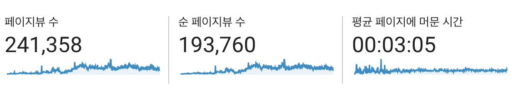
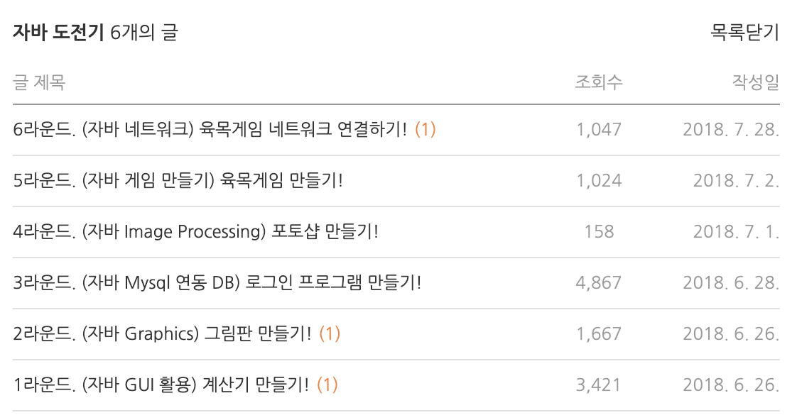
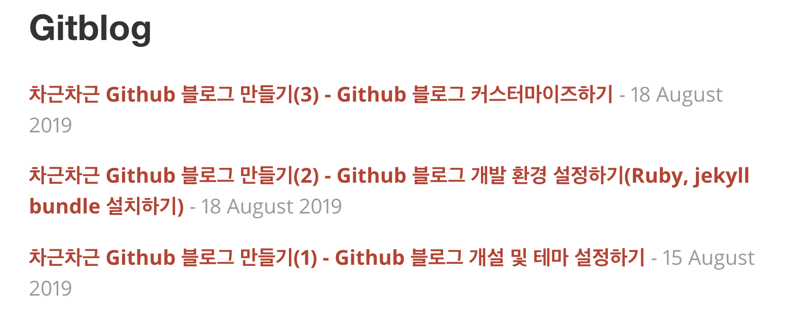
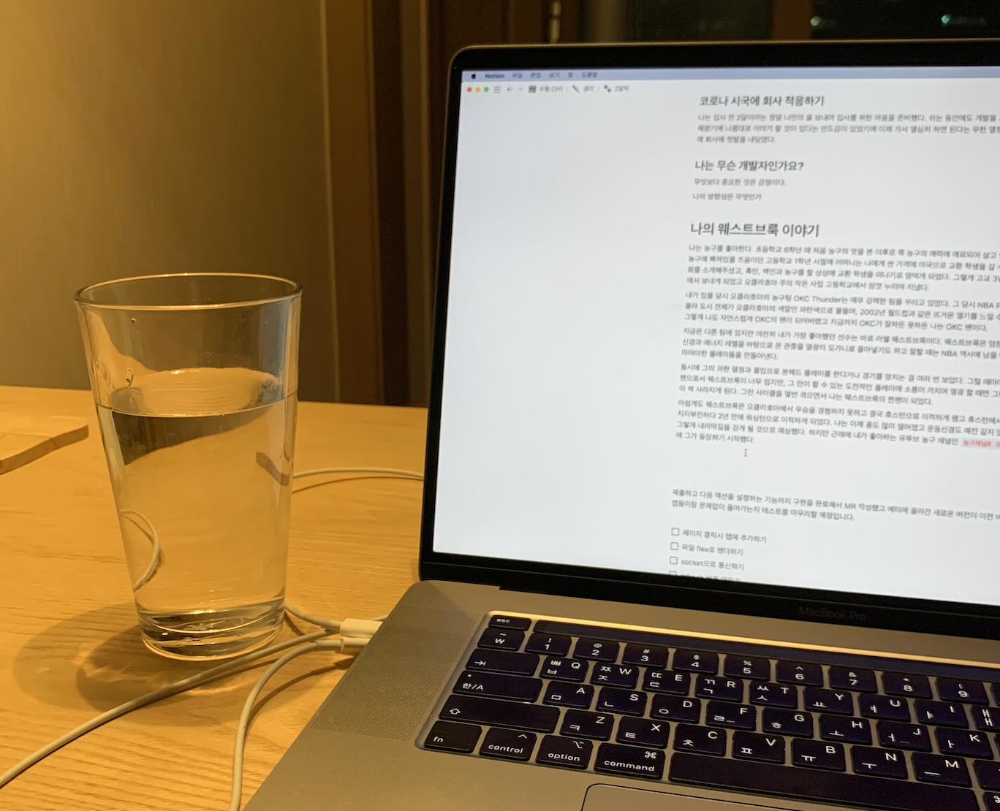

## 🙋‍♂️ 내 소개 + 블로그 소개


나는 개발 4년차, 블로그 4년차인 개발자 **줌코딩**이다👋 개발을 시작하고 얼마지 않아 블로그를 운영하기 시작했고, 개발도 블로그도 꾸준히 운영하다보니 글의 양도 많아지고 글을 읽어주시는 분들의 수도 점차 늘어났다. (어느새 페이지뷰 수도 꽤 많이 늘었다🌝)



그렇게 블로그에 점점 애정이 생겨가면서 자연스럽게 내 블로그를 직접 개발하여 커스터마이징해보고 싶은 욕심이 생겼다. 그리고 올해 입사를 하게 되어 입사 전 마지막 프로젝트로 개발 블로그를 직접 디자인하고 개발해보게 되었다.

블로그를 이전하고 처음 쓰는 글로 내 블로그 경험을 나누면 좋겠다는 생각에 이 글을 쓰게 되었다. 블로그에 관심이 있다면 부담없이 편하게 읽어주면 좋겠다.🙏

<br/>

## 🚀 블로그 시작

전공 첫학기에 개인 네이버 블로그에 과제를 포스팅해야하는 수업이 있었다. 당시 군복학으로 열정이 넘쳤던 나는 과제를 성실히 수행했고 학기가 흐르면서 자연스럽게 블로그에 차곡차곡 포스팅이 쌓여갔다.



그렇게 블로그에 내가 정리한 글이 쌓여가고 실제로 공유된 글이 조회되는 것을 보면서 나는 조금씩 재미를 맛보기 시작했다. 그리고 이왕 공부한 내용들을 정리도 할겸 앞으로 블로그를 운영하면서 공부한 내용들을 정리해보기로 마음 먹게 되었다.

<br/>

## 🏀 닉네임 + 테마 정하기

블로그를 시작하기로 마음 먹으면서 블로그 이름을 정해야 했고 깊이 고민하지 않다. 코딩과 어감이 비슷한 내 최애 농구 선수 코비가 떠올랐고, 코비의 농구화 시리즈 이름인 줌코비(Zoom Kobe)에서 마지막 자만 바꿔서 줌코딩(Zoom In Coding)을 내 닉네임으로 정했다.

당시 무심코 지은 내 닉네임은 나의 부캐가 되었다. 내가 블로그에 진심인 것을 아시는 분들은 나를 **줌코딩**으로 부르기도 한다. 이게 조금 웃긴데 그렇게 들을 때면 내심 기분이 좋다. 혹시 이제 막 블로그를 시작하시는 분들이라면 은근슬쩍 닉네임 지어보길 추천드린다. 여기서 오는 또 다른 재미가 있다.

그리고 내가 농구 선수인 좋아하는 선수인 로드맨의 이미지로 블로그 배경을 정했다.


TMI를 조금 나누자면, 이 사진 속 로드맨은 경기에 몰입한 나머지 나가는 공을 잡기 위해 착지를 고려하지 않고 몸을 내던진다. 물론 로드맨은 농구 외적으로 사고뭉치로 유명하지만 그가 자신이 하는 일을 대하는 애정과 열정만큼은 진짜였다. 나도 내가 하는 개발에 이런 태도를 가지고 싶다는 마음으로 이 사진을 배경으로 선택하게 되었다😂

<br/>

## 👷‍♂️ 본격 블로그 만들기

자 이제 블로그를 위한 재료들이 다 준비됐고, 어디에 블로그를 올릴지 결정해야 했다. 당시에 나는 개발을 막 시작한 상황이었고 직접 블로그를 개발할 능력이 없었다. 하지만 뭔가 너무 잘 되어 있는 블로그 플랫폼인 티스토리나 네이버 블로그에서 운영하고 싶지는 않았다.

개발자인데 조금 고생하더라도 github page를 통해 블로그를 만들어 봐야겠다고 마음을 먹게 되었다. 당시 괜찮아보였던 Centrarium이라는 jekyll theme을 활용해서 만들게 되었는데 여러 블로그에서 알려주는 방법을 따라해봐도 되지가 않았다. 그렇게 몇주에 걸친 삽질 끝에 내 개발 블로그인 줌코딩의 코딩 일기를 만들게 되었다.

분명 나같이 삽질한 분들이 많으시리라는 생각에 [차근차근 Github 블로그 만들기](https://zoomkoding.github.io/category/gitblog)라는 블로그 만들기 시리즈물을 만들기도 했다. (이 글은 꾸준히 많은 분들이 찾아와주신다.)



<br/>

## 🎒 블로그에 배움 나누기

초기에 나는 블로그를 **배움을 나누는 공간**으로 많이 사용했다. 내가 공부한 내용을 조금 더 신경써서 다른 사람들에게 공유될 수 있는 수준으로 정리한 뒤 이를 포스팅하기를 반복했다.

초반에는 개발을 시작함과 거의 동시에 블로그를 시작했기 때문에 자연스럽게 내가 나누는 배움의 깊이는 얕을 수 밖에 없었다. 하지만 차근차근 배우고 정리하는 과정이 몸에 익다보니 자연스럽게 이것이 나를 더 많이 배우고 성장할 수 있는 근육으로 자리잡았다. 너무 예전 글들은 내용이 부정확하기도 해서 내리기도 했지만 그 당시에 썼던 글들을 보면 뭔가 그 당시의 열정이 느껴져 기분이 좋다.

이러한 공부 방법이 가장 큰 효력을 발휘했던 때는 2년 전에 알고리즘 공부에 빠져서 휴학을 했을 때이다. 그때 나는 친구와 반년 가까이 대학교 근처에 방을 구해서 알고리즘 공부에 전념하며 살았는데 당시에 문제 풀이랑 알고리즘 정리글만 200개 넘게 썼다.(자세한 내용은 [이 글](https://www.zoomkoding.com/how-to-algo/)을 참고하길 바란다.)


공부하는데 블로그 정리할 시간이 어디 있을까 라는 생각이 있을지 들지도 모르겠지만 해보신 분들을 경험해보셨을거다. 공부하고 적용하고 글로 정리하기를 반복하는 무한 선순환 속에서 달리고 있는 자기 자신을 보게 될 것이다.

<br/>

## 🧢 블로그에 생각&경험 나누기

블로그를 운영하는 또 다른 재미는 바로 내 개인적인 경험이나 생각을 나누는 것이다. 이것은 매우 주관적인 것인 나만의 것이기 때문에 배움을 나누는 것과는 차원이 다른 매력이 있다.

블로그를 시작하고 2년 가까이는 그냥 블로그를 공부한 내용을 나누는 곳으로 사용했다. 내가 가진 경험이나 생각 많이 부족하기 때문에 이를 나누는 것은 아직 이르다는 생각이 있었다.

하루는 학교에 강연 온 내가 좋아하는 선배가 블로그에 `나만의 개똥철학`을 나누라는 이야기를 해주었다. 대다수의 사람들이 내 생각이 담긴 글에 관심을 가져주지는 않겠지만 누군가는 당신의 생각에 관심을 가지고 무언가 얻어갈 수도 있다는 이야기었다.



그 때부터 조금씩 내 개인 생각이나 경험을 나누는 글들을 조금씩 써보고 있다. 이런 글을 쓰다보면 자연스럽게 내가 가지고 있는 생각이나 경험의 과정을 되돌아 보게 되는데, 이 과정이 나에게는 매우 의미가 있었다. 이 속에서 당시에는 보지 못했던 감사한 부분, 의미있는 부분, 아쉬웠던 부분들을 떠올릴 수 있었고 어느 정도 내 경험과 생각이 정리가 되기도 했다.

글을 쓰고 처음에는 이런 글을 누가 읽긴 할까 했지만 정말 신기하게 읽고 댓글까지 남겨주는 고마운 분들이 여럿 있었다. 내 경험이나 생각이 공감받거나 누군가에게 자극이나 도움이 됐다는 이야기를 들을 때면 내 경험의 가치가 더 커짐을 느낀다.

<br/>

## 💎 나에게 개발 블로그란

블로그는 나에게 정말 감사한 존재이다. 그간 블로그는 나에게 공부하게 해주는 동력이었고 경험과 생각으 정리하면서 다시 달릴 수 있는 힘을 얻는 공간이었다. 생각지도 않았지만 실제로 내 블로그를 통해 도움이나 좋은 영향을 받았다는 분들의 이야기를 들으면, 그 기쁨을 이루 말할 수 없다. 앞으로 내가 어떠한 개발자로 또 어떤 생각을 가진 사람으로 성장할지는 모르겠지만 블로그가 각 과정에서의 배움과 경험을 나눌 수 있는 창구가 되었으면 좋겠다.

<br/>

## 🔮 그리고 짧은 홍보

그리고 웹 개발자가 되면서 기존에 Jekyll Theme을 이용해서 블로그를 운영하던 때 아쉬웠던 점들과 내가 좋아했던 블로그들을 참고하여 내 블로그를 직접 만들게 되었다.

아직 많이 부족하지만 이 테마로 블로그를 운영하고 싶거나 같이 발전시켜볼 생각이 있다면 PR, 이슈, 개인적인 문의 모두 대환영이다.💯

<br/>

## 👋 마지막으로

나도 내가 아는 개발자 분들의 블로그에 종종 방문해서 새로운 올라온 글들을 읽어보기를 좋아한다. 각자가 가지고 있는 경험들과 공부한 내용들을 보면서 나도 배울 것들과 생각 해볼 것들을 얻는다. 혹시 나와 같은 생각으로 블로그를 운영하시는 분들이 있다면 댓글로 블로그 링크를 남겨주면 너무 좋을 것 같다. 나도 구경하러 가도록 하겠다 🙂

```toc

```
