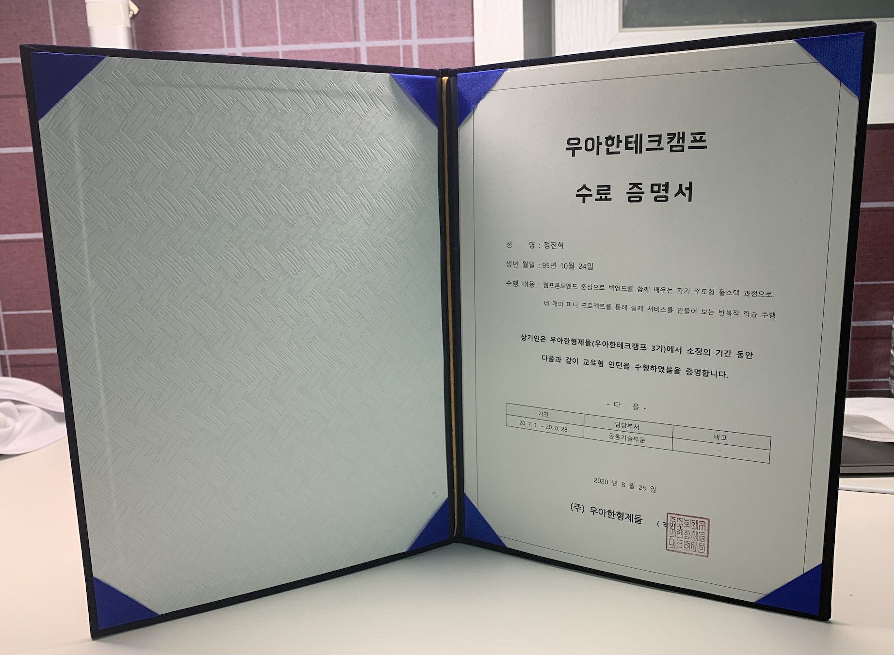
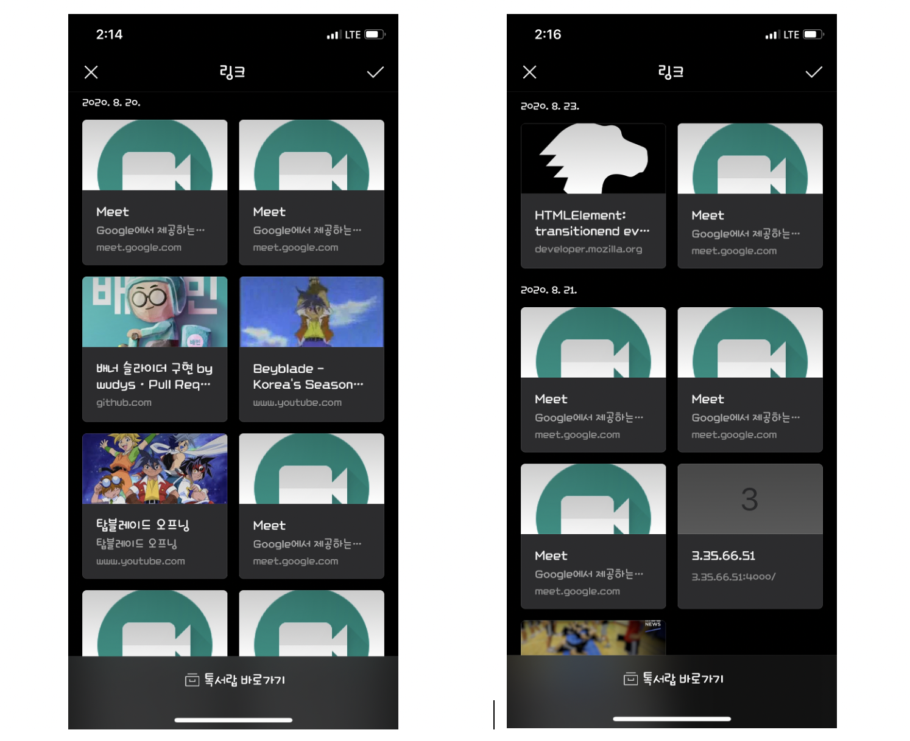
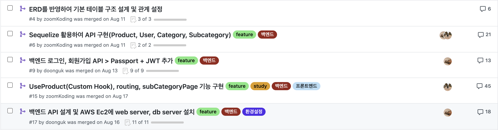

## 💫 목적

캠프의 반환점을 돌며 포스팅을 썼으니 캠프의 마무리 회고를 잘 쓰고 캠프를 끝맺고 싶었지만, 복학과 함께 4학년 생활을 시작하게 되면서 끝을 보지 못했다😭

그렇게 방치했던 회고였지만 이제는 진짜로 우아한테크캠프의 마무리를 지어 보려 한다!ㅎㅎ

일단 수료증 사진 투척하고 간다~ㅋㅋ



## 우아한테크캠프의 마지막 2개의 프로젝트

일단 나는 매우매우 인복이 좋은 사람이다. 이전 프로젝트에서도 그랬지만 마지막 두개의 프로젝트를 함께할 팀원 명단을 보고 매우 안도했다. 그리고 실제로 프로젝트를 하며 많이 배우고 제법 완성도 있는 결과물도 만들어 내게 되었다.

### 우아한가계부(with 갇해민)

[결과물 링크](http://3.35.66.51:3003)

[프로젝트 링크](https://github.com/woowa-techcamp-2020/hkb-15)

해민이(당시 해민님)은 정말 갇해민이었다. 이미 캠프에서 어너더 클래스로 많은 사람에게 은총을 베푸시는 분이셨다. 그리고 심지어 디자인까지 너무 잘하는 **자칭타칭 만능 프론트엔드 디자이너**였다. ([해민이 블로그글](https://blog.jhaemin.com/frontend-designer-cke7xdby002bnyjs1cx4h45jy))

이번 프로젝트 기간 동안에 **나와 해민이는 개발자, 개발과 디자인이 가능한 프로젝트 매니저**와 같은 느낌으로 함께 프로젝트를 했던 것 같다.

해민이는 좀더 디자인과 UX에 집중해서 진행하는 동안에 나는 선 개발을 진행하기 시작했고 매일 아침에 이전 날 작업한 것들에 대한 해민이의 리뷰를 받으며 개발을 진행했다. 이 과정에서 해민이가 정말 열심히 봐주고, 내가 모르던 부분들을 잘 가르쳐줘서 고마웠다.

이전 프로젝트와 달리 문서화나 구조보다는 생산성을 추구하다 보니 생각보다 빠른 시일 내에 너무 맘에 드는 결과물을 만들게 되었다.(역시 디자인이 이쁘면 개발할 맛이 난다.)

나는 남은 시간 동안 해민이가 차트 생성해주는 module을 개발해서 npm 올린 걸 참고해서 이전 프로젝트 때부터 개발 해왔던 나만의 **Custom ORM을 모듈화하여 npm에 배포**하게 되었다.


사실 나는 이제 막 프론트엔드를 입문한 사람으로서 이런 해민이랑 이야기하고 같은 프로젝트를 할 수 있는 건 너무 좋은 기회였다. 개발적으로도 많이 배웠지만 개발자라는 틀에서 사고하는 나의 틀도 많이 깨졌던 시간이었다.

그리고 해민이를 따라 나도 디자인에 기여 해보고 싶은 마음에 캘린더 부분의 모바일뷰를 맡아서 디자인을 진행해봤다 ㅎㅎ


프로젝트 기간 동안 항상 열린 마음으로 사고하고 꼼꼼하게 내 코드를 봐주는 해민이한테 많이 고마웠다. 그리고 무엇보다 잡담하면서 해민이 생각을 많이 듣고 생각해볼 수 있어서 좋았다. 그리고 **절제가 안되서 삭제하긴 했지만 카트도 너무 재밌었다 ㅎㅎ**

### 우아한비마트(with 갇동욱, 갇관형)

[결과물 링크(Mobile Web)](http://bmart.zoomkoding.com)

[프로젝트 링크](https://github.com/woowa-techcamp-2020/bmart-6)

이 프로젝트는 팀으로의 시너지를 제대로 경험했던 프로젝트였다.

마지막 프로젝트여서 잘 만들고 싶은 것도 있었지만 우형 개발자, 기획자들에게 데모가 진행될 거라고 했기 때문에 그 부담은 배가 됐었다. 이 과정 속에서 나와 관형이는 리액트를 처음 입문했고 모두 입사 면접을 위한 자소서까지 써야했기에 시간적으로도 심적으로도 많이 초조했다.

너무 좋은 동욱이형은 우리가 개발을 진행할 동안에 리액트의 여러 가지를 이해할 수 있는 예제 코드를 만들어주고 친절히 설명도 해줘서 리액트를 짧은 시간 동안 잘 배울 수 있도록 도와줬다.

공부도 바쁠텐데 관형이는 비마트 디자인을 Figma로 옮기고 다른 서비스를 참고해서 디자인을 개선해주었다. 덕분에 우리가 마크업을 구현하는데 어려움을 줄여주었다.(진짜 좋은 사람들...🙏)


이번 프로젝트의 특징은 소통과 완성도에 있었던 것 같다. 갑자기 온라인으로 변경되면서 소통의 어려움이 있을 법도 했지만 조금의 어려움이 있거나 논의할 게 있다면 바로 google meet을 키고 밤낮 가리지 않고 대화했다. 물론 잡담으로 생각보다 시간이 많이 흘러갈 때도 있었지만 항상 서로가 하고 있는 것들에 대해 알고 같이 고민했다.



그리고 Google meet과 Github을 이용해서 서로의 코드도 활발하게 리뷰해주었다. 특히 관형이가 코드를 깊게 봐주고 놓친 부분들이나 개선점을 잘 찾아주었다.



그렇게 마지막날 밤까지 지새우고 데모를 하고 기분 좋게 마무리하게 되었다. 진짜 함께 끝까지 최선을 다해 준 동욱몬과 관형몬에게 감사하다.❤️

## 캠프에서 남은 것들

캠프에서 뭐를 배웠냐고 물어보면 뭐를 말해야 할까 고민이 된다. 지금 나에게 떠오르는 다음 두 가지이다.

### 긍정적인 협업 경험과 사람들

무엇보다 제일 먼저 내 머리 속에 떠오르는 건 **`긍정적인`** 협업 경험이다. 협업을 꺼리는 건 아직 협업을 했을 때의 장점이나 협업에 대한 좋은 기억이 없어서 라는 이야기를 듣고 나는 매우 공감했다. 이전에도 여러 번의 협업 경험이 있었지만 협업이 너무 좋다고 느끼지는 않았던 것 같다. 이전 스타트업에서의 개발 과정에서도 배포 후에야 나의 부족함에서 협업의 필요성을 느꼈을 뿐이었다.

이번 캠프 기간 동안에 나는 운 좋게 너무 성격도 좋고 실력도 좋은 분들과 팀을 이뤄 함께 개발을 진행해봤다. 이 과정에서 높아지는 완성도와 성장을 경험하게 되었다.

특히 마지막 프로젝트에서 협업의 장점을 많이 느꼈다. 혼자 3주동안 같은 걸 만들었다면 저 퀄리티는 불가능했다. 나 같이 저돌적으로 코딩하는 사람은 디테일을 놓치기 너무 쉬운데, 내 코드에 대해서 작은 부분도 열심히 리뷰해주고 디테일을 살리기 위해 노력해준 관형이와 동욱이형 덕에 결과물을 너무 잘 만들어냈다.

뿐만 아니라, 모든 프로젝트에서 각자 잘 모르고 넘어갔던 부분들에 대해 함께 공부할 수 있었고 파트너의 코드를 리뷰하며 좋은 코드에 대한 힌트를 계속 얻을 수 있었다.(특히 해민이 진짜 고맙다ㅠㅋㅋ)

그리고 모든 프로젝트에서 만난 사람들과 다 기분좋게 프로젝트를 마무리하게 되서 좋은 개발 덕후 친구가 여럿 생겨서 기분이 좋았다. 마지막 회식 자리에서 연호가 해준 감동적인 말들, 해민이 베스트 파트너 투표 2위(?), 마지막 팀의 케미 모두 내가 협업 뽕에 취하게 하기에 충분했다.

앞으로 프로젝트를 누군가와 함께 하게 된다면 이 경험들 덕분에 기분 좋게 시작할 수 있을 것 같다.

### 공부하는 방법

캠프를 통해 제대로 근본까지 알고 쓰는 것의 중요성과 그로써 오는 자신감을 경험할 수 있었다.

내가 유독 그런 점을 많이 느꼈던 부분은 아무래도 Express였던 것 같다. 이전 스타트업에서도 백엔드를 Express로 구현했고 나만의 Express 사용법도 가지고 있다고 생각했다.

프로젝트를 시작하고 호눅스님이 Express middleware와 session에 대해서 제대로 알고 쓰라고 하셨던 말씀에 첫 프로젝트가 끝나고 주말 동안 [포스팅](https://zoomkoding.github.io/nodejs/%EC%9A%B0%EC%95%84%ED%95%9C%ED%85%8C%ED%81%AC%EC%BA%A0%ED%94%84/2020/07/12/express-middleware-log-in.html)을 적으며 공부를 진행했다. 이 과정에서 참 나 middleware 잘 몰랐구나를 느꼈다. 그리고 session과 cookie를 직접 까보고 확인하면서 무슨 일이 일어나고 있고, 편하게 쓰고 있던 passport가 어떻게 session을 사용하고 있는지도 알게 되었다. 또 추가적으로 Express에 대해 공부해보면서 error handling, routing에 대해 알게 되어 기존 내 코드에서 Express의 장점을 더 잘 살릴 수 있는 부분들을 찾게 되었다.

뿐만 아니라 React가 아닌 쌩 JS로 프로젝트를 여러번 진행하면서 내가 이전에 웹 공부를 했다면 깊이 보지 않았을 Event, DOM, Webpack에 대해서 공부하고 삽질하는 시간을 가지게 되었다. 그리고 React를 공부하다 보니 React의 여러 기능들에 마음 깊이 감사하게 되고 그것들을 얼추 이해하고 프로젝트에 적용하는 데까지 생각보다 오래 걸리지 않았다.(하지만 아직 공부할 것들이 산더미이다.)

이 과정에서 제일 다시 근본을 보고 싶었던 건 Flutter의 언어인 Dart이다. 이전 몇 달간 정말 많이 사용했는데 캠프가 끝나고 보니 너무 모르고 사용했다는 생각에 아쉬움이 컸다. 기회가 된다면 Flutter로 내 프로젝트를 한번 진행하면서 Dart도 다시 공부해보고 싶다.

## 다시 포항으로

어찌어찌 달려서 간신히 캠프를 마무리하게 되었다. 막상 끝나고 사람들과 여운을 느낄 새도 없이 나는 바로 포항에 내려왔다. 앞으로 약 1년 간 포항에서 다시 대학 생활을 해야하는데 생각보다 적응이 쉽지 않아 애를 먹고 있다ㅎㅎ

음 앞으로 어떻게 될지 모르지만 또 재밌게 달려보자!ㅎㅎ

```toc

```
