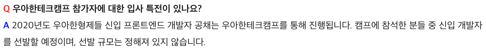
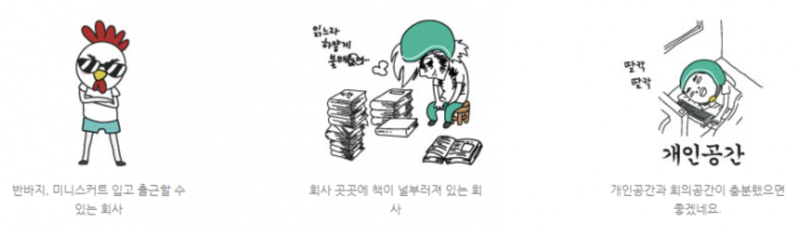
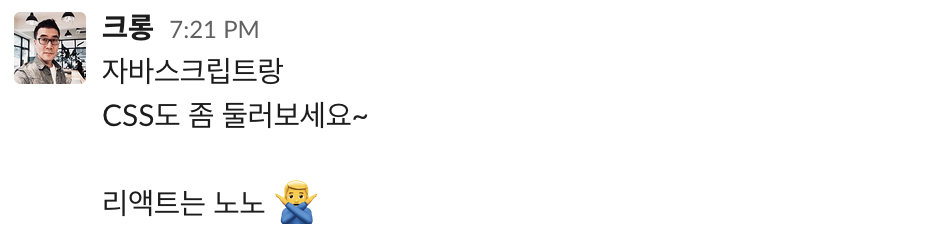
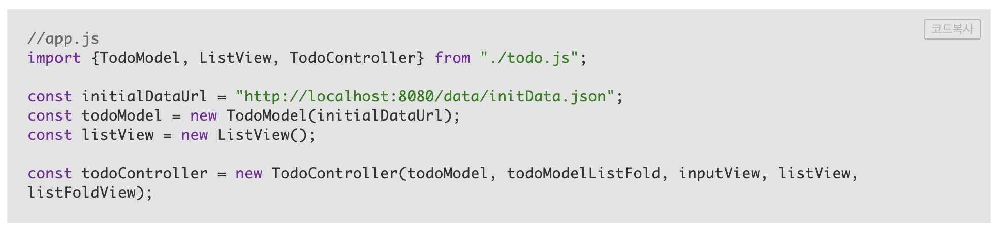
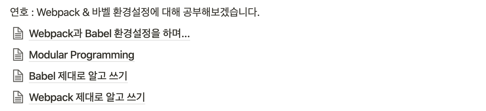
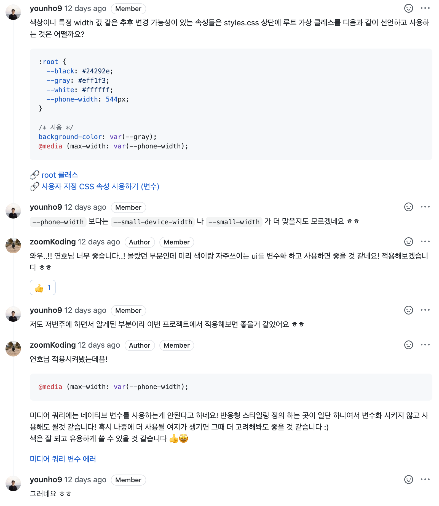
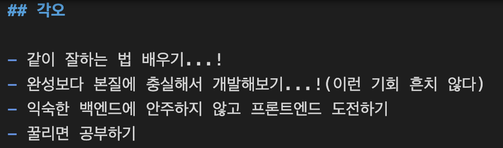

## 💫 목적

**우아한테크캠프(우테캠**)의 중간 즈음 온 시점에서 4주 동안 참여했던 캠프의 과정들에서 경험했던 것들과 배웠던 것들을 돌아보고자 한다. 🤓


<br>

## 🌪 시작 전 두려움

합격 통보를 받고 퇴사 회고를 쓰며 나름 결의를 다졌지만 막상 7월 1일이 다가오기 앞서서 고민하기 시작했다.

붙으면 완전 신나서 올 줄 알았는데 막상 가려니 어떻게 보면 **배부른 고민(?)**이 생겨났다.😭

<br>

### ♘♞ 또 다른 경쟁의 시작? (#우아한형제들입사)



사실 우테캠를 시작하기 전에 마음이 굉장히 어려웠다. 온전히 배움에 집중하기 위해 우테캠에 참여하게 됐지만 결국 이 프로그램은 우아한 형제들 신입 채용이 포함되어 있는 과정이라 배움보다 잘하는 걸 보여줘야 하는 또다른 성과의 스트레스 속에 들어가는 게 아닌가 하는 두려움이 있었다.

<br>

### ❓반복적인 프로젝트 속 공부는 언제? (#픚플젝플젝프을젝)

3기는 교육 기간을 따로 가지지 않고 4번의 짧은 프로젝트로 진행하고 마무리 하는 식으로 진행된다.

지원 전 1기 일정표를 봤는데 1달은 공부 1달은 프로젝트를 진행하는 걸 보고 지원을 했던 나였기에 이 부분이 조금은 당황스러웠다.

나는 웹 프론트엔드 개발 프로젝트를 진행해본 경험이 없고 특히 리액트나 웹 프레임워크는 매우 낯설다. 웹에 대한 기초 공부는 생활코딩 강의를 들었던 것이 전부였던 나였기에 자신감이 없었고 그 두려움은 더더욱 컸다.

<br>

## 🐣 시작과 첫주

부담감 속에서 잠실행 버스를 타고 출근했다. 첫날에 괜찮겠지 하고 반바지를 입고 출발했는데 막상 가보니 나만 반바지를 입어서 당황했지만 알고보니 우아한 버킷리스트에 다음 내용에 체크가 되어있는 걸 보고 안심했다 ㅋㅋ



<br>

### 👨‍🏫 대표님 강의

어색함 속에 막 받은 맥북을 설정하고 출입증을 목에 걸고 회사의 이쪽저쪽을 소개 받은 뒤에 어색함 속 김범준 대표님의 캠프의 시작을 알리는 강의(?)를 듣게 되었다.

대표님은 이 프로그램의 목적은 채용에 있지 않고 배움에 있으며 이 프로그램을 끝내고 캠프 수료생들에게 듣고 싶은 내용은 `우아한 형제들에 가고 싶다` 보다는 `캠프 기간동안 정말 많이 성장했다`를 듣고 싶다고 하셨다. (전자는 자연스럽게 따라오는 것 같다.. 😂)

이 캠프의 목적을 들으면서 내 걱정이 조금은 가셨고 참 잘 왔다고 생각했다. 그리고 이번 프로젝트 동안 **많이 배우는데 집중하자**고 마음을 먹었다.

<br>

### 🌝 캠프 사람들과의 만남

첫주 동안 프로젝트와 여러 기회로 사람들을 만나며 이야기를 나눌 수 있었다.

이렇게 나와 비슷한 상황에 있는 개발자를 만나는 건 처음이라 다들 어떻게 지원했는지 이런 저런 것들을 막 물어봤다. 일을 하고 온 사람들도 있었고 개발을 시작하지 않은 사람들도 있었다.(비전공자도 많았다)

각 사람들이 캠프에 참여하는 목적도 다양하고 경험도 다양했지만 **동일했던 부분은 다들 개발에 대한 열정이 있다는 점**이었다.

<br>

### 🤼 크롱님과 호눅스님(#케미잼)

부캠, 우테캠 교육을 몇년간 해오시며 개발자들 성장을 눈앞에서 봐오셨던 두 분이기에 학교의 저명한 교수님을 맞이하는 마음으로 이야기를 들었다. 도대체 어떻게 가르치실까 하는 궁금증도 있었지만 일단 두 분은 매우 유쾌했다. 강의 속에서 두 분의 티키타카를 보는 재미가 쏠쏠했다.

좋았던 부분은 실습 위주의 강의 속에서 스스로 답을 찾을 수 있도록 기회를 제공해주신다는 점이었다. 그리고 궁금한 부분이 생기면 답을 주시기도 하시지만 대부분 답보다는 공부할 방향을 던져주시기도 한다.

그리고 무엇보다 **제대로 알고 하는 코딩과 이유있는 코딩을 강조**하셨다.

프로젝트를 진행하는데 앞서 뭐를 준비해야하나 하는 내 고민을 말씀드렸더니 다음과 같이 말씀해주셨다.

<br>



<br>

`근본이 우선이다`를 느낄 수 있는 대목이다. 그렇게 한주동안 엄청나게 방대한 공부할 거리를 받고 한주가 마무리됐다.

그리고 기술 외적인 부분도 많이 이야기를 해주셨다. 격하게 기억이 남았던 이야기는 아래와 같다

- **코드 리뷰는 리뷰 퀄리티보다 감정적 교감이 우선되어야 해요!**
- 개발자는 개발을 하다보면 **자기 코드와 사랑에 빠져요**(완전 격하게 공감했다.)
- 나는 다른 사람보다 **미래의 나와 협업**하기 위해 코드를 잘 짜야해요.
- **개똥철학(우리만의 개발 철학)**은 매우 중요합니다.

<br>

## 👊 2번의 팀 프로젝트

첫주 이후에 두번의 팀 프로젝트를 진행했다. 뭘 만들어야 하는지는 생각보다 단순했다. 웹 개발 기초 튜토리얼에서도 흔히 볼 수 있는 **로그인 페이지**와 **칸반 페이지**였다. 간단해보일 수 있지만 여기서 중요한 점은 `어떻게 만들고 무엇을 배우며 만들 것인가`이었다. 그 고민 속에서 파트너와 함께 공부하며 설계하고 개발하는 과정은 전혀 단순하지 않았다. 🤩

<br>

### 👩‍🎓 협업 ⇒ 협공

이 프로젝트 기간 동안 나는 나와 개발 경험이 다르고 목적과 배우고 싶은 부분이 다를 수 있는 파트너와 함께 개발을 해야 했다.

이를 위해 서로 이해하기 위해서 이야기를 최대한 많이 했던 것 같다. (그래서 프로젝트 초반이 다른 팀들이 비해서 많이 더뎠던 것 같다)

다행히 두번의 프로젝트에서 만났던 파트너들은 모두 나보다 성격이 훨 좋은 분들이셨다. 그리고 이야기를 할수록 함께 열심히 하고 싶은 생각이 넘쳐났고 함께 성장 할 수 있는 방법에 대해서 잘 조율할 수 있었던 것 같다.

그리고 두 분 모두 성장에 초점을 두고 계신 분들이었다.

두 프로젝트 모두 다음에 *`많이 성장해서 다음 프로젝트를 맞이하자!`*에 초점을 뒀던 것 같다.

<br>

**다음은 두번째 프로젝트에서 연호님과 세웠던 개발 목표들이다.(연호님이 이쁘게 정리해주셨다..** 😇)


<br>

### 🤔 계속 고민하기(#개똥철학)

혼자 앱을 개발했던 때나 그 이전 프로젝트에서 내 개발의 주고객층은 서비스를 사용하는 유저들이나 대표님이었기에 나는 **코드보다는 잘 돌아가는 결과물**을 내기 위해 집중했었다.

스타트업을 퇴사하기 2달 전부터 새로운 개발자들이 들어오면서 새로운 개발자들이 내 코드 때문에 함숨 쉬는 개발자를 목격하게 되었다.

이 과정에서 내가 깨달았던 점은 **나의 주된 고객은 사실 미래의 나와 나의 코드와 일하게 될 다른 개발자**이며 결과물도 당연히 중요하지만 코드 자체에 더 관심이 있다는 점이었다.

그런 상황이다 보니 프로젝트 동안 제일 많이 신경썼던 부분은 **내 생각의 흐름이 지배하는 코딩이 아니라 나름의 이유가 있는 코딩**이었다. 이를 위해서 많은 고민이 필요했고 이를 뒷받침할 많은 리서치가 필요했다 했다.

특히 두번째 프로젝트에서는 **프론트엔드 구조와 환경 설정에 대한 조사**에만 한주를 사용했다.

주된 고민의 내용은 **MVC 패턴에 대한 이해**였는데 강의 자료에서 틀만 보여줬던 다음 코드에서 고민이 시작되었다.

<br>



<br>

**❓프론트에서 MVC를 어떻게 쓰지?**

결국 이 부분에 대한 이해를 위해 레퍼런스를 엄청 찾아 다녔고 본격 코딩은 주말에야 시작되었다.

어떤 하나의 패턴이 딱 맞다고 결론 내리지는 못했지만 우리가 이해한 수준 속에서 **우리 팀만의 프론트엔드를 위한 개똥 철학**이 생겨났다.

<br>

💩**우리만의 프론트엔드 개똥철학**

- **Model**은 데이터 처리만을 담당하고 **View**는 유저의 액션을 받고 유저에게 보여주는 역할만을 한다.
- **Model**의 **API call**은 한곳에 모아서 처리한다.
- **Controller**는 둘 사이 상호작용을 담당하게 된다.
- 상호작용은 우리가 정의한 **Event** 객체를 활용한다.(Listen, Trigger 가능)
- **View**의 함수는 잘게 쪼개서 사용에 용의하도록 한다.
- 모든 **component**는 **components에 모듈화 해서 사용**한다.
- component는 **atom부터 작은 단위**로 만들어서 css 중복을 줄인다.

이 과정이 있으니 빡구현이 들어간 2주차에도 부분 부분만 보고도 흐름을 이해하고 변경이 생길 시에도 어려움이 상대적으로 적었다.

결정적으로 데모 전날 밤에 연호님과 밤을 새며 각자 작업한 코드를 연호님이 잠든 상황에서 진행해야 했다. 이 때 연호님의 설명을 듣지 않고도 연호님의 코드의 흐름을 이해하고 수정하고 조금이라도 잠을 잘 수 있었다(연호님이 코드를 잘 짜셔서도 있는 것 같다..ㅋㅋ🦸)

<br>

### 👺 공부와 결과, 그 중간 지점 찾기(#갈등)

두 프로젝트 모두 공부에 초점을 두고 진행했지만 데모를 해야하고 결과물을 내야하는 부담 혹은 욕심을 무시할 수 없었다.

심지어 결과물이 안 나와도 된다고 생각하고 하자고 이야기했지만 데모 일이 다가올수록 생각보다 만들어져 가는 결과물에 대한 욕심이 났다.

특히 칸반 프로젝트에서 그런 느낌이 강했다. 결과가 중요하지 않다고 이야기했던 사람이 나였기에 조바심을 드리고 싶지 않은 마음에 혼자 전전긍긍하다가 데모 이틀 전에 연호님께 내 이런 마음을 조금은 감정적으로 털어놨다.

내 이런 상황을 미리 공유했다면 좀 더 잘 대응했을 것 같은데 연호님에게 시간이 부족한 상황에서 부담감을 드린 것 같아서 너무 죄송했다. 하지만 그래도 연호님이 잘 이해해주셔서 프로젝트 데모까지 잘 마무리 할 수 있었지만 이 부분이 너무 아쉬움으로 남았다.

하지만 여전히 파트너와 함께 적극적으로 서로의 코드를 리뷰해주고 공부한 내용과 고민을 나누는 과정 속에서 많이 성장했다.

**부족하지만 나의 의견을 열심히 들어주고 함께 프로젝트를 진행해준 명우님과 연호님께 정말 감사하다!**👍🙏

<br>

## 💥 배운점

### ⛹️‍♂️ 함께 공부하는 법

무엇보다 혼자 공부하는 것이 아니라 같이 공부하고 성장하는 하며 함께 공부하는 좋은 기억이 생기게 되었다.

<br>

**👨🏻‍🏫 공부하고 나누기**

두번의 프로젝트를 통해 개인적으로 공부하는 게 두번의 프로젝트를 진행하면서 파트너와 공부한 내용을 설명하는 과정을 반복했다.

그리고 설명을 제대로 하기 위해서는 공부한 내용을 잘 이해하고 있어야 했기에 깊이 있게 공부해야했다.

첫번째 프로젝트에서 명우님과 위키에 정리했던 공부 글들이다!


<br>

두번째 프로젝트에서는 연호님이 웹팩과 바벨를 깊이 있게 공부하고 싶으시다고 하셨고 그 부분에 대해 실제로 많이 공부하시고 많이 나눠주셨다.

연호님은 배운 내용을 문서화 하고 시간이 되실 때 따로 설명해주셨다.(설명을 정말 잘 해주셨고 많이 배웠다고 생각한다.)

이 과정에서 연호님에게 물어보고 내가 이해한 내용을 되뇌이는 과정을 진행하면서 웹팩과 바벨에 대해서 나도 공부할 수 있었던 것 같다.



<br>

**📝리뷰 열심히 하기**

그리고 함께 서로의 코드를 진득하게 봐주는 과정 중에 많이 배울 수 있었던 것 같다. 어떤 부분을 지적하기 위해서는 내가 제안하는 방법에 대한 이해가 있어야 했고 이를 근거할 수 있는 자료가 필요했다. 그리고 내 코드에서 내가 발견하지 못했던 개선점이나 의문점을 알려주기도 했다.

이 과정을 통해서 **좋은 코드가 뭔지 더 고민**할 수 있었고 자연스럽게 공부할 것들이 생겨나게 되었다.



이번 기회를 통해 함께 공부하고 함께 성장하는 방법의 여러 장점에 대해 생각해볼 수 있었다.

아직 많이 부족하지만 이번 기회를 통해 더 많이 배우고 성장했으면 좋겠다 ㅎㅎ

<br>

### 💪 도구 잡기 전에 근력 키우기

웹은 익숙하지 않았지만 나는 웹 공부를 시작한다고 했으면 리액트 클론 코딩을 먼저 공부하기 시작했을 것 같다. 그래서 이번 캠프를 시작하면서도 프레임워크에 익숙하지 않다는 점에서 염려가 많았다. 하지만 캠프에서 프로젝트를 진행하고 크롱님과 호눅스님의 이야기를 들으며 **도구보다는 언어 자체(근본)와 개똥철학이 중요하다는 것**을 깨달았다.

그리고 구조를 고민하면서 생겨난 아직 많이 부족하지만 나만의 **개똥철학**이 조금씩 생겨나고 있음을 느꼈고 그 과정 자체도 너무 보람차고 즐거웠다. 웹 프레임워크도 아직 써보지는 않았지만 두려움이나 걱정은 많이 사라진 듯 하다.🤠

<br>

### 🎺 평가가 없는 공부

처음에 염려가 많았지만 우테캠은 경쟁에서 성장하도록 진행되지 않는다. 금요일 마다 데모를 하긴 하지만 누가 잘했는지를 가려내는 자리도 아니고 아니고 각자의 공부한 부분을 리스펙하는 분위기이다.

그래서 각 데모가 끝나고 비교로 인한 열등감보다는 또다른 자극이나 보람으로 다음 프로젝트를 진행할 수 있게 되는 것 같다.

<br>

`설마 진짜 그렇겠어?` 라는 마음으로 처음 데모 때는 평가에 대한 스트레스를 받았던 것 같다.

이제는 데모에 대한 두려움 보다는 우리 팀이 고민한 결과물을 보여주고 다른 팀이 만들어낸 개똥철학과 결과물을 보는 기대감이 커졌다.

**우테캠**의 이러한 분위기가 함께 성장하는데 초점을 둘 수 있게 도와주는 것 같다.

<br>

## 🏃‍♀️ 약진 앞으로!

두번의 완벽하지 않았던 프로젝트를 기반으로 나도 참 많이 성장했던 것 같다. 그리고 처음에 걱정했던 부분들도 성장에 대한 기대감으로 변해갔던 같다.

**남은 5주 동안 새로 만나게 될 파트너와도 파이팅이다..!**

마지막으로 **첫 주에 작성했던 각오**를 다시 되뇌이고 마무리한다.



```toc

```
